# Runiac Project Requirements Document (PRD)

> Source document: `/Users/leejinseo/Desktop/FYP/FYP-26-S2-38_PRD.docx`

> Embedded images were extracted to `PRD_assets/` and referenced in-place below.

CSCI321 - Final Year Project

A Mobile Application for Wise Workout

Supervisor: Mr Ee Kiam Keong

Group Number: FYP-26-S2-38

| Name | UOW ID | SIM ID | SIM E-Mail Address |
| --- | --- | --- | --- |
| Lee Jinseo | 9096978 | 10256487 | lee169@mymail.sim.edu.sg |
| Kenji Yeo | 7906833 | 10246841 | Yeo009@mymail.sim.edu.sg |
| Kaif Lim Er | 7906742 | 10240265 | Kelim003@mymail.sim.edu.sg |
| Liu Zhihui | 9182123 | 10252641 | zliu051@mymail.sim.edu.sg |
| Konada Obadiah Nahshon | 10266652 | 9088829 | konada001@mymail.sim.edu.sg |

## 1. Team Structure

The Runiac project requires different areas of work to be handled in a coordinated way, including mobile development, backend logic, database design, UI/UX, testing, and project management. Therefore, the team structure was arranged so that each member has a clear main responsibility while still being able to support other members when needed.

### 1.1 Roles and Responsibilities

The following table summarizes the five roles. Detailed responsibilities are assigned to ensure that every functional area required by the project scope (Section 3) has a clear owner.

| Role | Primary Responsibilities | Member Name |
| --- | --- | --- |
| Project Manager | Overall project planning and scheduling. Sprint coordination and stand-up facilitation. Risk monitoring and mitigation. Documentation quality control. Acts as the integration point across all functional roles. | Lee Jinseo |
| Mobile Frontend Developer | Implementation of the Flutter mobile application. UI assembly from designer specifications. GPS, sensor, and wearable device integration. Map rendering and leaderboard visualization interactions. Local state management and offline behavior. | Kaif Lim Er |
| Backend Developer | Cloud Functions and API design on the Firebase platform. Authentication and session management. Server-side aggregation logic for location-based leaderboard. Push notification orchestration. Third-party API integration (mapping, geocoding). | Kenji Yeo |
| Database & Data Engineer | Firestore data model and security rules. Geospatial indexing and regional aggregation for leaderboard and XP progression. Time-series storage of activity data. Data aggregation jobs for analytics and personalized coaching inputs. Backup and migration strategy. | Liu Zhihui |
| UI/UX Designer & QA Lead | Beginner-focused interface design and user flow definition. Wireframes, mock-ups, and design system maintenance. Usability testing with target users. Test plan authoring, manual QA execution, and defect tracking. Accessibility review. | Konada Obadiah Nahshon |

## 2. Current Market Survey

Before defining Runiac’s features, we reviewed several existing running and fitness applications to understand what is already available in the market and where the main gaps are. The comparison focuses on Strava, Nike Run Club, Runkeeper, Whoop, and Garmin Connect because these applications represent different types of users, from casual runners to more serious athletes.

### 2.1 Available Software in the Market

The applications surveyed represent three distinct positioning strategies: social-first activity tracking (Strava), guided coaching for newer runners (Nike Run Club, Runkeeper), and physiological optimization for serious athletes (Whoop, Garmin Connect).

| Application | Primary Function | Target User Segment | Pricing | Key Features | Strengths | Weakness / Limitations |
| --- | --- | --- | --- | --- | --- | --- |
| Strava | Activity tracking with social network | Intermediate to advanced runners and cyclists | Freemium | GPS tracking, route recording, leaderboard, challenges, social sharing | Strong community and competition features | Some advanced analytics are locked behind paid subscription |
| Nike Run Club | Guided running and coaching plans | Beginner to intermediate runners | Free | Guided runs, training plans, pace tracking, achievements | Beginner-friendly and free coaching content | Less advanced community competition compared to Strava |
| Runkeeper | GPS tracking with basic coaching | Entry-level to intermediate runners | Freemium | GPS tracking, goal setting, audio cues, progress tracking | Simple and easy to use | Premium needed for more advanced plans and insights |
| Whoop | Recovery, strain, and sleep optimization | Serious athletes and health-focused users | Subscription | Heart rate and sleep tracking, recovery and strain scoring, personalized insights | Advanced recovery analytics and personalized health insights | Subscription required, no display and limited social features |
| Garmin Connect | Comprehensive fitness data hub paired with Garmin wearables | Endurance athletes and Garmin device owners | Free + premium tier | Health metrics, running analytics, training status, route tracking | Strong data analytics and wearable integration | Requires Garmin devices for full value |

### 2.2 How Current Software Supports the Running Workflow

Data Collection

All five applications rely primarily on GPS sensors, either smartphone-based or via a paired smartwatch to capture distance, pace, elevation, and route. Heart rate is acquired through optical wrist sensors or external chest straps. Whoop is an outlier: it foregoes GPS on the band itself and depends on the paired smartphone for location, focusing its hardware on continuous physiological monitoring.

Data Processing and Analysis

Raw sensor data is uploaded to cloud services where it is processed into derived metrics which are average pace, calorie estimates, heart rate zones, training load, and recovery scores. Strava and Garmin emphasize per-activity analysis. Whoop emphasizes longitudinal trends daily strain, recovery, and sleep aggregated over weeks.

Coaching and Planning

Coaching and planning in the current market are delivered mainly through structured programmes, guided runs, or advanced physiological insights. Nike Run Club provides audio-guided runs with coaching support, while Runkeeper offers relatively fixed beginner plans such as 5K programmes over several weeks. Garmin Coach and Whoop provide more advanced guidance, but these systems often depend on wearable-derived metrics or assume that users are already comfortable interpreting performance data. Strava, by contrast, offers little native coaching and relies more heavily on tracking and third-party integrations. As a result, beginner runners are often left with either static plans that lack ongoing interpretation or advanced systems that feel too data heavy.

Motivation Mechanisms

Motivation is delivered through three channels which are badges and achievements, social comparison via friend feeds and leaderboards, and time-bound challenges. Strava's segment feature virtual race sections where users compete on the same stretch of road is the most game-like mechanic in the mainstream market, but it remains a thin layer on top of conventional tracking.

### 2.3 Common Features Across the Market

At the most fundamental level, all platforms provide GPS-based activity tracking, enabling users to record essential workout data such as distance, pace, and running routes. This is typically complemented by physiological data monitoring, particularly heart rate and recovery metrics, which allow the system to capture the intensity and physical impact of each activity. These raw inputs are then transformed through performance analysis and derived metrics, generating insights such as calorie expenditure, pace consistency, and training load, which help users better understand their performance.

In addition to individual activity analysis, all applications maintain activity history and progress tracking, enabling users to review past workouts and observe trends over time. This historical perspective is further supported by training plans and coaching features, which guide users through structured programmes or provide recommendations to improve performance. Such guidance ranges from beginner-friendly guided runs to more advanced, data-driven coaching systems depending on the platform.

To enhance user engagement, most platforms incorporate motivation systems, including badges, achievements, and challenges, which encourage continued participation through goal-setting and recognition. These are often reinforced by social features, allowing users to share activities, connect with others, and participate in competitive or community-driven experiences. Finally, all major applications support wearable device integration and data synchronization, ensuring that data from smartwatches and other fitness devices can be seamlessly incorporated into the system.

Overall, these features establish the functional baseline of the current market. However, while they effectively support activity tracking, analysis, and light engagement, they do not sufficiently address the key challenge of sustaining long-term motivation and habit formation among beginner runners, which remains a critical gap explored in the following section.

### 2.4 Detailed Feature Comparison

This feature comparison table evaluates leading running applications in the current market, including Nike Run Club (NRC), Runkeeper, Strava, Whoop, and Garmin Connect, against the proposed Runiac system.

| Feature | NRC | Runkeeper | Strava | Whoop | Garmin | Runiac |
| --- | --- | --- | --- | --- | --- | --- |
| User account and login required | ✓ | ✓ | ✓ | ✓ | ✓ | ✓ |
| Profile creation and editing | ✓ | ✓ | ✓ | ✓ | ✓ | ✓ |
| Beginner-targeted onboarding flow | ✓ |  |  |  |  | ✓ |
| In-app tutorial / first-run guide | ✓ | ✓ |  | ✓ |  | ✓ |
| GPS-based activity tracking | ✓ | ✓ | ✓ |  | ✓ | ✓ |
| Wearable device synchronization | ✓ | ✓ | ✓ | ✓ | ✓ | ✓ |
| Heart-rate zone analysis | ✓ |  | ✓ | ✓ | ✓ | ✓ |
| Calorie estimation | ✓ | ✓ | ✓ | ✓ | ✓ | ✓ |
| Manual activity entry | ✓ | ✓ | ✓ |  | ✓ | ✓ |
| F1: Collect running-related activity data | ✓ | ✓ | ✓ | ✓ | ✓ | ✓ |
| F2: Estimate running effects and provide analysis | ✓ | ✓ | ✓ | ✓ | ✓ | ✓ |
| F3: Supply running advice and schedule a running plan | ✓ | ✓ | ✓ |  | ✓ | ✓ |
| Personalized training plans | ✓ | ✓ |  | ✓ | ✓ | ✓ |
| F4: Remind User of Running or Rest | ✓ | ✓ | limited | ✓ | ✓ | ✓ |
| F5: Connect with social media and initiate competitions | ✓ | ✓ | ✓ |  | ✓ | ✓ |
| F6: Streak & Consistency Tracking | ✓ | ✓ | ✓ |  | ✓ | ✓ |
| F7: Community-driven route sharing |  | limited | ✓ |  | limited | ✓ |
| F8: Level-Based Territorial Leaderboard |  |  |  |  |  | ✓ |
| Beginner-tiered metric presentation | ✓ | limited |  |  |  | ✓ |
| F9: Runner Level and XP Progression System |  |  |  |  |  | ✓ |
| Challenges and competitions | ✓ | ✓ | ✓ | ✓ | ✓ | ✓ |
| Achievement badges and milestones | ✓ | ✓ | ✓ |  | ✓ | ✓ |
| Leaderboards and segment racing | limited |  | ✓ |  | limited | ✓ |
| F10: AI-assisted Post-Run Summary |  |  |  |  |  | ✓ |
| Smartphone-only operation (no wearable required) | ✓ | ✓ | ✓ |  | limited | ✓ |

### 2.5 Shortcomings and Missing Features in Current Software

Although the running app market is already well developed, several limitations remain for beginner runners. Many existing applications are effective at recording activities and displaying performance data, but they do not always provide enough support for the early stage of habit formation. This is a critical period because new users are more likely to lose motivation within the first few weeks after installation.

The following table summarizes the main gaps identified in current applications and explains how Runiac addresses them through its beginner-focused features.

| Gap in Current Market | How Runiac Addresses It |
| --- | --- |
| Beginner onboarding is shallow. Most apps assume an existing running habit. | Designed from the ground up for the beginner-to-serious-runner journey, with a dedicated beginner-targeted onboarding flow and an in-app first-run tutorial designed to ease users into running gradually and confidently. |
| Motivation features across the market are often limited to badges, streaks, and broad leaderboards. They rarely provide fair competition based on both location and user progression level. | F8: Level-Based Territorial Leaderboard introduces a location-aware competitive system where users are ranked within specific geographic regions and similar level divisions. Unlike traditional global leaderboards, this system provides localized and fairer competition, making rankings more achievable and motivating for beginner users. |
| Route recommendations rank routes by raw popularity, ignoring time of day, safety, and user level. | F7: Community-Driven Route Sharing surfaces user-uploaded routes on a map, enabling beginners to discover suitable paths based on community-generated data. |
| Beginner runners are often discouraged when they are compared directly with highly experienced runners or when progress feels too slow to notice. | F9: Runner Level and XP Progression System convert running activity, plan adherence, streak progress, and weekly consistency into XP and user levels. F8 then uses these levels to group users into fair territorial leaderboard divisions, allowing beginners to compete with users at a similar progression stage. |
| Post-run data is presented as raw metrics. Beginners lack the knowledge to interpret pace, cadence, or zone breakdowns. | F10: AI-assisted Post-Run Summary translates raw data into plain-language, beginner-friendly insights, highlighting strengths and providing simple, actionable improvement suggestions after each run. |
| Current applications may record streaks, send reminders, or display consistency statistics, but these features are often treated as passive records rather than active habit-forming support. As a result, beginner runners may still lose motivation when their routine starts to weaken. | F6: Streak & Consistency Tracking makes consistency visible through streak counts, weekly progress indicators, and motivational feedback. This is supported by F4: Reminder System, which sends contextual prompts when a user is at risk of missing a planned run or breaking a streak. Together, these features help beginners maintain continuity and build a more stable running habit. |
| Social features are limited to challenges and leaderboards. No mechanism connects running to real geographic territory or local community. | F5 and F8 together create a location-grounded social experience by combining social interaction with regional and level-based competition, allowing users to compare their progress within meaningful and fair local contexts. |
| Whoop and Garmin require expensive proprietary hardware, excluding cost-sensitive beginners. | Smartphone-first design. Wearable integration via F1: Collect Exercise Data is optional, not required. All core features function on a smartphone alone. |
| Data presentation overwhelms beginners. Garmin and Whoop expose dozens of metrics that lack meaning to new users. | F2 analysis layer feeds into F10 AI summary, ensuring that complex performance metrics are translated into simple, actionable insights rather than being directly exposed to beginners. |

### 2.6 Summary of Market Position

The existing market can be broadly grouped into two types of application. Casual and social applications such as Strava, Nike Run Club, and Runkeeper are easy to use, but they offer limited support for long-term retention among beginner runners. On the other hand, data-driven athlete platforms such as Whoop and Garmin Connect provide powerful analytics, but they often require expensive hardware, prior running knowledge, and a user who is already committed to fitness.

Based on this comparison, there is a clear gap between casual running apps and advanced athlete platforms. Runiac is positioned in this gap by combining accessible running support, beginner-friendly interpretation of performance data, habit forming consistency features, and fairer location-based motivation.

## 3. Project Scope

### 3.1 Problem Statement

The mobile market for running applications is highly saturated, yet the fundamental problem of beginner retention remains largely unresolved. Industry reports indicate that a significant proportion of new users abandon running and fitness applications within the first four weeks, which is the critical period in which exercise habits either begin to form or break down.

Analysis of the current market in Section 2 reveals a structural gap in how existing applications are designed. Most mainstream platforms are built for users who are already engaged in running. Strava and Garmin Connect focus strongly on performance tracking and data analysis for committed runners, while Whoop emphasizes physiological optimization for users who are already invested in health and performance monitoring. Even beginner-oriented applications such as Nike Run Club and Runkeeper generally assume that users have enough motivation and readiness to follow a structured running plan.

As a result, existing solutions do not adequately address one of the most difficult problems in this domain: helping a non-runner become a consistent runner. Traditional running applications primarily focus on tracking performance, whereas Runiac is designed around behavior change. In this project, tracking is treated as a baseline requirement, while the core value of the system lies in supporting habit formation and sustained motivation during the critical early stages of running adoption.

In addition, Runiac is intentionally scoped as a running-focused and health-related mobile application rather than a general fitness platform. Because running places direct physical demands on the user, the system cannot assume that all users share the same fitness level, running experience, injury history, or health condition. A beginner with no exercise background should not receive the same plan as a more experienced runner. Therefore, the application must consider basic health and fitness information during onboarding so that training guidance can be adjusted to the user’s condition and progression can remain safe and realistic.

For this reason, the project addresses two linked challenges at the same time, which are improving beginner retention and supporting safe progression. Runiac aims not only to keep users engaged through beginner-friendly motivation and gamified features, but also to help them start at an appropriate level, avoid excessive strain, and build a sustainable running habit over time.

### 3.2 Target Users and User Roles

As Runiac is a health-aware running application, users may be required to provide basic information during onboarding, such as running experience, fitness level, personal goals, injury history, and relevant health conditions. This information supports safer and more appropriate running guidance.

Basic User

A Basic User is a general runner who uses the application to record and manage running activities. This role includes beginner runners and casual runners who want to build consistency through GPS-based run tracking, running history, goal setting, basic performance summaries, reminders, and selected motivational features. During onboarding, basic fitness and health-related information may be collected so that the system can provide suitable beginner-level guidance and reduce the risk of unsafe progression.

Premium User

A Premium User is a runner who has progressed beyond basic usage and wants more structured support for the next running milestone, such as completing a first 5K, 10K, 21K, and 42K or improving consistency. In addition to the core features available to Basic Users, this role can access more specialized running metrics, richer analytical views, goal preparation plans, and more personalized training recommendations based on accumulated activity data. This role supports users who want deeper performance understanding without shifting the system's overall focus away from beginner-friendly progression.

Platform Administrator

The Platform Administrator is responsible for managing the application environment. This includes user account management, moderation of reported content, challenge or leaderboard configuration, report handling, and monitoring overall platform reliability and safety.

Trainer / Medical Advisor

The Trainer or Medical Advisor represents an expert advisory role related to health-aware running support. This role may provide guidance on training progression, injury prevention, exercise intensity, and safe habit formation based on onboarding information, user activity history, fitness level, and health-related data. In the current scope of the project, much of this guidance is supported through system-generated recommendations and AI-assisted summaries rather than direct human intervention.

### 3.3 Features

F1. Collect running-related activity data

The application collects user running-related activity data through smartphone sensors and optional wearable devices via Bluetooth or Wi-Fi. Key data such as distance, pace, duration, and basic activity metrics are recorded during each run. This collected data serves as the foundation for all subsequent analysis, planning, and personalized features within the system. In addition, during onboarding, the system collects basic user profile information such as running experience, fitness level, personal goals, injury history and relevant health conditions.

F2. Estimate running effects (short-term or long-term) and provide analysis

Based on the collected data, the system analyzes both short-term and long-term running performance, including metrics such as calories burned, average pace, and activity trends over time. These insights help users understand their progress and provide essential input for higher-level features such as running plan generation and adaptive adjustments.

F3. Supply running advice and schedule a running plan

Using the user’s onboarding health profile, user-defined goals, and analyzed running activity data, the system generates a weekly running plan tailored to the user’s condition and recent performance. The plan considers running experience, current fitness level, injury history, relevant health conditions, recent running performance, and activity trends to determine an appropriate starting level and progression rate. The system then provides suitable running advice and schedules running and rest days for the upcoming week to support safe and sustainable progression.

F4. Remind user of running or rest

The system sends timely reminders to encourage users to follow their running plans or take breaks when necessary. By monitoring adherence to the schedule and recent activity levels, the application helps maintain consistency while reducing the risk of overtraining or unsafe progression.

F5. Connect with social media and initiate competitions between users

The application enables users to share their running achievements, post-run summaries, and selected leaderboard results on social media platforms. In Runiac, user competition is primarily supported through the Level-Based Territorial Leaderboard feature (F8), where users compare their progress within relevant geographical regions and level divisions. Therefore, F5 acts as the social sharing and engagement layer, while F8 provides the underlying competition mechanism. By connecting running achievements with social comparison and regional leaderboard visibility, this feature enhances motivation, accountability, and user engagement.

F6. Streak & Consistency Tracking

This feature tracks the user’s running consistency by monitoring consecutive workout days and overall activity patterns. By maintaining streak counts and highlighting regular participation, the system encourages users to build sustainable exercise habits. It also provides simple visual feedback on progress, motivating users to stay consistent and gradually improve over time.

F7. Community-Driven Route Sharing

This feature allows users to share their running routes, which are then displayed on a map for others to explore and follow. By leveraging community-generated data, the system highlights popular and frequently used routes, enabling users to easily discover suitable running paths. The initial design focuses on simple route sharing and visualization to ensure feasibility, with potential for future expansion into more advanced recommendation systems.

F8. Level-Based Territorial Leaderboard

This feature introduces a location-based leaderboard system that ranks users within specific geographical territories and similar level ranges. Instead of placing all runners into one ranking table, the system groups users according to their current level or league, which is determined by their accumulated XP from F9. Within each territory and level division, users compete on a weekly or monthly basis using weekly XP or monthly XP as the ranking score.

When users view the map at a broader level, such as the entire country, the leaderboard displays top users within the selected level division for that larger region. As users zoom into more localized areas, such as districts or neighborhoods, the leaderboard dynamically updates to show runners in the same level range within that specific area. This creates a fairer and more achievable competitive environment, allowing beginners to compete with users at a similar progression stage rather than being directly compared with highly experienced runners.

F9. Runner Level and XP Progression System

This feature introduces an experience point and level progression system that converts running activity, plan adherence, streak progress, and weekly consistency into visible user growth. After each valid run, the user receives XP based on activity completion, completed distance, and whether the activity followed the system-generated running plan. Additional bonus XP is awarded when the user maintains a plan-based streak or completes weekly consistency goals. The accumulated XP determines the user’s running level, while weekly XP and monthly XP are used by F8 to create fair leaderboard rankings within the appropriate territory and level division.

F10. AI-assisted Post-Run Summary

This feature provides an AI-assisted post-run reflection after each completed running session. Instead of only presenting raw metrics such as distance, pace, duration, and calories, the system translates these values into a simple diary-style explanation that beginner runners can understand. The summary explains how the user performed during the run, what the recorded metrics mean, and which aspects of the run were positive, such as completing the planned session, maintaining a steady pace, or improving consistency compared to previous activities. For implementation and business model purposes, the free tier may generate this summary through rule-based templates, while the premium tier can enhance it using LLM-based AI assistance for richer historical comparison and more personalized wording.

The feature also provides supportive and practical feedback for the next run. For example, it may encourage the user to maintain a similar rhythm, avoid increasing intensity too quickly, or continue following the weekly running plan. The purpose is not to provide medical diagnosis or professional coaching advice, but to help beginner users understand their running records in a clear, motivational, and beginner-friendly way. By turning performance data into an easy-to-read reflection, this feature helps users learn from each run and stay motivated to continue building a running habit.

### 3.4 MVP and Phase 2 Scope Allocation

The MVP focuses on delivering the core functionality required to demonstrate Runiac’s key value, including running tracking, safe training guidance, habit formation support, and visible user progression. Although the Level-Based Territorial Leaderboard is one of Runiac’s key differentiators, it is placed in Phase 2 because it depends on sufficient user activity data, regional aggregation, and a larger active user base. The MVP therefore focuses on building the foundation for this feature through F6 and F9, which establish the habit and progression systems needed before leaderboard competition can be meaningful.

| Phase | Features Included |
| --- | --- |
| MVP (Demo Build) | F1. Collect running-related activity data F2. Estimate running Effects and Analysis F3. Supply running advice and schedule a running plan F4. Remind user of running or rest F6. Streak & Consistency Tracking F9. Runner Level and XP Progression System |
| Phase 2 (post-MVP) | F5. Connect with social media and initiate competitions between users F7. Community-Driven Route Sharing F8. Level-Based Territorial Leaderboard F10. AI-assisted Post-Run Summary |

### 3.5 Feature Justification

Each feature is justified along three dimensions: the beginner pain point it solves, the gap in the current market it fills, and the behavior change mechanism it implements. This three-axis analysis ensures that every feature contributes to the project's central thesis of behavior change.

| Feature | Beginner Pain Point Solved | Market Gap Filled | Behavior Change Mechanism |
| --- | --- | --- | --- |
| F1. Collect Running-related activity data | Beginners need objective evidence that they have completed physical activity | Industry-standard baseline; absence would disqualify the application from the category. | Provides the foundational data required for all analysis, feedback, and engagement features. |
| F2. Estimate Running Effects and Provide Analysis | Beginners cannot easily understand whether they are improving or making progress. | Existing applications often present too many metrics without clear interpretation | Transforms raw activity data into structured insights, enabling gradual understanding of performance. |
| F3. Supply Running Advice and Schedule a Running Plan | Beginners do not know how to structure their training or where to start. | Most applications assume prior knowledge or intrinsic motivation to follow a plan. | Provides an initial structured plan that reduces decision-making friction and supports early-stage habit formation. |
| F4. Remind User of Running or Rest | Beginners often forget or lack external triggers to maintain a routine. | Reminder systems exist but are not designed specifically for habit formation. | Acts as a behavioral trigger, reinforcing consistency through timely prompts aligned with the user's activity patterns. |
| F5. Connect with Social Media and Initiate Competitions | Beginners lack accountability and external motivation. | Social features are often generic and not tailored to beginner engagement. | Introduces light social pressure and shared experiences to increase commitment and engagement. |
| F6. Streak & Consistency Tracking | Beginners struggle to maintain consistency, especially in the first few weeks. | Existing apps track activity but do not actively reinforce habit continuity. | Reinforces behavior through Streak & Consistency Tracking and visual progress, encouraging users to avoid breaking their routine. |
| F7. Community-Driven Route Sharing | Beginners do not know where to run or which routes are suitable. | Existing route recommendations are often based on raw popularity without context. | Reduces decision fatigue by enabling users to discover routes through community-generated data. |
| F8. Level-Based Territorial Leaderboard | Beginners lack motivation because global rankings feel unattainable and disconnected from their daily environment. | Existing applications provide global or friend-based leaderboards, but they rarely combine localized competition with level-based grouping for fair beginner participation. | Encourages engagement through location-based and level-based competition. Users compete within familiar regions and similar progression groups, making leaderboard progress feel realistic, fair, and motivating. |
| F9. Runner Level and XP Progression System | Beginners may feel that progress is slow or invisible, especially before physical improvement becomes obvious. | Existing apps often reward distance, speed, or advanced performance, but they do not strongly reward plan adherence and beginner-level consistency. | Converts completed runs, plan adherence, streak progress, and weekly consistency into XP and levels, making progress visible and rewarding while supporting fair competition through F8. |
| F10. AI-assisted Post-Run Summary | Beginners cannot interpret raw metrics such as pace, cadence, or trends. | Existing applications rely on users to interpret complex data themselves. | Translates performance data into simple, actionable insights, reinforcing learning and continuous improvement. |

## 4. Business Model

### 4.1 Selected Business Model

Runiac adopts a freemium subscription model. The free tier provides the core beginner running experience, while the premium tier provides advanced insight, goal preparation, AI-assisted feedback, and premium social or status features. This model is suitable because Runiac targets beginner runners who may not yet have a stable running habit. Core habit-forming functions should therefore remain accessible, while premium features support users who are ready to progress toward clearer running milestones.

### 4.2 Free and Premium Feature Allocation

The table below summarizes how the main features are divided between Free and Premium users. The allocation is designed to keep the core habit-forming and gamification experience fair, while placing deeper interpretation, goal preparation, and premium presentation features in the paid tier.

| Feature | Free Tier | Premium Tier |
| --- | --- | --- |
| F1. Collect running-related activity data | Full access to GPS tracking, distance, pace, duration, route recording, and activity storage. | Same as Free Tier. |
| F2. Estimate running effects and provide analysis | Basic metrics such as distance, duration, average pace, calories burned, weekly total distance, and simple progress charts. | Advanced analytics such as longer-term trends, pace consistency, heart-rate based training load analysis, split analysis, and goal progress forecast. |
| F3. Supply running advice and schedule a running plan | Basic beginner weekly running plan based on onboarding profile, goals, fitness level, and health-related information. | Goal Preparation Mode as a premium extension of F3, including First 5K, 10K, 21K, and 42K, adaptive weekly plan adjustment, and milestone tracking. |
| F4. Remind user of running or rest | Full access to running reminders, rest reminders, missed-session reminders, and streak-risk reminders. | Same as Free Tier. |
| F5. Connect with social media and initiate competitions | Basic sharing of completed runs and simple post-run achievement cards. | Premium sharing cards for leaderboard rank, territorial achievements, level badges, and enhanced visual templates. |
| F6. Streak & Consistency Tracking | Full access to streak count, weekly consistency progress, and visual habit progress indicators. | Same as Free Tier. |
| F7. Community-Driven Route Sharing | View and share community routes, access basic route popularity information, and explore shared routes on the map. | Advanced route filters, saved route collections, route comparison, and distance, elevation, or time-based filtering. |
| F8. Level-Based Territorial Leaderboard | Fair participation in weekly and monthly territorial leaderboards, including the same leaderboard ranking information for all users. | Same leaderboard access as Free Tier, plus premium profile frames, badge styles, animated achievement cards, and premium visual templates. No XP or ranking advantage is provided. |
| F9. Runner Level and XP Progression System | Full access to XP earning, level progression, weekly XP, monthly XP, streak bonus, and consistency bonus. | Same as Free Tier. |
| F10. AI-assisted Post-Run Summary | Rule-based post-run summary that explains basic metrics in simple beginner-friendly language. | LLM-based AI-assisted summary with historical comparison, pattern-based feedback, personalized next-run focus, and richer motivational explanation. |

### 4.3 Premium Value Proposition

The premium tier is positioned as support for the user’s transition from beginner to intermediate runner. It is not designed only for professional athletes. Instead, it helps users who have started building a running habit and are ready to pursue the next milestone, such as completing their first 5K, 10K, 21K, and 42K or understanding their progress in more detail. Premium therefore focuses on goal preparation, deeper insight, AI-enhanced feedback, and richer status expression.

### 4.4 Business Model Justification

This business model aligns with Runiac's beginner-focused purpose. If essential features such as activity tracking, reminders, streaks, XP progression, or fair leaderboard participation were placed behind a paywall, the application would weaken its own habit-formation objective. Therefore, these core features remain free. Premium features are monetized through additional value that does not create unfair competition: advanced analytics, milestone-oriented plans, AI-assisted summaries, advanced route discovery, and premium sharing or visual status features. In particular, F8 remains fair because Premium users do not receive additional XP, ranking boosts, scoring advantages, or exclusive competitive information.

## 5. Functional Requirements

### 5.1 Overview

The functional requirements below explain how each major Runiac feature is expected to work from the user’s point of view. Each feature is linked to the project scope and is supported with a use case diagram, use case description, sequence diagram, and activity diagram.

### 5.2 F1 – Collect Running-Related Activity Data

#### 5.2.1 Use Case Diagram

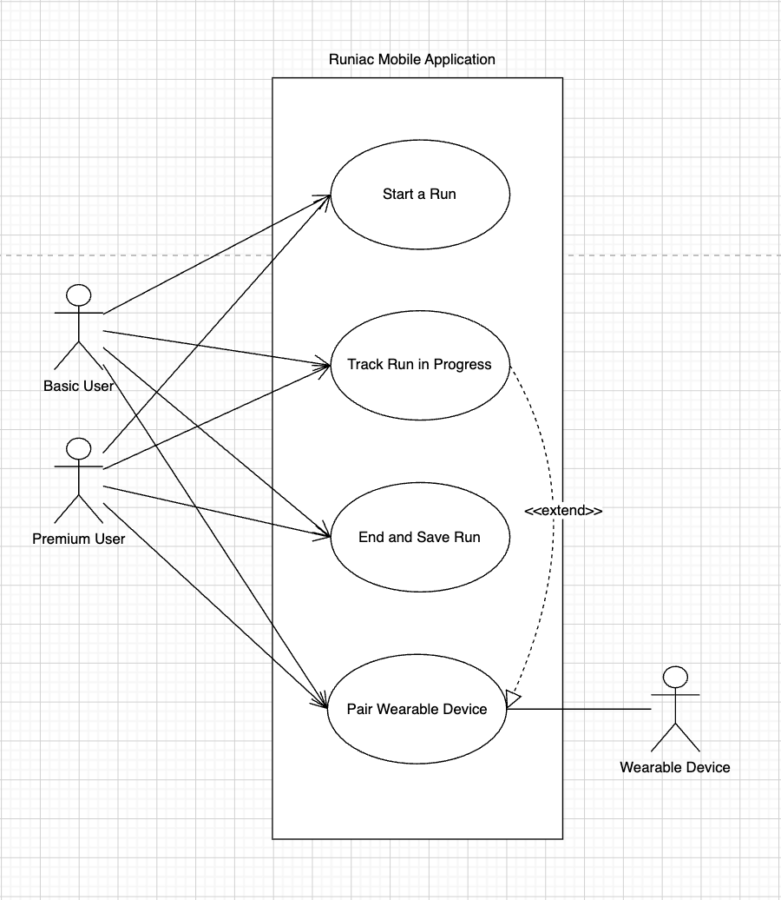

#### 5.2.2 Use Case Description

| Use Case ID | UC-F1 |
| --- | --- |
| Use Case Name | Collect Running-Related Activity Data |
| Primary Actor | Basic User, Premium User |
| Supporting Actors | GPS Sensor (Smartphone), Optional Wearable Device, Firestore (Backend) |
| Stakeholders | Runiac System, Database & Data Engineer |
| Preconditions | The user is registered and authenticated. Onboarding profile (running experience, fitness level, personal goals, injury history, and relevant health conditions) has been completed. Location permission has been granted. |
| Trigger | The user taps the “Start Run” button on the home screen. |
| Main Flow | 1. The user opens the application and selects “Start Run”. 2. The system verifies that location permission and required sensors are available. 3. The system begins recording GPS samples, distance, pace, duration, and elevation in real time. 4. If a wearable device is paired, the system also captures heart rate and other supported metrics. 5. The system stores activity data locally during the session to prevent data loss under unstable connectivity. 6. The user taps “Pause” or “Stop” to control the session. 7. Upon completion, the user confirms the activity. 8. The system uploads the finalized activity record to Firestore and triggers downstream processing (F2, F9). 9. The system displays a confirmation screen showing the recorded activity summary. |
| Alternate Flow | 4a. If no wearable is paired, the system continues with smartphone sensors only. 5a. If connectivity is lost during the run, the system continues recording locally and synchronizes the data when connectivity is restored. 8a. If activity validation fails (implausible speed, sudden GPS jumps, or duration below minimum threshold), the activity is flagged and excluded from XP calculation; the user is notified. |
| Postconditions | A validated activity record is persisted in Firestore and made available for analysis (F2), plan adjustment (F3), streak tracking (F6), XP progression (F9), and post-run summary generation (F10). |

#### 5.2.3 Sequence Diagram

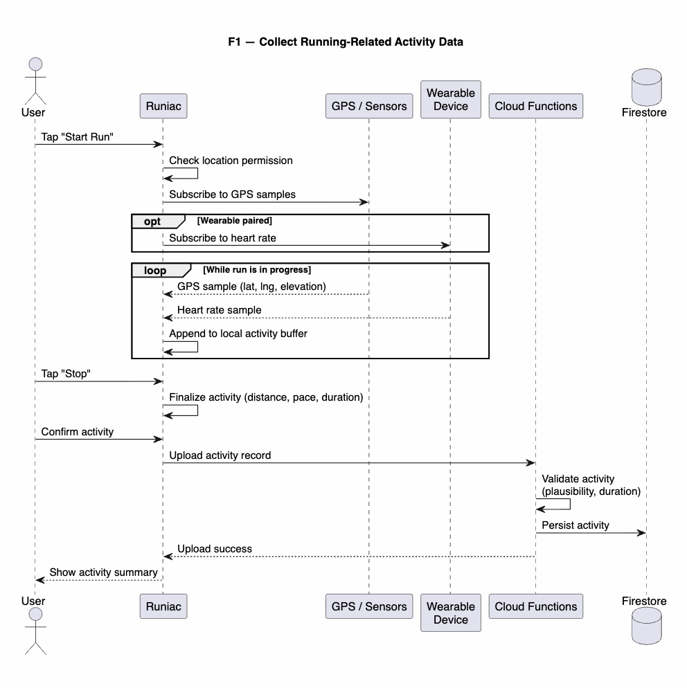

#### 5.2.4 Activity Diagram

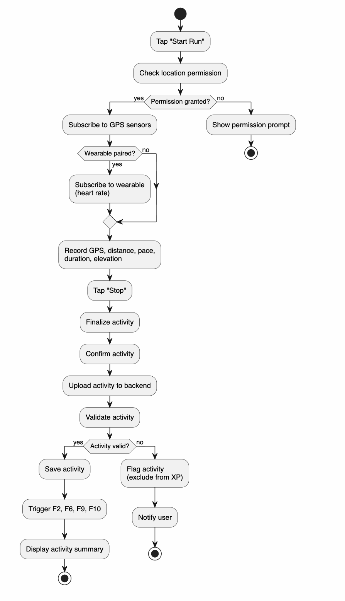

### 5.3 F2 – Estimate Running Effects and Provide Analysis

#### 5.3.1 Use Case Diagram

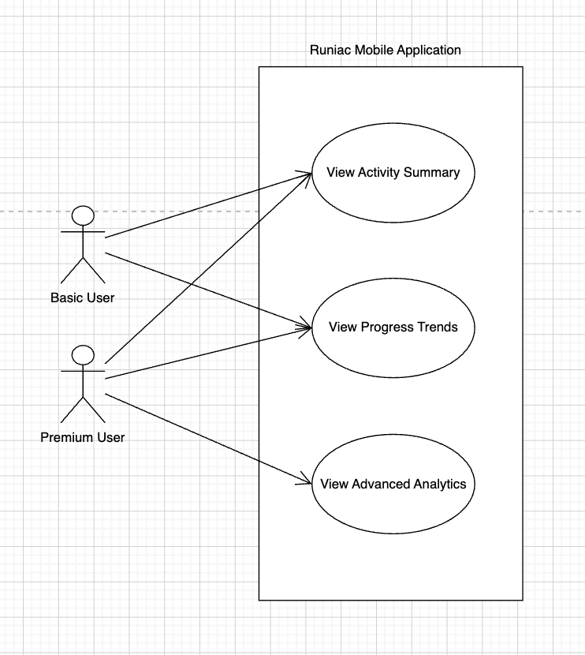

#### 5.3.2 Use Case Description

| Use Case ID | UC-F2 |
| --- | --- |
| Use Case Name | Estimate Running Effects and Provide Analysis |
| Primary Actor | Basic User, Premium User |
| Supporting Actors | Cloud Functions (Backend), Firestore |
| Stakeholders | Runiac System |
| Preconditions | The user has at least one validated activity record stored in Firestore (produced by UC-F1). |
| Trigger | The user opens the dashboard, activity history, or activity detail screen; or a new activity has just been uploaded. |
| Main Flow | 1. The user navigates to the dashboard or selects an activity from history. 2. The system retrieves the relevant activity records from Firestore. 3. The system computes derived metrics including average pace, calories burned, heart-rate zones (if available), weekly distance, and progress trends. 4. For Premium users, the system additionally computes longer-term trends, pace consistency, training load, split analysis, and goal progress forecasts. 5. The system renders the analysis in beginner-friendly visual components such as charts and progress bars. 6. The user reviews the analysis and may drill down into specific metrics. |
| Alternate Flow | NIL |
| Postconditions | Analysis results are presented to the user. Derived metrics are cached for use by F3 (plan adjustment), F9 (XP calculation), and F10 (post-run summary). |

#### 5.3.3 Sequence Diagram

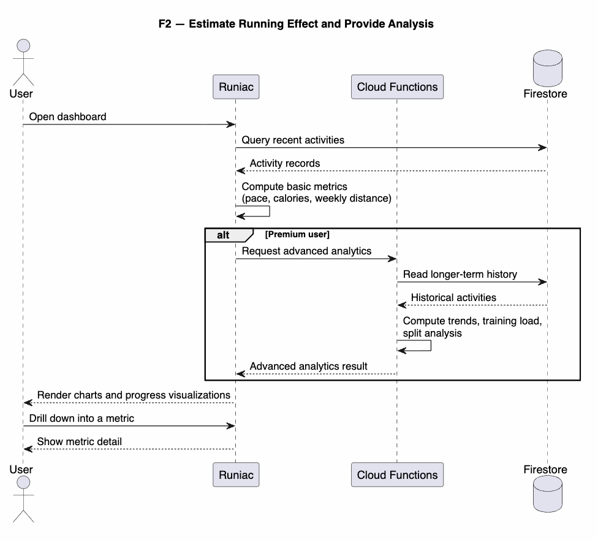

#### 5.3.4 Activity Diagram

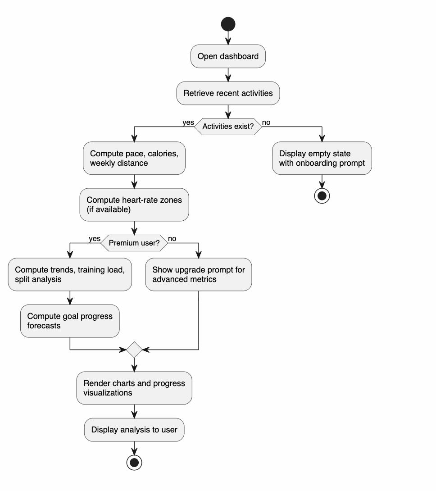

### 5.4 F3 – Supply Running Advice and Schedule a Running Plan

#### 5.4.1 Use Case Diagram

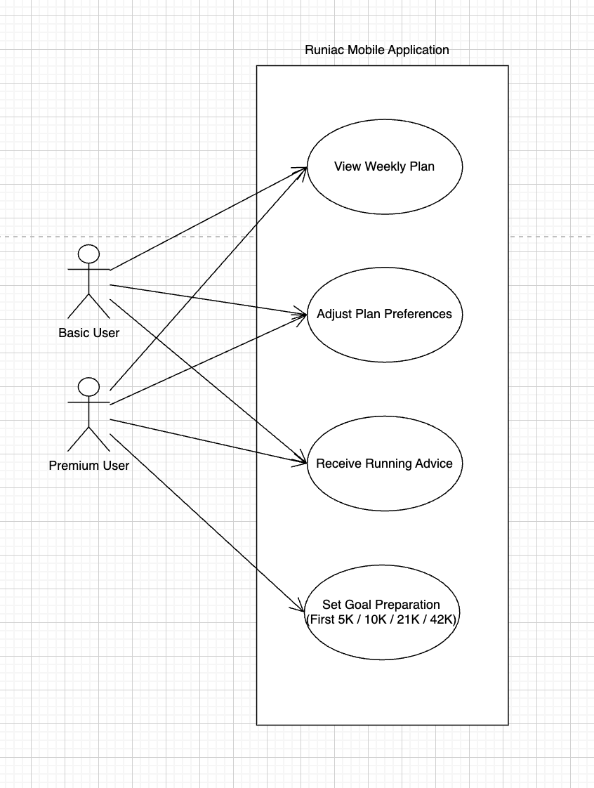

#### 5.4.2 Use Case Description

| Use Case ID | UC-F3 |
| --- | --- |
| Use Case Name | Supply Running Advice and Schedule a Running Plan |
| Primary Actor | Basic User, Premium User |
| Supporting Actors | Cloud Functions (Backend), Firestore |
| Stakeholders | Runiac System, Trainer / Medical Advisor (advisory role) |
| Preconditions | The user has completed onboarding and provided fitness, experience, goals, and health-related information. At least baseline activity data exists, or onboarding data is available as a fallback. |
| Trigger | The user accesses the “Training Plan” tab; or the system performs a scheduled weekly plan refresh; or a new activity triggers an adaptive plan update. |
| Main Flow | 1. The user opens the training plan view. 2. The system retrieves the user’s onboarding profile, recent activity history, current fitness level, and stated goals. 3. The system applies plan-generation logic to determine an appropriate weekly schedule, including running days, rest days, and target distance or duration per session. 4. For Premium users with Goal Preparation Mode, the system additionally generates a milestone-oriented plan such as First 5K, 10K, 21K, and 42K. 5. The system displays the weekly plan along with running advice, including recommended pace ranges and notes on safe progression. 6. The user reviews the plan and confirms or adjusts preferences. |
| Alternate Flow | 3a. If recent activity indicates overtraining risk (e.g., consecutive high-intensity runs without rest), the system inserts additional rest days and surfaces a warning. 4a. If the user is on the Free tier, Goal Preparation Mode is hidden and replaced with the standard weekly plan. 6a. If the user manually overrides the plan, the system records the override and adjusts subsequent recommendations accordingly. |
| Postconditions | A current weekly running plan is stored in Firestore and made available for reminders (F4), streak tracking (F6), and XP plan-adherence bonuses (F9). |

#### 5.4.3 Sequence Diagram

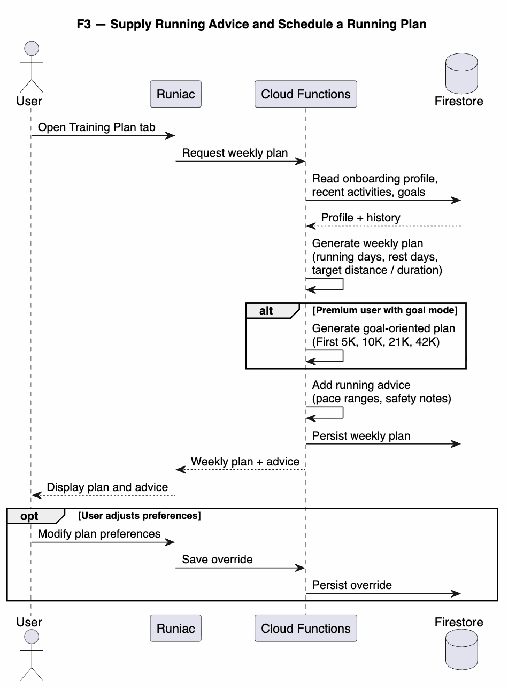

#### 5.4.4 Activity Diagram

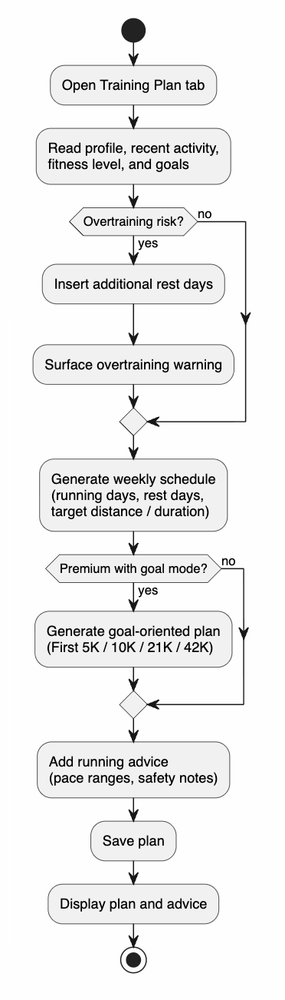

### 5.5 F4 – Remind User of Running or Rest

#### 5.5.1 Use Case Diagram

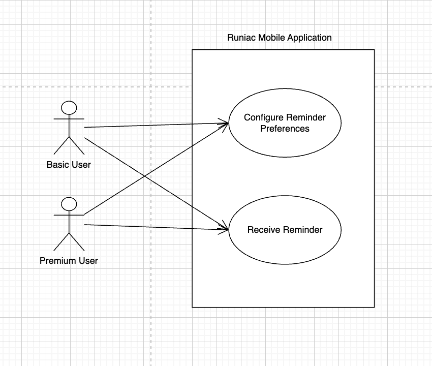

#### 5.5.2 Use Case Description

| Use Case ID | UC-F4 |
| --- | --- |
| Use Case Name | Remind User of Running or Rest |
| Primary Actor | Basic User, Premium User |
| Supporting Actors | Firebase Cloud Messaging, Cloud Functions (Backend), Firestore |
| Stakeholders | Runiac System |
| Preconditions | The user has granted notification permissions. A running plan exists (from UC-F3). The user’s reminder preferences are configured (default: enabled). |
| Trigger | A scheduled Cloud Function evaluates user state at predefined intervals; or a triggering event such as a missed planned session, an at-risk streak, or sustained inactivity occurs. |
| Main Flow | 1. The scheduled Cloud Function periodically evaluates each user’s plan adherence, recent activity, and streak status. 2. If a planned run is upcoming, the function schedules a running reminder. 3. If the user has missed a planned session, the function schedules a missed-session reminder. 4. If the user’s streak is at risk of breaking, the function schedules a streak-risk reminder. 5. If recent activity indicates overtraining, the function schedules a rest reminder. 6. Firebase Cloud Messaging delivers the notification to the user’s device at the scheduled time. 7. The user receives the reminder and taps it to open the relevant in-app screen or dismisses it. |
| Alternate Flow | NIL |
| Postconditions | A notification has been delivered (or queued for delivery). Reminder delivery and user response are logged for tuning future reminder cadence. |

#### 5.5.3 Sequence Diagram

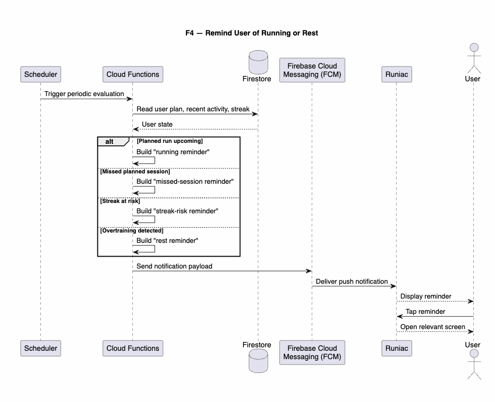

#### 5.5.4 Activity Diagram

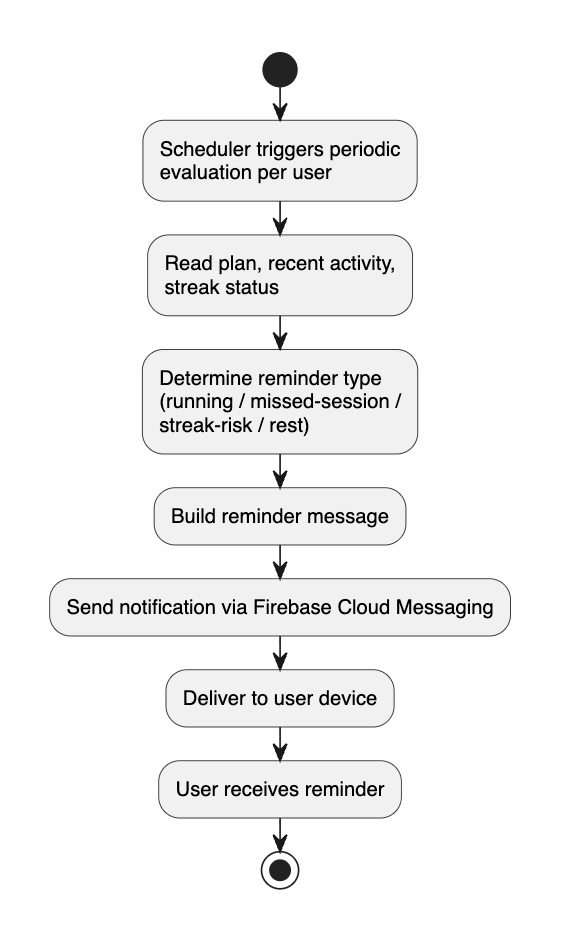

### 5.6 F5 – Connect with social media and Initiate Competitions

#### 5.6.1 Use Case Diagram

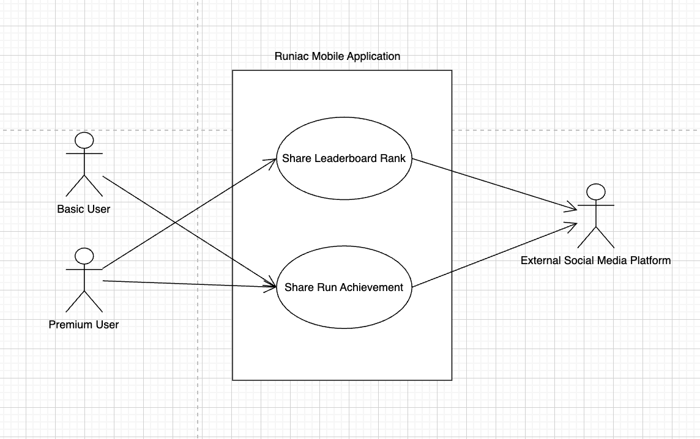

#### 5.6.2 Use Case Description

| Use Case ID | UC-F5 |
| --- | --- |
| Use Case Name | Connect with social media and Initiate Competitions |
| Primary Actor | Basic User, Premium User |
| Supporting Actors | Operating System Share Sheet, External Social Media Platforms, Firestore |
| Stakeholders | Runiac System |
| Preconditions | The user has completed at least one activity. The user has granted any required sharing permissions. |
| Trigger | The user taps the “Share” button on a run history, leaderboard rank screen, achievement card, or level-up notification. |
| Main Flow | 1. The user selects a shareable item (run history, leaderboard rank, achievement card, or level badge). 2. The system generates a sharing card containing the selected information, applying privacy masking where appropriate. 3. For Premium users, the system applies premium visual templates and additional shareable item types (territorial achievements, level badges, animated cards). 4. The system invokes the operating system share sheet. 5. The user selects a target platform (Instagram, X/Twitter, WhatsApp, Facebook, etc.) or copies the content. 6. The user confirms posting on the external platform. 7. The system records the share event for engagement analytics. |
| Alternate Flow | 2a. If the share target involves location data, the system prompts the user to confirm before exposing route information externally. 3a. If the user is on the Free tier, only basic sharing card templates are available. 5a. If the user cancels the share dialog, no external action occurs. |
| Postconditions | The selected information has been shared to an external platform (or canceled). No automatic posting occurs without user confirmation. |

#### 5.6.3 Sequence Diagram

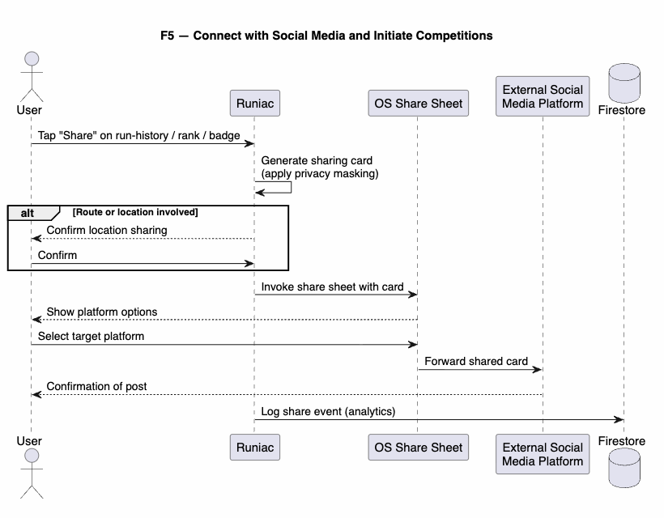

#### 5.6.4 Activity Diagram

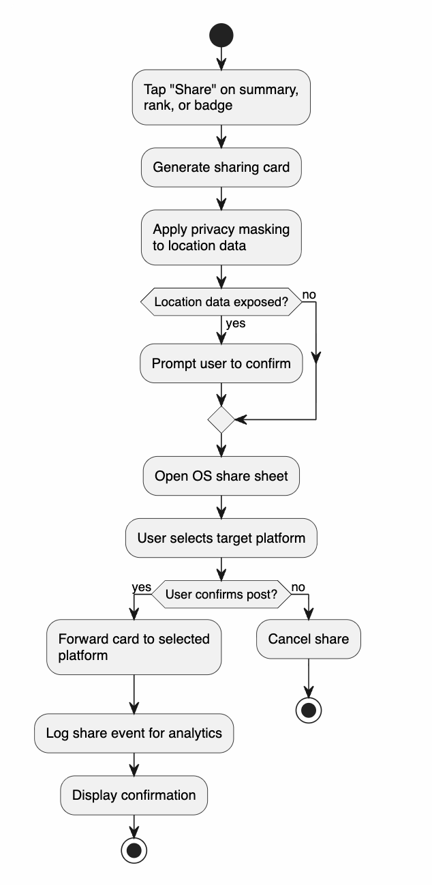

### 5.7 F6 – Streak and Consistency Tracking

#### 5.7.1 Use Case Diagram

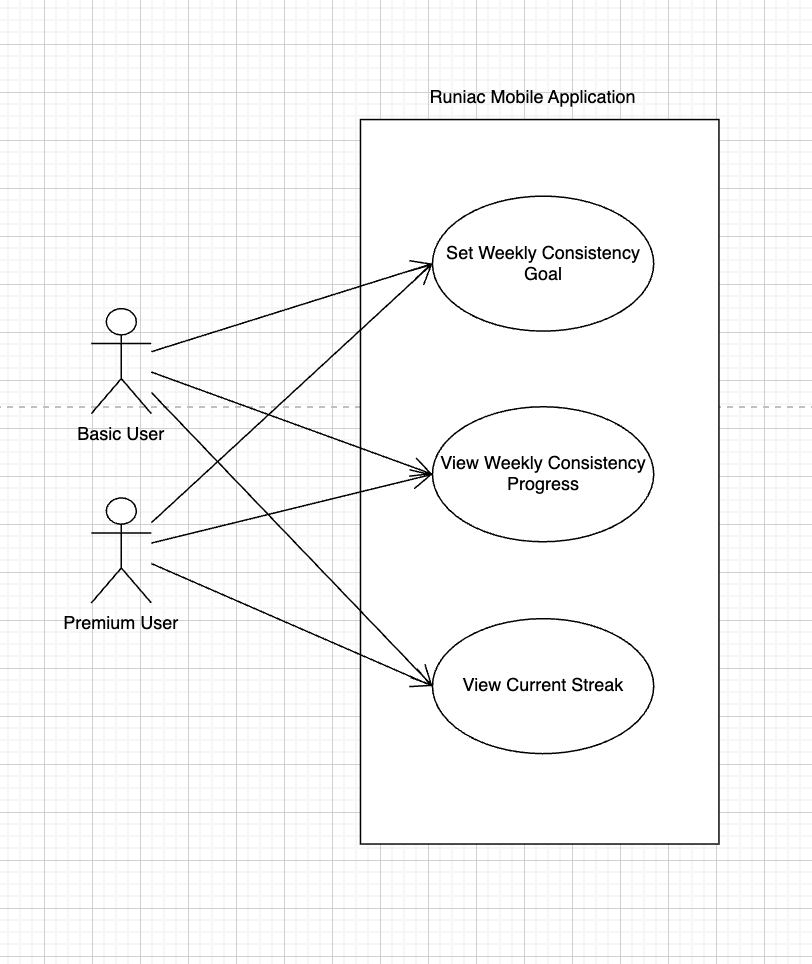

#### 5.7.2 Use Case Description

| Use Case ID | UC-F6 |
| --- | --- |
| Use Case Name | Streak and Consistency Tracking |
| Primary Actor | Basic User, Premium User |
| Supporting Actors | Cloud Functions (Backend), Firestore |
| Stakeholders | Runiac System |
| Preconditions | The user has at least one validated activity record. |
| Trigger | A new activity is uploaded; or the user opens the streak/consistency view; or a scheduled function performs daily streak evaluation. |
| Main Flow | 1. Upon successful activity upload, a Cloud Function evaluates whether the activity satisfies streak continuation criteria (minimum distance, plan adherence, and within the streak window). 2. If criteria are met, the user’s streak counter is incremented and weekly consistency progress is updated. 3. If the activity satisfies a weekly consistency goal (e.g., three runs in the week), a consistency bonus is recorded. 4. The user opens the streak view and observes current streak length, longest streak, and weekly consistency progress represented through clear visual indicators. 5. The system surfaces motivational feedback such as “5-day streak — keep it going”. |
| Alternate Flow | 1a. If no qualifying activity is recorded within the streak window, the streak resets on the next evaluation cycle and the user is notified. 1b. If the streak is at risk (no activity for most of the day before window expiry), the system triggers a streak-risk reminder via UC-F4. |
| Postconditions | Streak count, longest streak, and weekly consistency progress are updated in Firestore. Updates feed XP calculation in F9 (streak bonus, consistency bonus) and may trigger reminders in F4. |

#### 5.7.3 Sequence Diagram

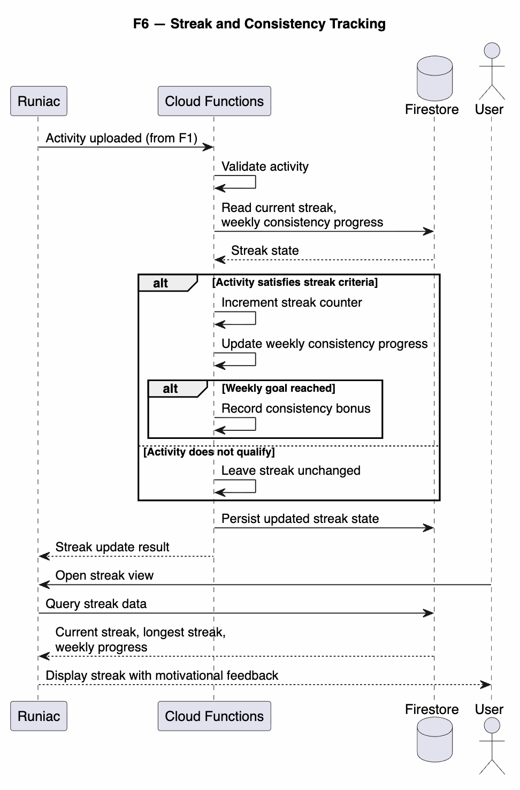

#### 5.7.4 Activity Diagram

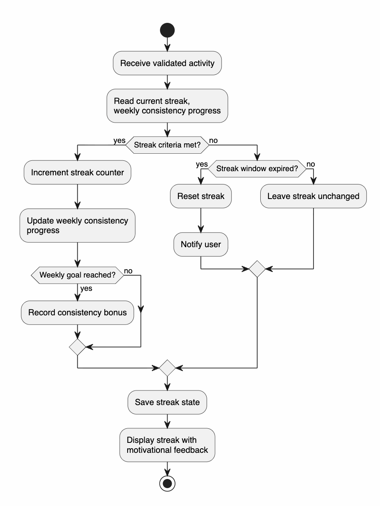

### 5.8 F7 – Community-Driven Route Sharing

#### 5.8.1 Use Case Diagram

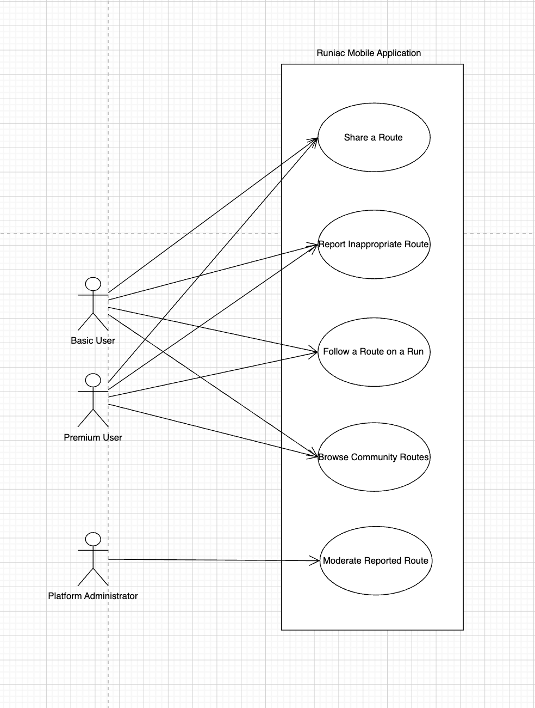

#### 5.8.2 Use Case Description

| Use Case ID | UC-F7 |
| --- | --- |
| Use Case Name | Community-Driven Route Sharing |
| Primary Actor | Basic User, Premium User |
| Supporting Actors | Mapping Service (Google Maps or Mapbox), Firestore, Cloud Functions, Platform Administrator (moderation) |
| Stakeholders | Runiac System, Other Runiac Users |
| Preconditions | The user has at least one completed run with a recorded route, or wishes to browse community routes. |
| Trigger | The user taps “Share This Route” on a completed activity, or opens the “Community Routes” map screen. |
| Main Flow | 1. The user selects an activity and chooses “Share This Route”. 2. The system applies privacy masking to the start and end points (privacy zones) and removes any sensitive metadata. 3. The user adds an optional title, description, and tags (e.g., “beginner-friendly”, “park”). 4. The user confirms sharing. 5. The route is uploaded to Firestore and indexed geospatially via GeoFlutterFire. 6. Other users open the Community Routes map and the system displays nearby shared routes based on their current location and selected filters. 7. A user selects a route to view details, elevation profile, and community ratings. 8. The user can save or follow the route during their next run. |
| Alternate Flow | 6a. If no community routes exist within the visible map area, the system surfaces an empty state and suggests expanding the search radius. 7a. For Premium users, advanced filters (distance range, elevation, time of day) and saved route collections are available. 8a. If a route is reported as unsafe or inappropriate, the Platform Administrator reviews the report and may remove the route. |
| Postconditions | The shared route is persisted with privacy protections applied. Community routes are queryable by other users. Reported routes are flagged for moderation review. |

#### 5.8.3 Sequence Diagram

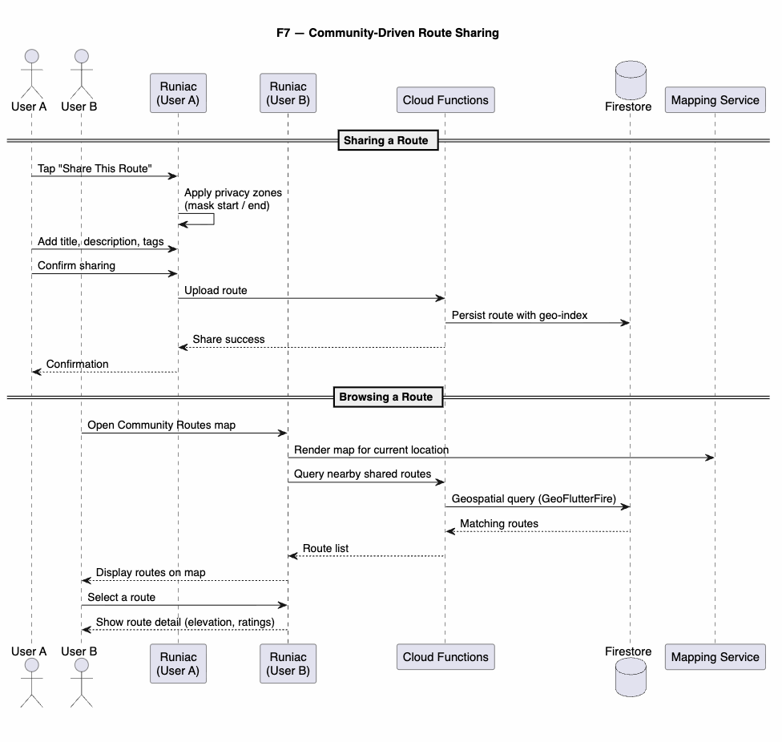

#### 5.8.4 Activity Diagram

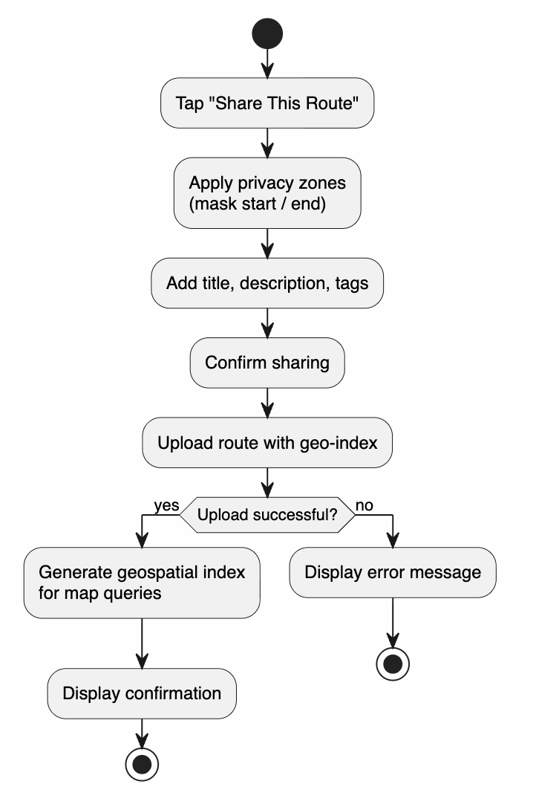
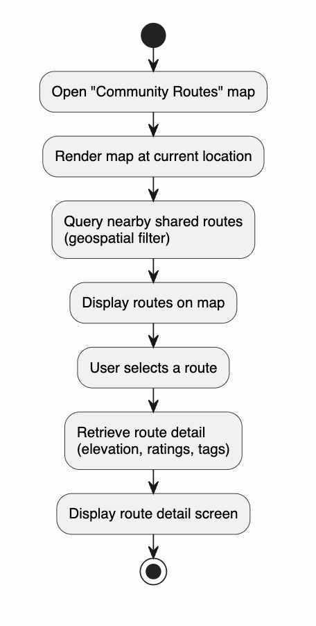

### 5.9 F8 – Level-Based Territorial Leaderboard

#### 5.9.1 Use Case Diagram

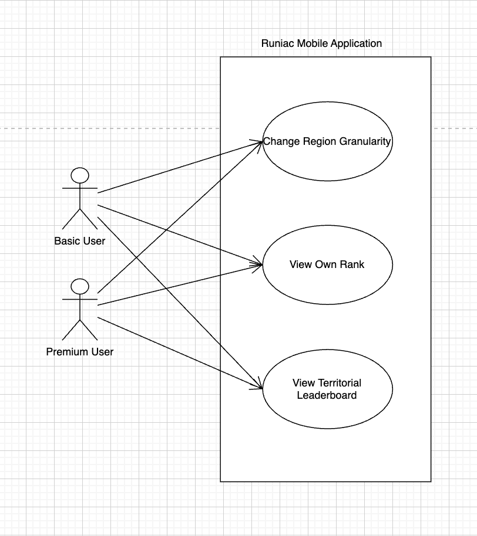

#### 5.9.2 Use Case Description

| Use Case ID | UC-F8 |
| --- | --- |
| Use Case Name | View and Participate in Level-Based Territorial Leaderboard |
| Primary Actor | Basic User, Premium User |
| Supporting Actors | Cloud Functions (Backend), Firestore, Mapping Service |
| Stakeholders | Runiac System |
| Preconditions | The user has accumulated XP through UC-F9 and has at least one validated activity within a recognized geographic region. |
| Trigger | The user opens the “Leaderboard” screen, or zooms into a region on the map view, or views the weekly/monthly leaderboard summary. |
| Main Flow | 1. The user opens the leaderboard view. 2. The system identifies the user’s current geographic context (country, city, district) and current level division based on accumulated XP. 3. The system queries pre-aggregated leaderboard records from Firestore for the relevant region and level division. 4. The system displays rankings using weekly XP or monthly XP as the score. 5. The user can zoom in or out on the map; the leaderboard dynamically updates to show rankings at the corresponding regional granularity. 6. The user can view their own rank, top users in their division, and surrounding ranks. 7. Scheduled Cloud Functions periodically recompute leaderboard aggregations based on validated activity data. |
| Alternate Flow | 2a. If the user has insufficient activity to be ranked, the system displays the leaderboard for their region and level division with a message indicating their pending status. |
| Postconditions | Pre-aggregated leaderboard records reflect the latest validated activity. The user has visibility into their rank within a fair, level-matched group. No XP or ranking advantage is granted to Premium users. |

#### 5.9.3 Sequence Diagram

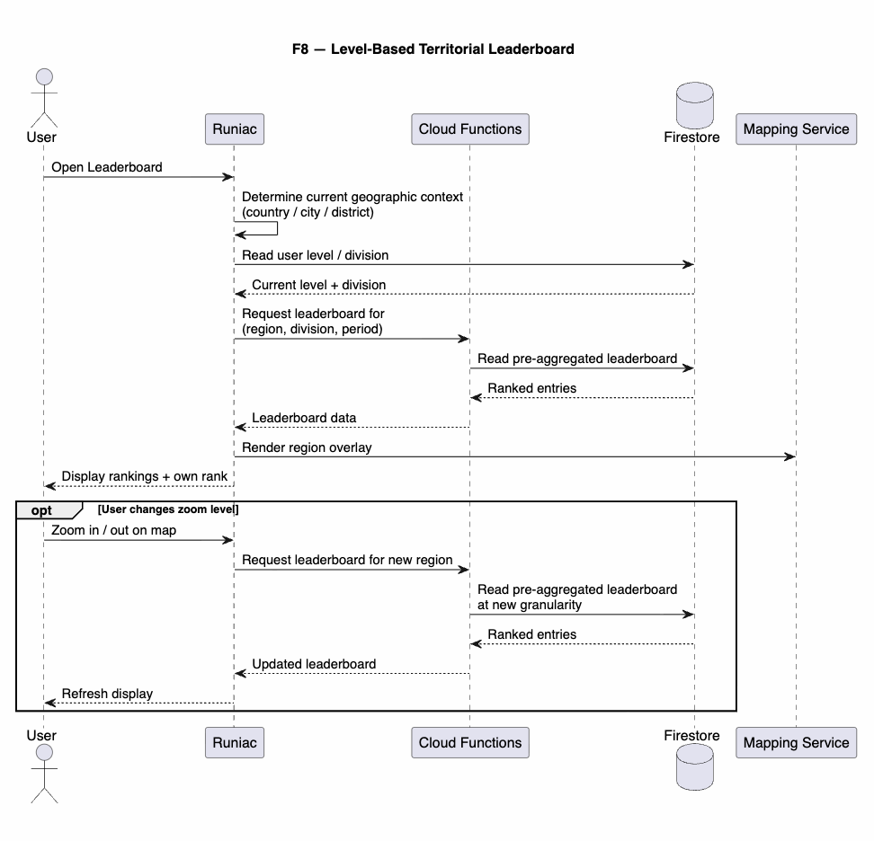

#### 5.9.4 Activity Diagram

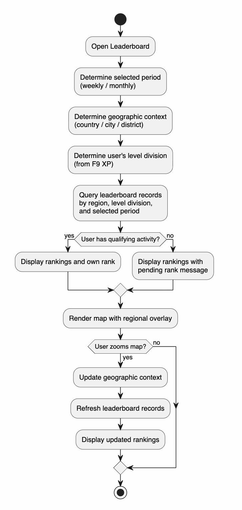

### 5.10 F9 – Runner Level and XP Progression System

#### 5.10.1 Use Case Diagram

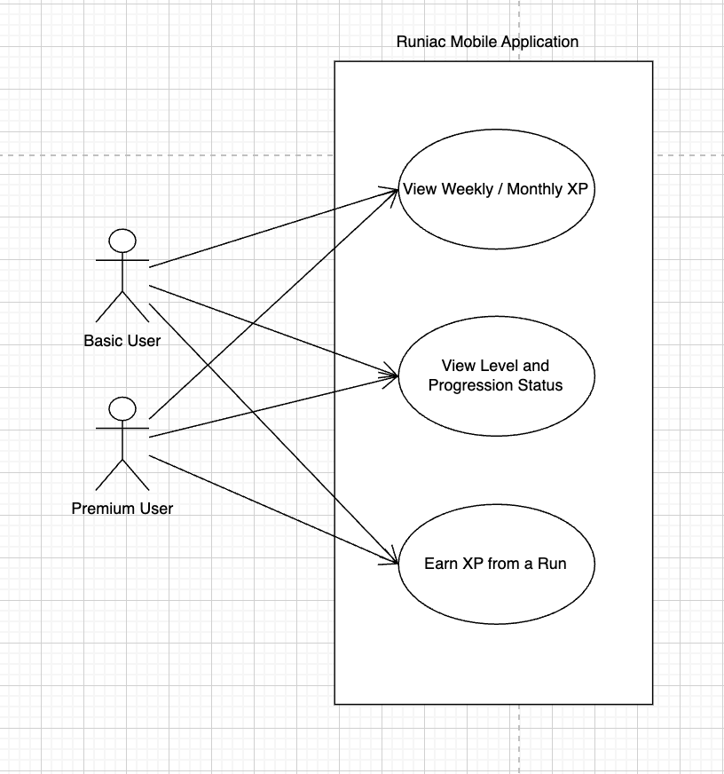

#### 5.10.2 Use Case Description

| Use Case ID | UC-F9 |
| --- | --- |
| Use Case Name | Earn XP and Progress through Runner Levels |
| Primary Actor | Basic User, Premium User |
| Supporting Actors | Cloud Functions (Backend), Firestore |
| Stakeholders | Runiac System |
| Preconditions | The user has at least one validated activity record produced by UC-F1. |
| Trigger | A validated activity is uploaded and accepted by server-side validation. |
| Main Flow | 1. A Cloud Function is triggered upon successful activity upload and validation. 2. The function calculates base XP from activity completion and recorded distance. 3. The function checks whether the activity adhered to the system-generated weekly plan (UC-F3) and awards a plan-adherence bonus if applicable. 4. The function checks streak status (UC-F6) and awards a streak bonus if the activity continues a streak. 5. The function checks weekly consistency progress and awards a consistency bonus if a weekly goal is reached. 6. The function updates the user’s total XP, weekly XP, and monthly XP records. 7. If the new total XP crosses a level threshold, the user’s level and league division are updated and a level-up event is generated. 8. The user opens the progression view and observes current level, XP toward next level, recent XP-earning activities, and weekly/monthly XP totals. 9. The system optionally displays a level-up celebration on first view after the level change. |
| Alternate Flow | 2a. If the activity fails validation (implausible pace, GPS spoofing, or below minimum thresholds), no XP is awarded and the activity is excluded from progression. 7a. If the user’s level changes, the user’s leaderboard division (used by UC-F8) is updated accordingly on the next aggregation cycle. |
| Postconditions | The user’s total XP, weekly XP, monthly XP, level, and league division are updated in Firestore. Progression data is consumed by UC-F8 for fair leaderboard division assignment. |

#### 5.10.3 Sequence Diagram

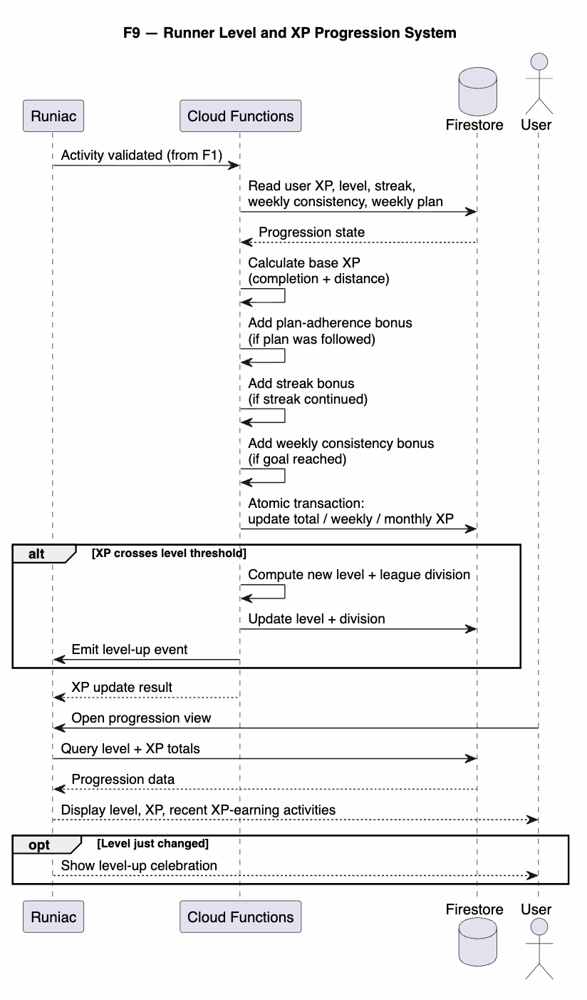

#### 5.10.4 Activity Diagram

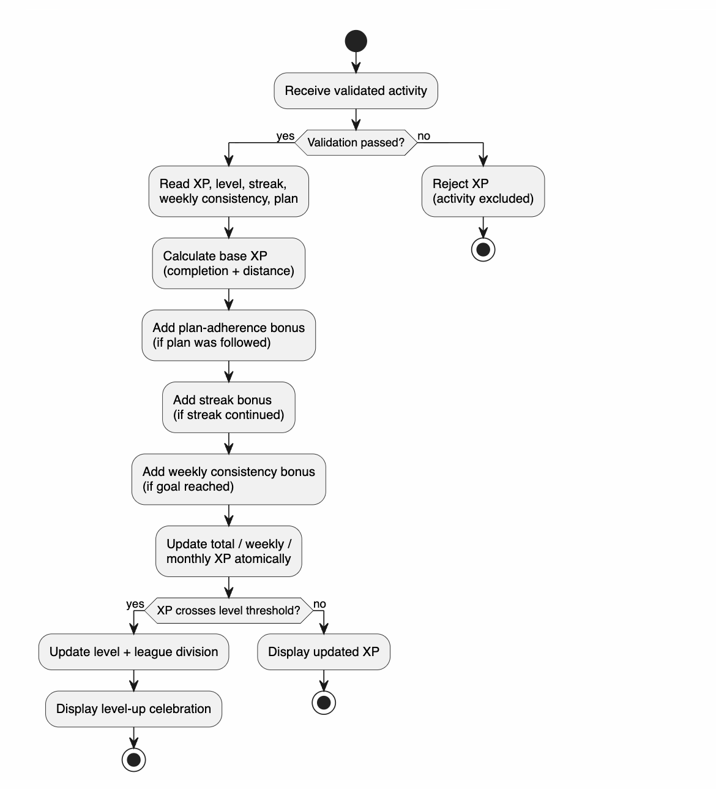

### 5.11 F10 – AI-Assisted Post-Run Summary

#### 5.11.1 Use Case Diagram

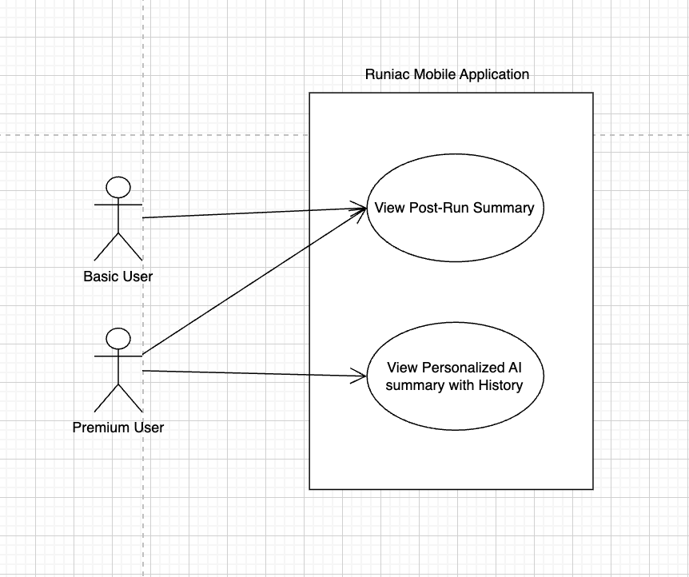

#### 5.11.2 Use Case Description

| Use Case ID | UC-F10 |
| --- | --- |
| Use Case Name | Generate AI-Assisted Post-Run Summary |
| Primary Actor | Basic User, Premium User |
| Supporting Actors | Cloud Functions (Backend), Firestore, External LLM Provider (Premium tier only) |
| Stakeholders | Runiac System |
| Preconditions | A validated activity record exists. Derived metrics from UC-F2 are available. The user’s recent activity history is accessible. |
| Trigger | An activity is successfully uploaded and validated; or the user opens the post-run summary screen for an existing activity. |
| Main Flow | 1. Upon successful activity validation, a Cloud Function prepares a structured input containing the activity’s key metrics (distance, pace, duration, calories, plan adherence) and recent comparison context (previous runs, current streak, consistency progress). 2. For Free-tier users, the function generates a rule-based summary using predefined templates that translate metrics into beginner-friendly diary-style explanations. 3. For Premium-tier users, the function calls the external LLM provider with a structured prompt that produces a more personalized summary with historical comparison and pattern-based feedback. 4. The function applies safety filters to ensure the output avoids medical diagnosis, injury prediction, or unsupported health claims. 5. The summary is stored alongside the activity record in Firestore. 6. The user opens the post-run summary and reviews the diary-style explanation, highlighted positives, and supportive suggestions for the next run. 7. The user may optionally share the summary via UC-F5. |
| Alternate Flow | 3a. If the LLM provider is unavailable, the system falls back to the rule-based template and notes that the enhanced summary will be regenerated when the service recovers. 4a. If the safety filter detects unsafe or out-of-scope content, the function regenerates the summary with stricter constraints or falls back to the template version. 6a. If the user views the summary multiple times, the cached version is served to avoid repeat LLM calls (per risk R19). |
| Postconditions | A post-run summary is persisted with the activity. The summary is presented in a beginner-friendly tone and avoids prescriptive medical advice. LLM usage costs are bounded by caching and tier-based access. |

#### 5.11.3 Sequence Diagram

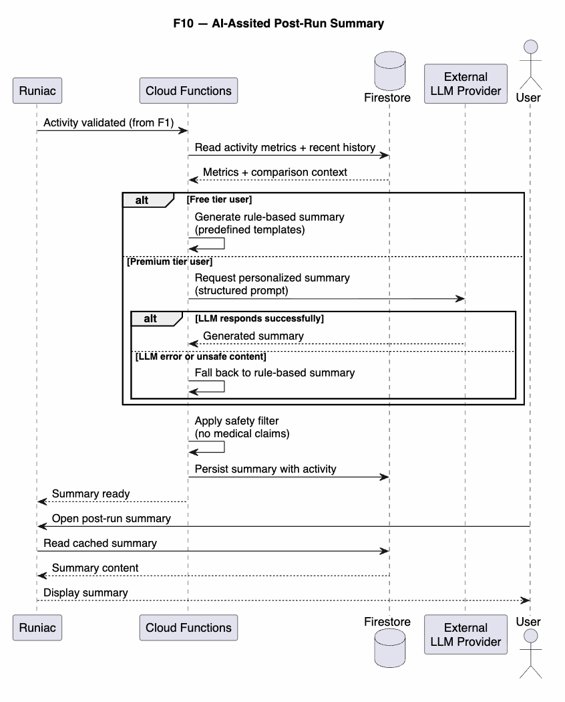

#### 5.11.4 Activity Diagram

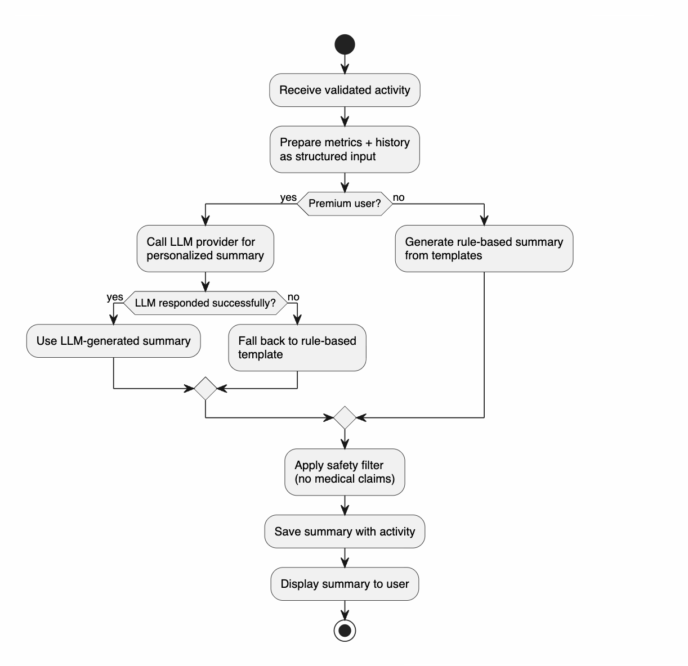

## 6. Non-functional Requirements

Introduction

Besides implementing the main features, Runiac must also meet several quality expectations. Since the application handles GPS routes, running records, health-related onboarding data, and user progression records, the system needs to be secure, reliable, responsive, and safe for beginner users.

### 6.1 Security and Authentication

Runiac shall provide secure user authentication through trusted third-party identity providers, primarily Google Sign-In and Apple Sign-In, using Firebase Authentication. User credentials shall not be stored directly by the Runiac mobile client. Authentication shall rely on secure token-based mechanisms so that only verified users can access protected application features.

Access to user-specific resources, including running history, training plans, XP records, leaderboard participation data, health profile information, and account settings, shall be restricted to authenticated users and authorized system components only. Firestore security rules and backend access controls shall be used to prevent unauthorized access to private user data.

This requirement will be verified through authentication test cases, including successful login, failed login, expired session handling, unauthorized access attempts, and access control checks for user-specific records.

### 6.2 Privacy, Health Data Protection and PDPA Compliance

Runiac shall protect all personal, health-related, and location-based data in accordance with relevant data protection principles, including Singapore’s Personal Data Protection Act (PDPA). The system shall only collect data that is necessary for account management, running analysis, training plan generation, reminder scheduling, XP calculation, leaderboard participation, route sharing, and post-run summaries.

During onboarding, users shall be informed about the types of data collected, including running experience, fitness level, personal goals, injury history, relevant health conditions, and location data. Sensitive information such as injury history, health conditions, GPS routes, and private activity records shall not be publicly displayed or shared with other users unless the user explicitly chooses to share selected information.

For route sharing and leaderboard-related features, the system shall apply privacy protection measures where appropriate. For example, route start and end points near sensitive locations may be masked to reduce the risk of exposing home, workplace, or routine movement patterns. User profiles shall be private by default, and social or public sharing features shall require user confirmation before any data is shared externally.

This requirement will be verified through privacy review, consent-flow inspection, access-control testing, and test cases that confirm sensitive health and location data are not exposed through public screens or shared features without user action.

### 6.3 Cross-platform Compatibility and Device Responsiveness

Runiac shall operate on both iOS and Android devices using a single Flutter codebase. Core functions, including account registration, GPS-based run tracking, activity history, running plan viewing, reminders, streak tracking, route sharing, leaderboard viewing, XP progression, and post-run summaries, shall remain available on both platforms.

The user interface shall adapt to common mobile screen sizes and resolutions without layout breakage, unreadable text, overlapping components, or inaccessible buttons. Since the application targets beginner runners, the interface should remain clear and usable across different devices rather than requiring users to adjust to platform-specific design differences.

This requirement will be verified by testing the prototype on at least one iOS device and one Android device. Key screens shall also be reviewed under different screen sizes to confirm that the layout remains responsive and usable.

### 6.4 Data Storage, Backup and Data Integrity

Runiac shall store critical user data in a persistent cloud-based database. This includes user profiles, onboarding health information, running activities, GPS routes, training plans, streak records, XP progression data, leaderboard records, reminder settings, and post-run summaries.

Completed activity data shall be synchronized to Firestore after the run is completed, while temporary local storage shall be used during active running sessions to prevent data loss during unstable connectivity. Backup or redundancy mechanisms provided by the cloud platform shall be used to reduce the risk of permanent data loss.

Data used for XP calculation and leaderboard ranking shall be validated on the server side before it affects user progression or public rankings. The system shall reject or flag implausible activity data, such as unrealistic speed, sudden GPS jumps, incomplete route records, or activity records that do not meet minimum validity conditions.

This requirement will be verified through database consistency checks, activity upload test cases, invalid activity submission tests, and review of server-side validation logic.

### 6.5 Performance and Responsiveness

Runiac shall provide stable and responsive performance during normal usage. Under standard network conditions, common read operations such as loading the dashboard, viewing running history, accessing route information, opening leaderboard rankings, and displaying post-run summaries should normally complete within 2 to 3 seconds.

After a run is completed, activity data should be synchronized with the backend within 5 to 10 seconds under stable network conditions. XP updates, streak updates, and post-run summaries should be generated shortly after the activity is successfully uploaded and processed.

For leaderboard-related features, rankings shall be served from pre-aggregated records where possible rather than recalculated on every client request. This reduces loading time, improves responsiveness, and helps control Firestore read costs.

This requirement will be verified through performance testing of key user flows, including dashboard loading, run completion synchronization, leaderboard loading, and post-run summary generation.

## 7. Project Development Methodology

Choosing a suitable development methodology is important because the team has a fixed academic deadline, limited manpower, and features that may need improvement after user feedback. For Runiac, the methodology must support both structured planning and iterative refinement.

### 7.1 Comparison of Methodologies

Four methodological options were evaluated. Each was assessed on its general strengths and weaknesses, and on its specific fit for the Runiac project.

| Methodology | Strengths | Weaknesses | Fit for Runiac |
| --- | --- | --- | --- |
| Waterfall | Clear sequential phases. Strong upfront documentation. Easy to plan when requirements are stable. | Inflexible to change. Late discovery of issues. Poor fit when the product depends on user feedback. | Poor. Runiac's gamification mechanics require iterative tuning based on user response. |
| Scrum | Iterative sprints with frequent feedback. Built-in ceremonies for planning, review, and retrospective. Strong support for evolving requirements. | Requires discipline. Overhead in ceremonies for very small teams. Velocity unstable in early sprints. | Strong. Matches Runiac's need for iterative refinement of behavior-change features. |
| Kanban | Continuous flow with no fixed iteration boundaries. Visual work-in-progress limits. Low ceremony overhead. | Less structure for milestone planning. Harder to align with academic deadlines. Weaker on coordinated releases. | Moderate. Good for ongoing maintenance, but lacks the milestone structure required for an academic project. |
| Hybrid (Scrumban) | Combines Scrum cadence with Kanban flow. Allows teams to adopt practices selectively. | Risk of inconsistent application. Requires team maturity to balance the two. | Possible. Could be considered if Scrum overhead proves excessive in retrospectives. |

### 7.2 Selected Methodology - Scrum

Our team has selected Scrum as the primary development methodology for Runiac. Scrum is suitable for this project because Runiac is not only a technical running tracker, but also a behavior-change application that depends on user engagement, motivation, and iterative refinement. Features such as streak tracking, XP progression, and the level-based territorial leaderboard may need to be adjusted based on testing and user feedback. Therefore, an iterative methodology is more appropriate than a fully linear approach.

Scrum was selected over Waterfall and Kanban for three main reasons. First, Scrum supports incremental development, allowing the team to build and test the MVP before expanding into Phase 2 features. Second, Scrum provides a structured sprint cadence that fits the fixed academic timeline and assessment milestones. Third, Scrum encourages regular communication, review, and adaptation, which is important for our team working across frontend, backend, database, UI/UX, testing, and documentation tasks.

### 7.3 Scrum Implementation for Runiac

Runiac will apply Scrum as an iterative and incremental development approach. While Section 7.2 explains why Scrum was selected, this section explains how Scrum will be applied in practice during the project.

#### 7.3.1 Sprint Structure

The project will be divided into multiple sprints, with each sprint focusing on a clear set of deliverables. The MVP Demo Build will be implemented first, covering F1, F2, F3, F4, F6 and F9. These features form the core behavior change workflow of Runiac, including running activity tracking, running analysis, training plan generation, reminders, streak tracking, and XP progression. Phase 2 features, including F5, F7, F8, and F10, will be developed after the MVP foundation is stable.

| Sprint | Scope | Focus | Feature Covered |
| --- | --- | --- | --- |
| Sprint 0 | Project Setup | Development environment and project management setup | Flutter, Firebase, GitHub, Jira setup |
| Sprint 1 | MVP Foundation | Basic user flow and run tracking prototype | Authentication, user profile, F1 |
| Sprint 2 | MVP Core Support | Running analysis, training guidance, and reminders | F2, F3, F4 |
| Sprint 3 | MVP Habit and Progression (XP) | Habit formation and visible progression (XP) mechanics | F6, F9 |
| MVP Integration | MVP Stabilization | Integration, testing, and refinement of MVP features | F1, F2, F3, F4, F6, F9 |
| Sprint 4 | Phase 2 Expansion | Social sharing and community route features | F5, F7 |
| Sprint 5 | Phase 2 Expansion | Advanced gamification and post run feedback | F8, F10 |
| Final Integration | Final Delivery | Full system testing, documentation, and final preparation | All features |

#### 7.3.2 Scrum Tracking Using Jira

Jira will be used as the main Scrum project management tool for the Runiac project. The team will use Jira to manage the product backlog, sprint backlog, task assignment, and progress tracking. The product backlog will include Runiac’s features from F1 to F10, user stories, documentation tasks, testing tasks, UI/UX tasks, and technical implementation tasks. At the beginning of each sprint, selected backlog items will be moved into the sprint backlog and broken down into smaller tasks. These tasks will then be assigned to individual team members based on their project roles and expertise.

### 7.4 Project Timeline

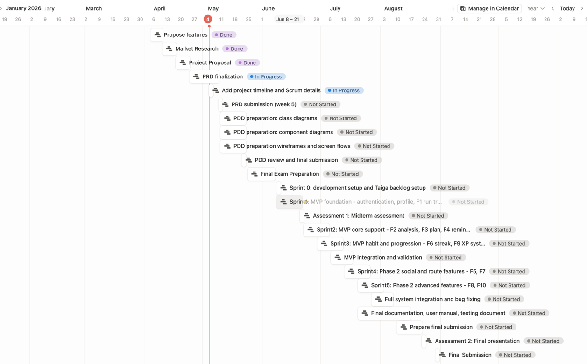

| No. | Task / Milestone | Start Date | End Date | Purpose / Deliverable |
| --- | --- | --- | --- | --- |
| 1 | Propose features | 4 Apr 2026 | 10 Apr 2026 | Identify and propose the initial feature set for the Runiac project. |
| 2 | Market Research | 10 Apr 2026 | 17 Apr 2026 | Review existing running and fitness applications, compare competitors, and identify market gaps. |
| 3 | Project Proposal | 17 Apr 2026 | 24 Apr 2026 | Prepare and complete the initial project proposal based on the selected idea and market research. |
| 4 | PRD Finalization | 24 Apr 2026 | 9 May 2026 | Finalize the Project Requirements Document, including scope, features, business model, methodology, platform, database, architecture, and risks. |
| 5 | Add Project Timeline and Scrum Details | 4 May 2026 | 6 May 2026 | Add the project timeline, sprint plan, and Scrum tracking details into the PRD. |
| 6 | PRD Submission (Week 5) | 9 May 2026 | 9 May 2026 | Submit the finalized PRD for the Week 5 deliverable. |
| 7 | PDD Preparation: Class Diagrams | 10 May 2026 | 23 May 2026 | Prepare class diagrams for the Project Design Document. |
| 8 | PDD Preparation: Component Diagrams | 10 May 2026 | 23 May 2026 | Prepare component diagrams showing the structure of the system and relationships between major components. |
| 9 | PDD Preparation: Wireframes and Screen Flows | 10 May 2026 | 23 May 2026 | Prepare UI wireframes and screen flow diagrams for the mobile application. |
| 10 | PDD Review and Final Submission | 21 May 2026 | 23 May 2026 | Review, refine, and submit the Project Design Document. |
| 11 | Final Exam Preparation | 24 May 2026 | 7 Jun 2026 | Allocate time for final examination preparation while maintaining project continuity. |
| 12 | Sprint 0: Development Setup and Jira Backlog Setup | 8 Jun 2026 | 9 Jun 2026 | Set up the development environment, version control, Firebase project, and project management backlog. |
| 13 | Sprint 1: MVP Foundation - Authentication, Profile, F1 Run Tracking | 8 Jun 2026 | 21 Jun 2026 | Implement authentication, user profile setup, onboarding foundation, and F1 running activity tracking. |
| 14 | Assessment 1: Midterm Assessment | 20 Jun 2026 | 20 Jun 2026 | Present or submit the midterm assessment deliverable. |
| 15 | Sprint 2: MVP Core Support - F2 Analysis, F3 Plan, F4 Reminders | 22 Jun 2026 | 5 Jul 2026 | Implement running analysis, basic plan generation, and reminder features. |
| 16 | Sprint 3: MVP Habit and Progression - F6 Streak, F9 XP System | 29 Jun 2026 | 12 Jul 2026 | Implement streak tracking, consistency progress, XP calculation, and level progression. |
| 17 | MVP Integration and Validation | 6 Jul 2026 | 17 Jul 2026 | Integrate MVP features, test main workflows, validate data flow, and fix major issues. |
| 18 | Sprint 4: Phase 2 Social and Route Features - F5, F7 | 13 Jul 2026 | 26 Jul 2026 | Implement social sharing and community-driven route sharing features. |
| 19 | Sprint 5: Phase 2 Advanced Features - F8, F10 | 20 Jul 2026 | 2 Aug 2026 | Implement the level-based territorial leaderboard and AI-assisted post-run summary. |
| 20 | Full System Integration and Bug Fixing | 27 Jul 2026 | 7 Aug 2026 | Integrate all MVP and Phase 2 features, conduct bug fixing, and stabilize the full system. |
| 21 | Prepare Final Submission | 9 Aug 2026 | 22 Aug 2026 | Prepare final documentation, source code, testing evidence, demo materials, and submission package. |
| 22 | Assessment 2: Final Presentation | 22 Aug 2026 | 22 Aug 2026 | Deliver the final project presentation and demonstration. |
| 23 | Final Submission | 29 Aug 2026 | 29 Aug 2026 | Submit the final project deliverables. |

## 8. Operating System Platform

Runiac is intended for beginner runners using different types of smartphones, so the platform decision affects both accessibility and development effort. The team therefore considered whether to build the app natively for one platform, separately for both platforms, or through a cross-platform framework.

### 8.1 Comparison of Platform Approaches

| Platform Approach | Strengths | Weaknesses | Fit for Runiac |
| --- | --- | --- | --- |
| iOS only (native, Swift) | Best-in-class performance and platform integration. Strong Apple Watch and HealthKit support. Cleaner sensor APIs. | Excludes Android users, who represent the majority of the global market | Poor. Excludes a large share of the primary target user base. |
| Android only (native, Kotlin) | Largest global market share. Strong Google Maps and Fit integration. Open ecosystem. | Excludes iOS users, who are heavily represented in the target geography. Wearable integration is fragmented across vendors. | Poor. Excludes Apple Watch users in the secondary persona segment. |
| Native iOS + Android (parallel) | Highest-quality experience on both platforms. Full access to platform-specific features. | Doubles development effort. Requires two specialized developers, which is not feasible with a five-person team. | Poor. Resource cost is incompatible with the team size. |
| Cross-platform (Flutter) | Single codebase compiles to both iOS and Android. Strong rendering performance for animated UI. Mature ecosystem of map, GPS, and sensor packages. | Some platform-specific features require native plugins. Slightly larger app binaries. | Strong. Best balance of coverage and effort for a small team. |
| Cross-platform (React Native) | Large developer community. JavaScript skills transferable. Strong third-party library ecosystem. | Performance can suffer for animation-heavy or map-intensive UIs. Bridge overhead for native modules. | Moderate. Workable, but Flutter has the edge for map-rendering performance, which Runiac depends on heavily. |

### 8.2 Selected Approach - Cross-Platform with Flutter

Runiac will be developed as a cross-platform mobile application targeting both iOS and Android using Flutter.

Supporting both platforms is essential because the application targets beginner users, who are highly sensitive to barriers to entry. Restricting the application to a single operating system would unnecessarily limit accessibility and reduce potential user adoption. By supporting both iOS and Android, the application ensures maximum reach and aligns with the goal of making running more accessible to new users.

Flutter was selected as the development framework for three primary reasons. First, it enables a single codebase for both iOS and Android, which is critical given the limited size of the development team. Maintaining separate native codebases would significantly increase development time and complexity. Second, Flutter provides strong rendering performance through its own graphics engine, making it well-suited for map-based visualization and interactive features such as the Level-Based Territorial Leaderboard and route sharing. Third, Flutter integrates seamlessly with Firebase services, which have been selected as the backend platform, reducing integration complexity and development risk.

React Native was considered as an alternative cross-platform solution but was not selected due to its reliance on a bridge-based architecture, which can introduce performance overhead in map-heavy and animation-intensive applications. Since Runiac depends heavily on real-time map rendering and interactive visual elements, Flutter provides a more suitable performance profile.

The team acknowledges that cross-platform development does not eliminate platform-specific challenges. Certain features, such as background location tracking and wearable integration, may require the use of native plugins. However, this trade-off is acceptable given the overall benefits of reduced development effort, faster iteration, and broader platform coverage.

### 8.3 Platform Considerations

While Flutter provides a unified development approach, several platform-specific considerations must still be addressed:

- Background Location Permissions

iOS and Android have different policies and requirements for background GPS tracking. Proper configuration and user permission handling will be required for both platforms.

- Push Notification Systems

iOS uses Apple Push Notification Service (APNs), while Android uses Firebase Cloud Messaging (FCM). These differences are abstracted through Firebase but still require platform-specific setup.

- Wearable Integration

iOS uses HealthKit, while Android uses Google Health Connect. Integration with these services is necessary to support optional wearable devices.

- Battery Optimization

Background activity and GPS tracking may be restricted differently across devices, especially on Android. The application must account for these differences to ensure consistent performance.

## 9. Database

The database is a key part of Runiac because many features depend on stored activity data, GPS routes, XP records, training plans, and leaderboard information. The selected database also needs to be realistic for our team to manage within the FYP period.

### 9.1 Comparison of Database Options

| Database | Strengths | Weaknesses | Fit for Runiac |
| --- | --- | --- | --- |
| MySQL | Mature relational database. Strong tooling and operational knowledge. Free and widely supported. | Requires a dedicated server and DBA effort. Geospatial support is functional but not best-in-class. | Moderate. Adds operational overhead disproportionate to team size. |
| PostgreSQL + PostGIS | Strongest open-source geospatial support. Mature SQL with rich query capabilities. Suitable for advanced geospatial queries and efficient regional data aggregation. | Requires server provisioning, backup management, and migration discipline. No built-in real-time sync. | Strong technically, but operationally heavy for a student team without DevOps support. |
| MongoDB | Flexible document model. Good for evolving schemas. Supports geospatial queries and adaptable schema for evolving leaderboard and activity data. | Real-time updates require additional infrastructure. Eventual consistency may affect leaderboard aggregation accuracy. | Moderate. No major advantage over Firestore for our use case. |
| Firebase Firestore | Serverless. Real-time updates out of the box. Built-in authentication, security rules, and offline support. First-class Flutter integration. Geospatial mapping and region-based data aggregation supported via GeoFlutterFire and Cloud Functions. | Per-document pricing model can become expensive at scale. Limited support for complex relational queries. Aggregation logic handled at the application or Cloud Function level. | Strong. Eliminates infrastructure burden and accelerates development. |

### 9.2 Selected Database - Firebase Firestore

Based on the evaluation, Firebase Firestore has been selected as the primary database for Runiac. Firestore is a serverless, document-oriented database that integrates natively with other Firebase services, including authentication, cloud functions, and messaging.

Firestore was selected because it directly supports the three core data requirements of Runiac. It enables real-time synchronization, which supports leaderboard updates, activity summaries, and social features where users must see updates immediately. It supports geospatial indexing through tools such as GeoFlutterFire, enabling efficient querying of location-based data for features like route visualization and regional leaderboard grouping. Additionally, its document-based structure is well-suited for storing time-series activity data generated from running sessions.

Another key advantage of Firestore is its low operational overhead. As a fully managed service, it eliminates the need for server provisioning, scaling, and maintenance, allowing the team to focus on application development rather than infrastructure management. Built-in offline support is particularly important for a running application, as users may experience intermittent connectivity during outdoor activities.

To support the Level-Based Territorial Leaderboard and Runner Level and XP Progression System, activity data is not processed purely in real time. While Firestore provides real-time synchronization for individual activity updates, computing large-scale regional rankings, weekly XP, monthly XP, and level changes directly on the client would be inefficient and vulnerable to manipulation.

Instead, region-based aggregation and XP progression updates are handled through Cloud Functions, where running activities are validated, mapped to predefined geographic regions, and converted into XP records. Leaderboard rankings, user levels, and league divisions are then computed and stored as pre-aggregated data.

This approach ensures efficient querying, consistent performance, and scalability as user activity increases, while avoiding the overhead of complex real-time geospatial computation.

Lastly, this design is particularly important for a student-scale system, where computational efficiency and simplicity must be balanced against feature requirements.

### 9.3 Data Model Overview

The Firestore data model is designed to separate different types of data into distinct collections to ensure scalability and efficient querying. The primary collections include:

| Collection | Stored Data |
| --- | --- |
| Users | user profiles, preferences, progression data, and onboarding information (running experience, fitness level, personal goals, injury history, and relevant health-related declarations) |
| Activities | completed running sessions, including GPS tracks and performance metrics |
| Leaderboards | pre-aggregated ranking data for different geographic regions (e.g., country, city, district), including top users and their activity scores |
| User Progression / XP Records | user XP, level, league division, streak bonus, consistency bonus, weekly XP, and monthly XP |
| Training Plans | user-specific training plans and plan adjustments based on user activity and progress |

This separation allows independent updates of different functional components and improves performance by reducing unnecessary data access across unrelated features.

To optimize performance and reduce database read costs, leaderboard rankings and XP progression data are pre-aggregated using scheduled cloud functions rather than computed dynamically on every client request. This approach significantly improves scalability and ensures efficient rendering on the client side.

### 9.4 Trade-offs and Limitations

While Firestore provides strong advantages in development speed and real-time capabilities, several trade-offs are acknowledged.

First, Firestore uses a usage-based pricing model, which may lead to increased costs if read and write operations are not carefully managed. To mitigate this, the data model is designed to minimize unnecessary queries, and aggregation strategies such as leaderboard pre-processing and XP progression pre-computation are applied.

Second, Firestore has limited support for complex relational queries compared to traditional relational databases. This limitation is addressed through data denormalization and the use of cloud functions to compute derived data when necessary.

Third, the use of Firebase introduces vendor lock-in to the Google Cloud ecosystem. This trade-off is considered acceptable within the scope of an academic project, where development speed and reduced operational complexity are prioritized over long-term portability.

## 10. Application Development Languages

The programming languages were selected based on the chosen technology stack. Since Runiac uses Flutter for the mobile client and Firebase for backend services, the language choices need to support mobile development, server-side processing, and data analysis without adding unnecessary complexity.

### 10.1 Languages by Layer

| Layer | Selected Language | Alternatives Considered | Justification |
| --- | --- | --- | --- |
| Mobile client | Dart (Flutter) | Kotlin + Swift, JavaScript (React Native) | Required by the chosen Flutter framework. Mature, type-safe, ahead-of-time compiled, with strong async support for sensor and network operations. |
| Backend (serverless functions) | TypeScript (Node.js) | Python, Go | Officially supported by Firebase Cloud Functions. Type safety reduces runtime errors. Large ecosystem of geospatial and date-time libraries. |
| Data analysis and aggregation | Python | R, JavaScript | Used for ad-hoc analysis of beta testing data, training-plan calibration, and model prototyping. Excellent ecosystem for data science (pandas, numpy, scikit-learn). |
| Configuration and infrastructure | YAML and JSON | TOML, HCL | Standard formats for Firebase configuration, CI definitions, and environment management. |

### 10.2 Mobile Client - Dart

Dart is the language used to develop Flutter applications. As Flutter has been selected for the mobile client (Section 8), Dart is a consequential rather than a discretionary choice. However, Dart also provides several advantages that make it particularly well-suited to the functional requirements of Runiac.

First, Dart’s async/await support is essential for handling the event-driven nature of the application. Runiac relies heavily on continuous GPS tracking, real-time Firestore listeners, and background data synchronization during running activities. These operations require efficient handling of asynchronous events, which Dart supports natively and cleanly.

Second, Dart’s sound null safety reduces a class of runtime errors that could otherwise destabilize a sensor and network-intensive application. Since Runiac processes live data from GPS sensors, user interactions, and remote databases, maintaining stability is critical to ensure a reliable user experience.

Third, ahead-of-time compilation enables Dart to produce fast native binaries on both iOS and Android. This is particularly important for performance-sensitive features such as real-time map rendering, Level-Based Territorial Leaderboard visualization, and XP progression display, where smooth UI interaction directly affects user engagement.

Finally, Dart’s strong typing combined with type inference improves code readability and maintainability, allowing the team to manage complex feature interactions such as activity tracking, streak logic, and map-based visualizations efficiently within a single codebase.

### 10.3 Backend - TypeScript on Node.js

Server-side logic in Runiac will be implemented using Firebase Cloud Functions written in TypeScript. This includes region-based leaderboard aggregation, XP calculation, level progression updates, and push notification orchestration.

TypeScript was selected over JavaScript primarily for its strong typing capabilities, which are particularly valuable in the context of Runiac. The backend processes structured data such as activity records, region-based leaderboard aggregation, user progress metrics, and notification payloads. Strong typing ensures consistency between the client, database, and backend logic, reducing the likelihood of integration errors.

In addition, TypeScript is well-suited for handling the aggregation logic associated with the region-based leaderboard system. Server-side validation of activity data, regional ranking updates, and consistent leaderboard state across users require predictable and maintainable code, which TypeScript facilitates through its interface-based design.

The team also considered Python for backend development, as it is supported by Firebase Cloud Functions. However, TypeScript was selected because the JSON-based data exchanged between Firestore and the client maps naturally to TypeScript interfaces. Furthermore, using the same language across backend services and potential web-based administration tools reduces development complexity and improves maintainability.

### 10.4 Data Analysis - Python

Python is used as a supporting language outside the core production stack for data analysis and feature development. It supports the development of the AI-assisted post-run summary feature (F10) and the refinement of personalized coaching logic.

Through Python, the team can analyze beta testing data, evaluate user activity patterns, and prototype simple rule-based or data-driven feedback mechanisms before integrating them into the main system. This allows experimentation without affecting the stability of the production environment.

Python’s ecosystem, including libraries such as pandas, numpy, and scikit-learn, provides powerful tools for handling and analyzing time-series activity data. This is especially relevant for Runiac, where user performance data must be interpreted and translated into simple, actionable insights for beginner users.

It is important to note that Python is not part of the core application runtime. Instead, it is used to support offline analysis, experimentation, and iterative improvement of features related to user feedback and coaching.

### 10.5 Justification Summary

The selected language stack, consisting of Dart for the mobile client, TypeScript for the backend, and Python for data analysis, is intentionally designed to align with the functional requirements of Runiac while remaining manageable for a small development team.

Each language serves a clearly defined role. Dart supports real-time user interaction, GPS tracking, and map-based visualization on the client side. TypeScript enables reliable backend processing of structured data, including region-based leaderboard aggregation and user activity updates. Python supports the development and refinement of data-driven features such as AI-generated post-run summaries.

This separation of concerns ensures that each layer of the system is implemented using tools best suited to its responsibilities, while avoiding unnecessary complexity. At the same time, the overall stack remains compact, reducing context-switching and simplifying development within the constraints of a five-member student team and a limited academic timeline.

## 11. Software Architecture

The software architecture explains how the mobile client, backend services, database, and third-party services work together. Since Runiac depends on GPS tracking, cloud storage, reminders, XP updates, and leaderboard processing, the system is divided into clear layers with separate responsibilities.

### 11.1 Architectural Options Considered

| Architecture | Strengths | Weaknesses | Fit for Runiac |
| --- | --- | --- | --- |
| Standalone application | No backend required. Maximum privacy. Works fully offline. | No multi-user features possible. No cross-device sync. No social or competitive functionality. | Poor. Incompatible with Runiac's region-based leaderboard and social features. |
| Client-server (REST API) | Well-understood pattern. Wide tooling support. Stateless servers easy to scale horizontally. | No real-time updates without additional infrastructure (WebSocket or polling). Higher operational burden. | Possible, but real-time leaderboard updates would require additional infrastructure beyond REST. |
| Web-based application | Universal access via browser. No app store distribution. | Background GPS tracking unreliable on mobile browsers. Limited access to wearable APIs. Poor on-the-go experience. | Poor. Background GPS limitations make this unsuitable for a running app. |
| Backend-as-a-Service (BaaS) with mobile client | Real-time updates built in. Managed infrastructure. Built-in authentication and security rules. Fast development velocity. | Vendor lock-in. Constrained query capabilities. Pricing tied to usage. | Strong. Aligns with the Firebase platform selected in Section 9. |

### 11.2 Selected Architecture - Mobile Client with Backend-as-a-Service

Runiac is implemented as a Flutter-based mobile client that communicates with a Firebase Backend-as-a-Service (BaaS) layer. This architecture separates responsibilities between the client and backend.

The mobile client is responsible for handling all real-time user interactions. This includes continuous GPS data collection during running activities, local caching of activity data to support offline usage, and real-time map rendering for features such as route sharing and Level-Based Territorial Leaderboard overlays. In addition, the client manages user interaction and interface logic, including XP progress and level displays, ensuring a responsive and smooth user experience even during active running sessions.

The backend layer, implemented using Firebase services, is responsible for data management and system-level processing. It handles user authentication and identity management, stores persistent data such as user profiles and running activities through Cloud Firestore, and executes server-side logic using Cloud Functions. These functions are used for critical operations such as activity validation, region-based leaderboard aggregation, and preparation of AI-assisted summaries. Firebase Cloud Messaging is also used to deliver push notifications, supporting features such as reminders and engagement prompts.

This separation of responsibilities ensures that computationally intensive and security-critical logic, particularly leaderboard aggregation and activity validation, is handled on the server side, while the mobile client remains lightweight and responsive. As a result, the system is able to support real-time interaction, scalable data processing, and efficient feature execution within the constraints of a student-scale project.

### 11.3 Logical Architecture

The Runiac system is divided into three main layers: the mobile client, Firebase backend services, and third-party services. This separation helps keep the system easier to maintain because each layer handles a different part of the application.

The mobile client is implemented using Flutter. It is responsible for user interaction, screen rendering, GPS-based activity tracking, and displaying running-related information to the user. During a running session, the client collects activity data such as distance, duration, pace, and route points. It also displays map-based features such as route-sharing visualizations, leaderboard views, activity summaries, XP progress, and user levels. When the network connection is poor or unavailable, the client can temporarily store activity data locally before synchronizing it with the backend.

The backend layer is implemented using Firebase services. Firebase Authentication is used to manage user login and identity. Cloud Firestore stores important application data, including user profiles, running activities, training plans, XP progression records, leaderboard rankings, and post-run summaries. Cloud Functions are used for server-side processing, such as activity validation, XP calculation, level updates, leaderboard aggregation, reminder checks, and preparation of post-run summaries. Firebase Cloud Messaging is used to send reminders and engagement notifications to users.

Third-party services are also used to support location-based features. Mapping services such as Google Maps or Mapbox provide map rendering and route visualization. These services help display running routes, community-shared routes, and regional leaderboard information in a more interactive way.

This logical architecture allows the mobile client to focus on user experience, while backend services handle data storage and heavier processing tasks. This is suitable for Runiac because features such as XP progression, territorial leaderboard rankings, reminders, and post-run summaries require reliable backend processing and synchronized data updates.

### 11.4 Data Flow Overview

A typical system flow is as follows:

- During a run, the mobile client collects GPS data and stores it locally to ensure uninterrupted tracking even in offline conditions.

- The client records GPS samples continuously and derives per-activity metrics such as distance, pace, and route coordinates throughout the activity.

- After the run is completed, the activity data, including route coordinates and performance metrics, is uploaded to Firestore.

- A Cloud Function is triggered upon activity upload. The function performs:

- Activity validation (minimum distance, duration, and plausibility checks)

- Activity filtering and normalization of performance metrics

- Region-based leaderboard aggregation

- For the region-based leaderboard, the system maps each activity to administrative regions (such as country, city, and neighborhood) based on the run’s route coordinates. Performance metrics are then aggregated per user within each region, and rankings are computed using scheduled Cloud Functions. This avoids complex real-time geometric computation and allows rankings to be served from pre-aggregated results.

- Leaderboard rank updates are executed using Firestore transactions to ensure consistency when multiple users submit activities within the same region concurrently. Ordering is handled server-side based on weekly XP and monthly XP, which are calculated from validated activity completion, distance, plan adherence, streak progress, and weekly consistency.

- XP progression data is updated after each valid activity. Cloud Functions calculate run completion XP, distance XP, plan completion bonuses, streak bonuses, and weekly consistency bonuses, then update the user’s total XP, level, weekly XP, and monthly XP.

- A post-run processing step generates a structured summary of the activity based on performance metrics and recent history. This summary is stored alongside the activity and displayed to the user.

- Updated data, including leaderboard rank changes and summaries, is synchronized to clients in real time through Firestore listeners.

### 11.5 Feature Specific Architectural Considerations

Level-Based Territorial Leaderboard (F8)

The Level-Based Territorial Leaderboard is implemented through server-side aggregation of user activity data across administrative regions and level divisions. Each completed run is linked to the regions it passes through, such as country, city, and neighborhood. The ranking data is then maintained separately for each region and level range, so users compete with others who are at a similar running progression stage rather than being compared with all runners in the same area.

This design is suitable for the project because it avoids the need for real-time geometric boundary computation during every ranking update. Instead, leaderboard data can be stored and queried more efficiently through pre-aggregated regional ranking documents in Firestore. The use of Firestore listeners also allows rank changes to be reflected in the application with minimal delay. As user activity increases, scheduled aggregation jobs can be used to update leaderboard data in a more scalable and manageable way.

To maintain fairness, server-side validation is applied before a running activity contributes to the leaderboard. This helps ensure that only legitimate running activities are counted, reducing the possibility of abuse and improving the reliability of the ranking system.

Runner Level and XP Progression System (F9)

The Runner Level and XP Progression System is implemented through server-side XP calculation after each valid running activity. XP is awarded for activity completion, distance, plan adherence, streak progress, and weekly consistency. Total XP determines the user’s level and league division, while weekly XP and monthly XP are used by the Level-Based Territorial Leaderboard to rank users within the appropriate region and level group.

AI-assisted Post-Run Summary (F10)

After each activity is processed, backend functions generate a structured summary using performance metrics and recent user history. Rule-based summaries can be generated for Free users, while LLM-based enhanced summaries can be generated for Premium users. This allows complex data to be translated into simple, beginner-friendly insights without requiring heavy computation on the client side.

Reminder and Training System (F3, F4)

Training plans and user activity data are stored in Firestore. Scheduled Cloud Functions periodically evaluate user behavior, such as inactivity or missed sessions, and trigger push notifications through Firebase Cloud Messaging to encourage consistency.

### 11.6 Justification

The BaaS architecture was selected because it is practical for a small student team and fits the limited FYP timeline. Firebase provides real-time synchronization, authentication, Cloud Functions, Firestore, and push notification support within one ecosystem. This reduces the need to build and maintain a custom backend infrastructure, allowing the team to focus more on the core features of Runiac.

This choice also supports features such as the Level-Based Territorial Leaderboard, XP progression display, reminders, and activity summaries, which require backend data processing and fast data updates. Although Firebase introduces vendor lock-in and usage-based cost concerns, these trade-offs are acceptable for a single-semester FYP project. The system design also separates the mobile client, backend functions, and data storage responsibilities, so parts of the backend can be replaced or extended in the future if needed.

## 12. Risk List

The risk list below highlights the main problems that could affect the success of Runiac. Some risks are technical, such as GPS accuracy and Firestore cost, while others relate to user safety, privacy, team workload, and whether users will find the gamification features motivating.

### 12.1 Risk Categories

Risks are grouped into six categories that reflect their source:

- Technical risks arise from the technologies and platforms the project depends on.

- User safety risks arise from how users may behave in response to the application's design.

- Privacy and data risks arise from the sensitive nature of location and biometric data.

- Project management risks arise from the constraints of the academic timeline and team composition.

- User adoption risks arise from the possibility that the product, even if technically successful, fails to engage real users.

- External risks arise from third-party services and platforms outside the team's control.

### 12.2 Identified Risks and Mitigations

| ID | Risk | Category | Likelihood | Impact | Mitigation |
| --- | --- | --- | --- | --- | --- |
| R1 | GPS accuracy degrades in dense urban areas, distorting distance and pace measurements. | Technical | High | Medium | Apply Kalman filtering and outlier rejection on raw GPS samples. Display a confidence indicator to the user when accuracy drops. Validate against a reference device during testing. |
| R2 | Background GPS tracking drains battery faster than acceptable for users. | Technical | High | High | Adaptive sampling rate based on movement state. Document battery best practices in the in-app onboarding. Test on a representative range of devices before release. |
| R3 | Wearable device APIs (HealthKit, Health Connect) change behavior across OS versions. | Technical | Medium | Medium | Pin minimum supported OS versions defined in Section 8. Abstract wearable access behind a single interface so future changes are isolated to one module. |
| R4 | Firestore read costs grow disproportionately as usage scales. | Technical | Medium | Medium | Pre-aggregate leaderboard and XP progression data via scheduled Cloud Functions. Monitor cost via Firebase budget alerts. Cap free-tier features if usage approaches budget limits. |
| R5 | Real-time leaderboard logic is exploitable from the client (e.g. spoofed GPS). | Technical | Medium | High | Server-side validation of submitted activities using Firebase Cloud Functions ensures that leaderboard rankings cannot be manipulated by the client. Implausible pace, distance, or location jumps are rejected before aggregation. |
| R6 | Users run in unsafe locations (busy roads, isolated areas at night) to improve their leaderboard ranking. | User safety | Medium | High | Surface safety guidance prominently in onboarding and route-sharing screens. Suppress leaderboard prompts in zones flagged as unsafe. Use plan-based XP bonuses and rest-day recognition so users are not encouraged to over-exercise for ranking gains. |
| R7 | Users with no prior running experience injure themselves attempting too much too soon. | User safety | Medium | High | The onboarding process collects basic fitness and health-related information, and the training plan system enforces conservative ramp-up rates for new users with relevant risk indicators. |
| R8 | Location data exposes home, workplace, or daily routines to other users. | Privacy and Data | High | High | Apply 'privacy zones' that mask the start and end of routes near sensitive locations (industry-standard practice from Strava). Default profile visibility is private. Clear consent flow before any location sharing. |
| R9 | User data is breached or accessed without authorization. | Privacy and Data | Low | High | Firestore security rules enforce per-user access. No client-side admin paths. Authentication via Firebase, including support for two-factor where possible. Periodic security rule review. |
| R10 | MVP scope cannot be completed within the available semester timeline. | Project Management | Medium | High | Strict MVP scope defined in Section 3. Sprint reviews flag slippage early. Phase 2 features held in reserve and deferred without affecting MVP delivery. |
| R11 | Team member becomes unavailable due to illness, exams, or other commitments. | Project Management | Medium | Medium | All members maintain documentation in their own modules. Code review discipline ensures at least two members understand each module. Critical-path tasks are not assigned to single owners. |
| R12 | Dependencies (Flutter packages, Firebase SDK) introduce breaking changes during the project. | External | Low | Medium | Lock dependency versions in pubspec.lock and package-lock.json. Defer non-essential upgrades until after MVP delivery. |
| R13 | Beta testers do not provide enough feedback to validate engagement claims. | User Adoption | Medium | Medium | Recruit at least eight beta testers to absorb dropout. Embed in-app feedback prompts. Schedule structured interviews mid-trial. |
| R14 | Level-Based Territorial Leaderboard or XP progression mechanics prove less engaging in practice than predicted. | User Adoption | Medium | High | Run a focused gamification usability test in sprint 4 before the full beta. Be prepared to adjust leaderboard mechanics, XP weighting, level ranges, regional granularity, ranking metrics, or refresh cadence based on findings rather than treating the design as fixed. |
| R15 | Map API provider changes pricing or rate limits during the project. | External | Low | Medium | Use providers with generous free tiers (Mapbox). Abstract API access behind an interface so providers can be swapped if needed. |
| R16 | App store review processes (Apple, Google) reject the application or delay release. | External | Low | Medium | Review platform guidelines before submission. Avoid features that historically attract scrutiny (e.g. real money, copyrighted music, location-tracking marketing copy). Submit early to allow time for revisions. |
| R17 | Regional leaderboards may feel unfair or discouraging in sparsely populated areas where few other users compete, undermining the motivational intent of the feature. | User Adoption | Medium | High | Dynamically adjust the regional granularity based on user density, so that sparsely populated areas are aggregated to a larger region while dense areas are split into smaller ones. Additionally surface alternative engagement signals such as personal streaks and pace improvements, so that users without local competitors still see meaningful progress. |
| R18 | AI-generated summaries may produce inaccurate or misleading feedback for beginner users. | Technical | Medium | Medium | The system limits AI-generated summaries to running data. The AI output will avoid medical diagnosis, injury prediction, or unsupported health claims. Summary prompts and response templates will be designed to keep feedback supportive, interpretable, and actionable. Generated summaries will also be reviewed during testing to identify inaccurate, unsafe, or misleading responses before wider deployment. |
| R19 | LLM-based post-run summaries may increase operating costs as user activity grows. | Technical | Medium | Medium | Use rule-based summaries for Free users, restrict full LLM-based summaries to Premium users, cache generated summaries per activity so repeated viewing does not trigger new API calls, monitor API usage, and apply monthly usage limits where necessary. |

## Annexure

To provide a clearer understanding of the reviewed products, supporting screenshots and website extracts have been included in the annexures. These attachments show the products’ interface, key functions, pricing information, and feature presentation. The annexures are referenced in the market research summary table to allow readers to examine the products in greater detail.

### Annex A1 – Strava Screenshots

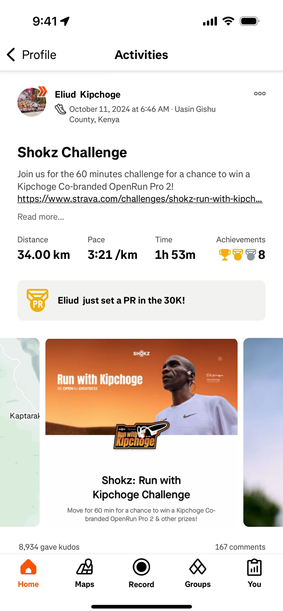
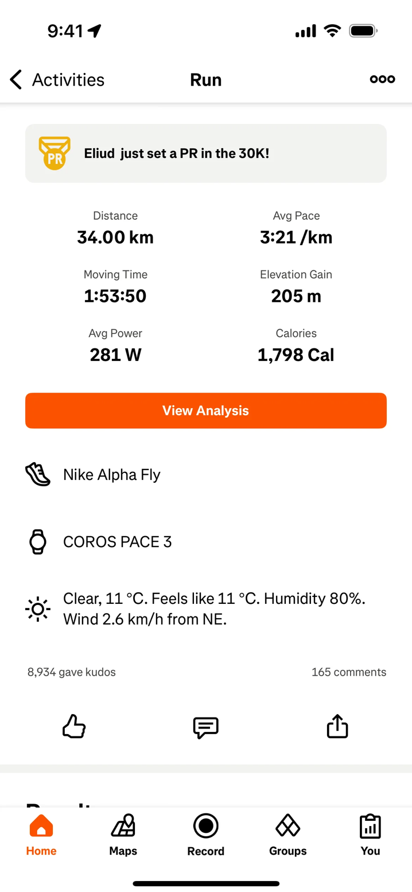
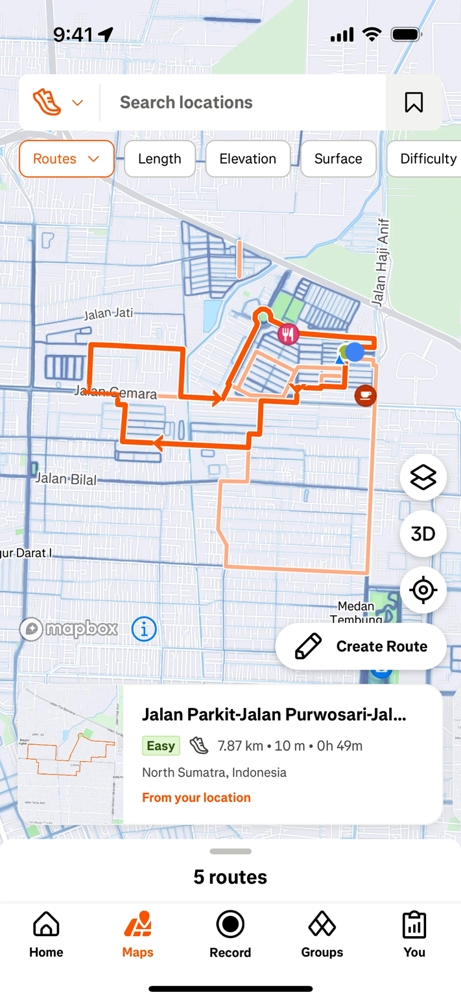

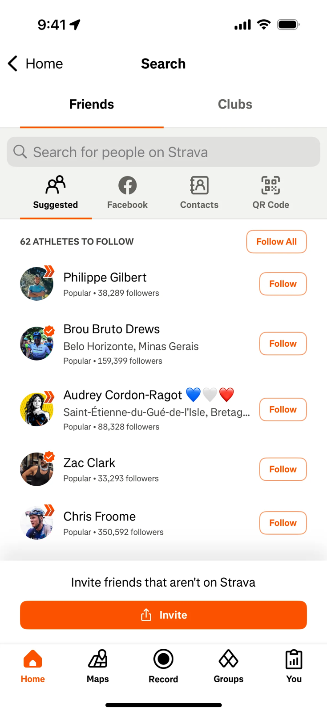
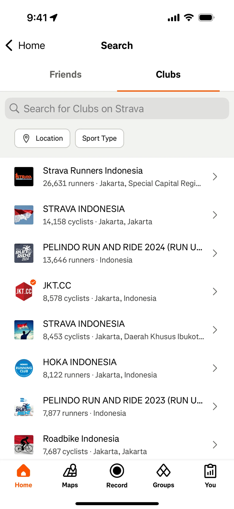
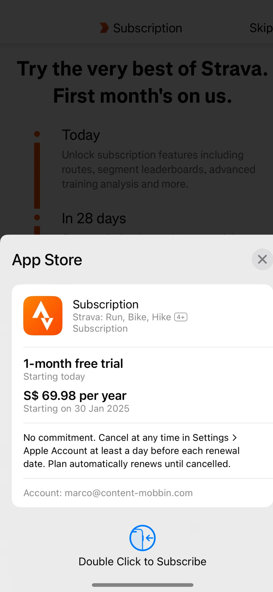

### Annex A2 – NikeRunClub Screenshots

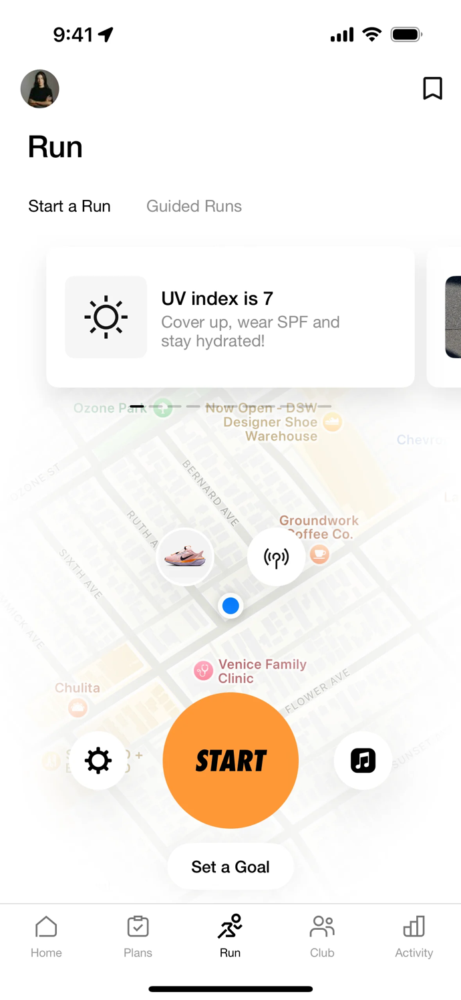
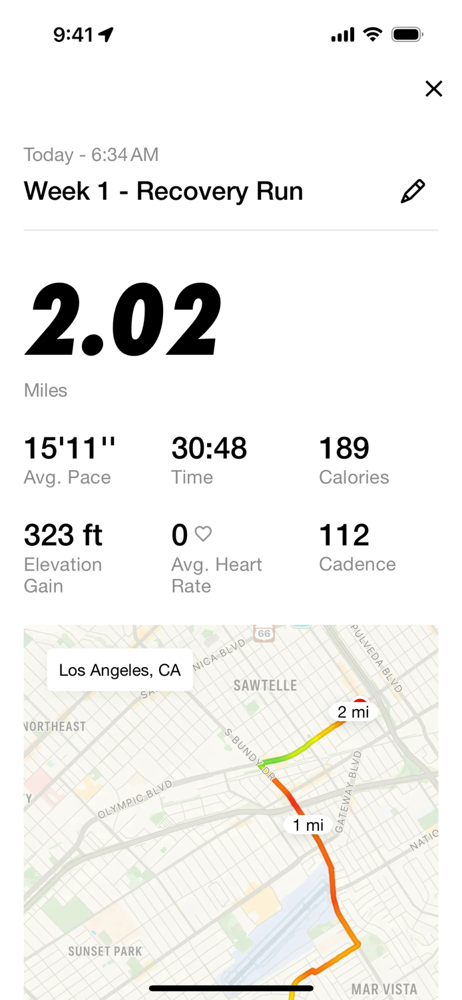
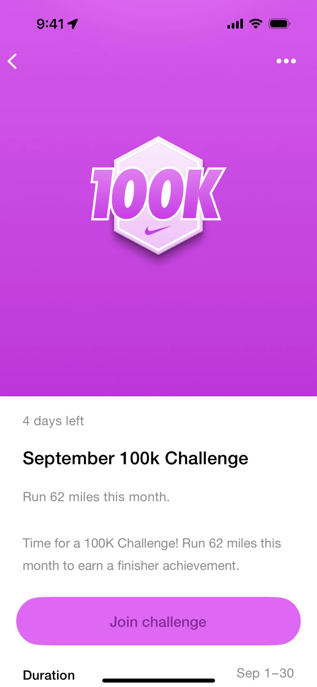

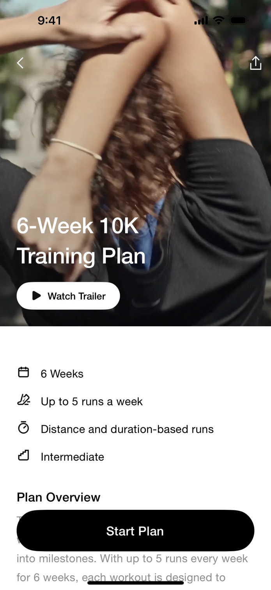
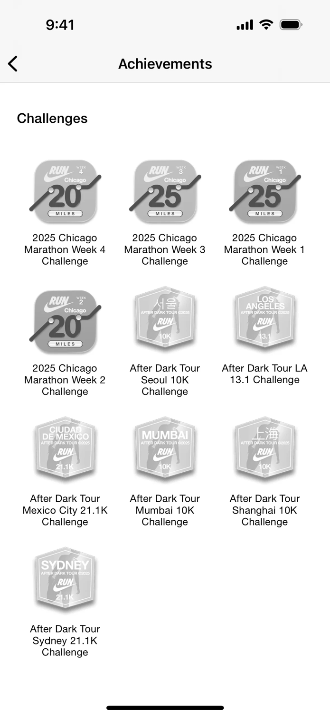
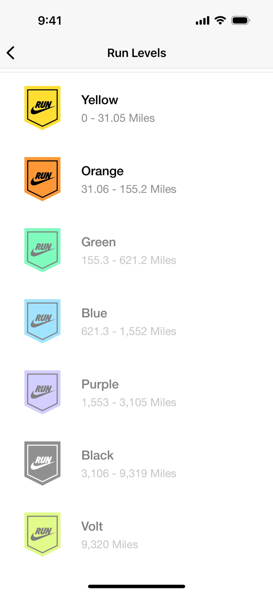

### Annex A3 – Runkeeper Screenshots

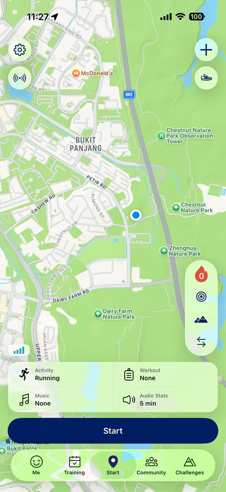
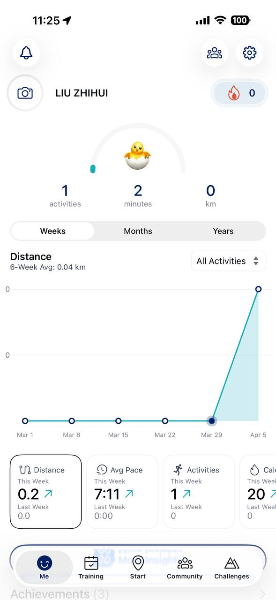
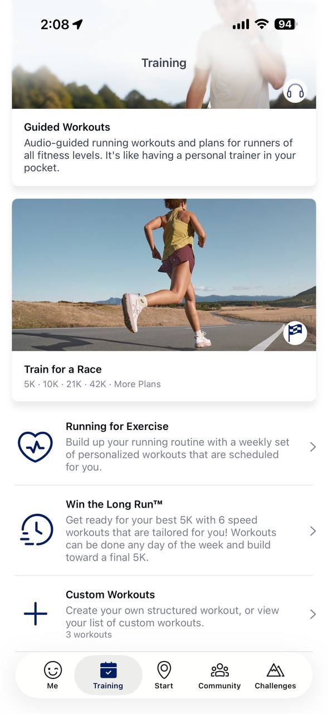

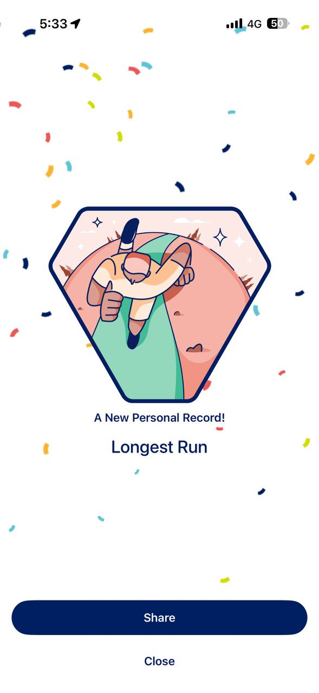
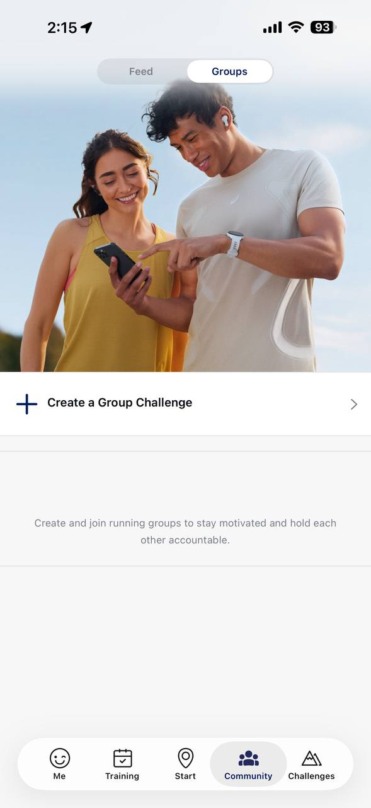
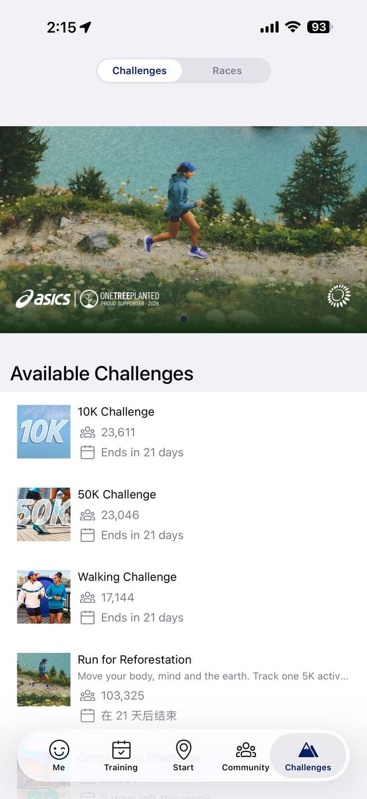

### Annex A4 – Whoop Screenshots


### Annex A5 – Garmin Connect Screenshots


## References

World Health Organization (WHO) (2020) Guidelines on Physical Activity and Sedentary Behaviour. Geneva: WHO.

Business of Apps (2025) App Retention Rates. Available at: Business of Apps website (Accessed: 8 May 2026).

Business of Apps (2025) Health & Fitness App Benchmarks. Available at: Business of Apps website (Accessed: 8 May 2026).

Bull, F.C. et al. (2020) ‘World Health Organization 2020 guidelines on physical activity and sedentary behaviour’, British Journal of Sports Medicine, 54(24), pp. 1451–1462.

Dart (n.d.) Asynchronous Programming. Available at: Dart Documentation (Accessed: 8 May 2026).

Dart (n.d.) Sound Null Safety. Available at: Dart Documentation (Accessed: 8 May 2026).

Flutter (n.d.) Build Apps for Any Screen. Available at: Flutter website (Accessed: 8 May 2026).

Flutter (n.d.) Flutter Architectural Overview. Available at: Flutter Documentation (Accessed: 8 May 2026).

Garmin Singapore (n.d.) Garmin Connect App. Available at: Garmin Singapore website (Accessed: 8 May 2026).

Garmin Support (n.d.) What Are Garmin Connect Challenges? Available at: Garmin Customer Support (Accessed: 8 May 2026).

Google Android Developers (2026) Request Background Location. Available at: Android Developers Documentation (Accessed: 8 May 2026).

Google Android Developers (n.d.) Health Connect. Available at: Android Developers Documentation (Accessed: 8 May 2026).

Google Firebase (n.d.) Access Data Offline. Available at: Firebase Documentation (Accessed: 8 May 2026).

Google Firebase (n.d.) Cloud Functions for Firebase. Available at: Firebase Documentation (Accessed: 8 May 2026).

Google Firebase (n.d.) Firebase Cloud Messaging. Available at: Firebase Documentation (Accessed: 8 May 2026).

Google Firebase (n.d.) Get Started with Cloud Firestore Security Rules. Available at: Firebase Documentation (Accessed: 8 May 2026).

Nike (2024) Nike Run Club App Delivers New Features to Prepare, Support and Empower Runners. Available at: Nike Newsroom (Accessed: 8 May 2026).

Nike Help (n.d.) Does the NRC App Have Training Plans? Available at: Nike Help website (Accessed: 8 May 2026).

Personal Data Protection Commission Singapore (n.d.) Data Protection Obligations. Available at: PDPC website (Accessed: 8 May 2026).

Personal Data Protection Commission Singapore (n.d.) PDPA Overview. Available at: PDPC website (Accessed: 8 May 2026).

Runkeeper Support (n.d.) Runkeeper Go Features. Available at: Runkeeper Help Centre (Accessed: 8 May 2026).

Runkeeper Support (n.d.) Runkeeper Training Plans. Available at: Runkeeper Help Centre (Accessed: 8 May 2026).

Sensor Tower (2023) Fitness Apps Work-Out Hard, But First Place is Elusive. Available at: Sensor Tower website (Accessed: 8 May 2026).

Strava Support (2024) Edit Map Visibility. Available at: Strava Support website (Accessed: 8 May 2026).

Strava Support (2024) What are Segments? Available at: Strava Support website (Accessed: 8 May 2026).

Strava Support (2026) Strava Subscription Features. Available at: Strava Support website (Accessed: 8 May 2026).

TypeScript (n.d.) TypeScript: JavaScript with Syntax for Types. Available at: TypeScript website (Accessed: 8 May 2026).

WHOOP Support (2026) WHOOP Strain. Available at: WHOOP Support website (Accessed: 8 May 2026).

Xu, L. et al. (2022) ‘The effects of mHealth-based gamification interventions on participation in physical activity: Systematic review’, JMIR mHealth and uHealth, 10(2), e27794.
