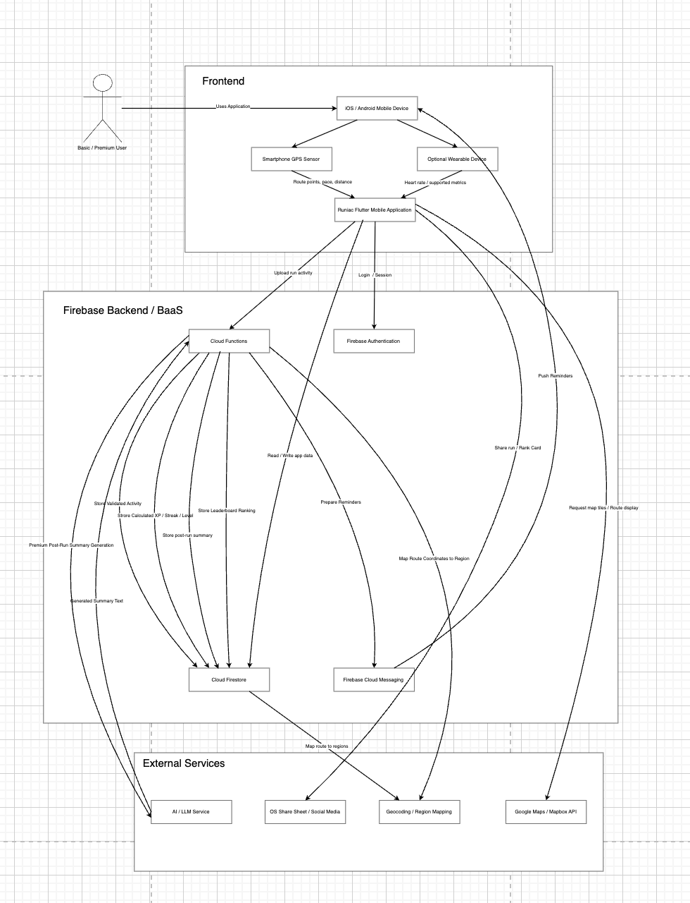

# Application Architecture Diagram - Draw.io Screenshot Notes

> Diagram category: PDD / System Architecture Design / Application Architecture Diagram
> Source screenshot: `application_architecture_drawio_screenshot_2026-05-20_0013.png`
> Interpretation status: user-provided application architecture draft, saved for later reconstruction and refinement.

## Source Screenshot

## High-Level Structure

The diagram is organized into three main architecture zones:

| Zone | Meaning |
| --- | --- |
| Frontend | User-facing mobile runtime: iOS/Android device, smartphone GPS, optional wearable, and Runiac Flutter mobile application. |
| Firebase Backend / BaaS | Backend platform services used by the app: Cloud Functions, Firebase Authentication, Cloud Firestore, and Firebase Cloud Messaging. |
| External Services | Third-party or platform services: AI/LLM service, OS share sheet/social media, geocoding/region mapping, and Google Maps/Mapbox API. |

## Components Identified From The Screenshot

### User

- `Basic / Premium User`
- The user accesses the system by using the application on an iOS/Android mobile device.

### Frontend

- `iOS / Android Mobile Device`
- `Smartphone GPS Sensor`
- `Optional Wearable Device`
- `Runiac Flutter Mobile Application`

Frontend responsibilities shown:

- collect route points, pace, and distance from smartphone GPS;
- collect heart-rate or supported metrics from optional wearable devices;
- run the Flutter mobile application as the main user interface;
- upload completed running activity to backend processing;
- use Firebase Authentication for login/session;
- read and write app data through Cloud Firestore;
- request map files or route display from maps API;
- share run or rank cards through OS share sheet/social media.

### Firebase Backend / BaaS

- `Cloud Functions`
- `Firebase Authentication`
- `Cloud Firestore`
- `Firebase Cloud Messaging`

Backend responsibilities shown:

- receive uploaded run activity from the Flutter app;
- validate activity data;
- calculate XP, streak, and level;
- store leaderboard ranking;
- store post-run summary;
- prepare reminder notifications;
- send push reminders through Firebase Cloud Messaging;
- persist processed data in Cloud Firestore.

### External Services

- `AI / LLM Service`
- `OS Share Sheet / Social Media`
- `Geocoding / Region Mapping`
- `Google Maps / Mapbox API`

External service responsibilities shown:

- AI/LLM service generates premium post-run summary text;
- OS share sheet/social media receives share cards from the mobile app;
- geocoding/region mapping maps routes to regions for territorial features;
- Google Maps/Mapbox API provides map files or route display support.

## Main Flow Interpretation

1. `Basic / Premium User -> iOS / Android Mobile Device`
   - User uses Runiac through a mobile device.

2. `Mobile Device -> Smartphone GPS Sensor -> Runiac Flutter Mobile Application`
   - GPS provides route points, pace, and distance to the Flutter app.

3. `Mobile Device -> Optional Wearable Device -> Runiac Flutter Mobile Application`
   - Optional wearable provides heart-rate or supported metrics.

4. `Runiac Flutter Mobile Application -> Cloud Functions`
   - The app uploads completed run activity for backend processing.

5. `Runiac Flutter Mobile Application -> Firebase Authentication`
   - Login and session handling.

6. `Runiac Flutter Mobile Application -> Cloud Firestore`
   - App data is read and written from Firestore.

7. `Cloud Functions -> Cloud Firestore`
   - Cloud Functions stores validated activity, calculated XP/streak/level, leaderboard ranking, and post-run summary.

8. `Cloud Functions -> Firebase Cloud Messaging -> Mobile Device`
   - Cloud Functions prepares reminders and Firebase Cloud Messaging sends push reminders.

9. `Cloud Functions -> AI / LLM Service -> Cloud Functions`
   - Premium post-run summary generation uses an external AI/LLM service, then returns generated summary text.

10. `Cloud Functions -> Geocoding / Region Mapping`
    - Route coordinates are mapped to regions for leaderboard and route-related features.

11. `Runiac Flutter Mobile Application -> Google Maps / Mapbox API`
    - App requests map files or route display.

12. `Runiac Flutter Mobile Application -> OS Share Sheet / Social Media`
    - App shares run or rank cards externally.

## Relationship To Mermaid Source

The existing Mermaid source `application_architecture.mmd` is a more detailed logical reconstruction of this screenshot. The screenshot is useful as the visual draw.io reference, while the Mermaid file is useful for text-based editing and future regeneration.

If the final PDD needs a cleaner version, use this screenshot as the baseline and simplify long crossing arrows by:

- placing Cloud Firestore closer to Cloud Functions;
- grouping repeated Firestore writes under a single labelled connection;
- keeping external services near the modules that call them;
- avoiding direct user arrows to every internal module.
