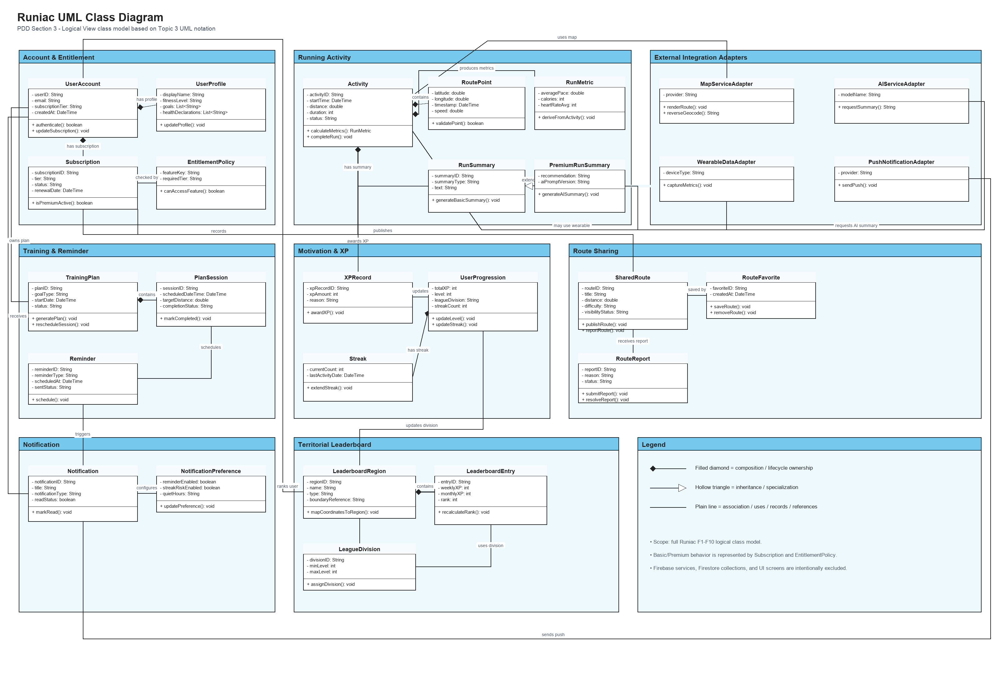

# Class Diagram

> Diagram category: PDD / Section 3 / UML Class Diagram
> Main reference: Topic 3 UML Logical View and class relationship notation.

## Current Assets

- Draw.io source: `class_diagram.drawio`
- SVG export: `class_diagram.svg`
- PNG export: `class_diagram.png`
- Planning notes: `class_diagram_plan.md`

## Diagram

## PDD Explanation

The class diagram shows the main logical classes that make up the Runiac system across the full F1-F10 feature scope. The model is grouped into account and entitlement, running activity, training and reminders, motivation and XP progression, route sharing, territorial leaderboard, notification, and external integration adapter areas. Each class includes only the key attributes and operations needed to explain its design responsibility in the Project Design Document.

The diagram follows Topic 3 UML class notation. Filled diamonds are used for composition relationships where one class owns the lifecycle of another, such as `Activity` containing `RoutePoint`, `RunMetric`, and `RunSummary`, and `TrainingPlan` containing `PlanSession`. Plain associations are used for looser relationships such as users recording activities, publishing shared routes, receiving notifications, and leaderboard entries ranking users. Inheritance is used only for `PremiumRunSummary`, which specializes `RunSummary` for premium AI-assisted feedback.

Firebase services, Firestore collections, Cloud Functions, FCM, and UI screens are intentionally excluded from this class diagram. Those concerns are covered by the architecture, component, and semantic data diagrams, while this diagram focuses on the logical object model.

## UML Interpretation Notes

- `+` indicates a public operation.
- `-` indicates a private attribute.
- Filled diamond connectors indicate composition / lifecycle ownership.
- Hollow triangle connectors indicate inheritance / specialization.
- Plain labelled connectors indicate associations such as `records`, `publishes`, `updates`, `uses`, and `receives`.
- Basic and Premium behavior is represented through `Subscription` and `EntitlementPolicy`, not separate user subclasses.
