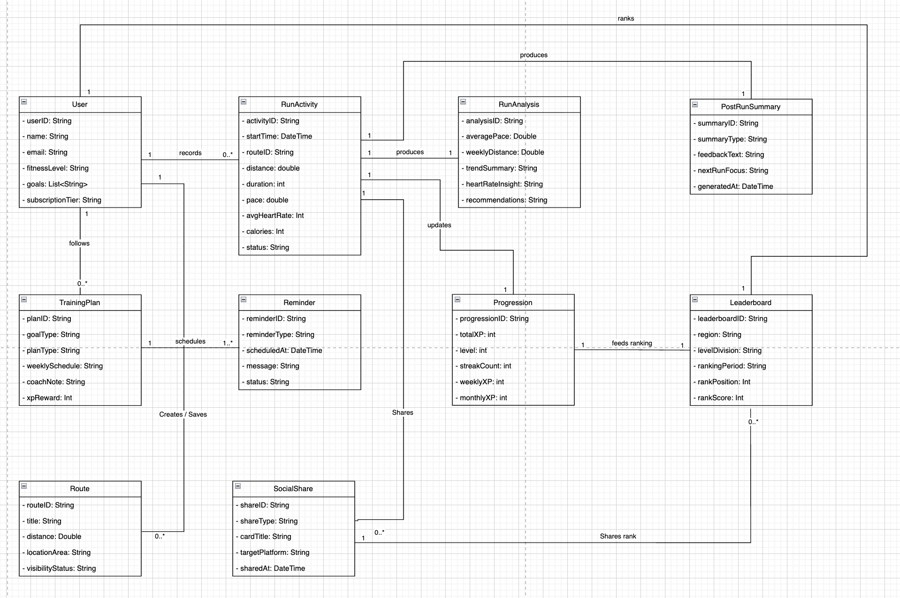

# Runiac UML Class Diagram Final Reference

This document is the canonical text reference for the final Runiac UML Class Diagram provided on 2026-05-20.

Reference image:

## Classes

| Class | Attributes |
| --- | --- |
| `User` | `userID: String`, `name: String`, `email: String`, `fitnessLevel: String`, `goals: List<String>`, `subscriptionTier: String` |
| `RunActivity` | `activityID: String`, `startTime: DateTime`, `routeID: String`, `distance: double`, `duration: int`, `pace: double`, `avgHeartRate: Int`, `calories: Int`, `status: String` |
| `RunAnalysis` | `analysisID: String`, `averagePace: Double`, `weeklyDistance: Double`, `trendSummary: String`, `heartRateInsight: String`, `recommendations: String` |
| `PostRunSummary` | `summaryID: String`, `summaryType: String`, `feedbackText: String`, `nextRunFocus: String`, `generatedAt: DateTime` |
| `TrainingPlan` | `planID: String`, `goalType: String`, `planType: String`, `weeklySchedule: String`, `coachNote: String`, `xpReward: Int` |
| `Reminder` | `reminderID: String`, `reminderType: String`, `scheduledAt: DateTime`, `message: String`, `status: String` |
| `Progression` | `progressionID: String`, `totalXP: int`, `level: int`, `streakCount: int`, `weeklyXP: int`, `monthlyXP: int` |
| `Leaderboard` | `leaderboardID: String`, `region: String`, `levelDivision: String`, `rankingPeriod: String`, `rankPosition: Int`, `rankScore: Int` |
| `Route` | `routeID: String`, `title: String`, `distance: Double`, `locationArea: String`, `visibilityStatus: String` |
| `SocialShare` | `shareID: String`, `shareType: String`, `cardTitle: String`, `targetPlatform: String`, `sharedAt: DateTime` |

## Relationships

| Source | Multiplicity | Relationship | Target | Multiplicity | Meaning |
| --- | --- | --- | --- | --- | --- |
| `User` | `1` | `records` | `RunActivity` | `0..*` | A user may record many running activities. |
| `User` | `1` | `follows` | `TrainingPlan` | `0..*` | A user may follow multiple training plans. |
| `TrainingPlan` | `1` | `schedules` | `Reminder` | `1..*` | A training plan schedules reminders. |
| `User` | `1` | `Creates / Saves` | `Route` | `0..*` | A user may create or save routes. |
| `RunActivity` | `1` | `produces` | `RunAnalysis` | `1` | A completed run produces run analysis. |
| `RunActivity` | `1` | `produces` | `PostRunSummary` | `1` | A completed run produces a post-run summary. |
| `RunActivity` | `1` | `updates` | `Progression` | `1` | A run updates XP, streak, and progression values. |
| `Progression` | `1` | `feeds ranking` | `Leaderboard` | `1` | Progression data contributes to leaderboard ranking. |
| `Leaderboard` | `1` | `ranks` | `User` | `1` | The leaderboard ranks users. |
| `RunActivity` | `1` | `Shares` | `SocialShare` | `0..*` | A run activity may be shared as an achievement card. |
| `SocialShare` | `1` | `Shares rank` | `Leaderboard` | `0..*` | A social share may share leaderboard rank information. |

## Interpretation Notes

- This is the final class diagram reference for the PDD class diagram section.
- Methods are intentionally omitted; the diagram uses class names and major attributes only.
- `PostRunSummary` is a feedback/AI summary class and is not a direct social share target.
- `SocialShare` represents run achievement sharing and leaderboard rank sharing.
- Firebase services, Firestore collections, UI screens, adapter classes, and implementation helper records are intentionally not modelled as classes.
