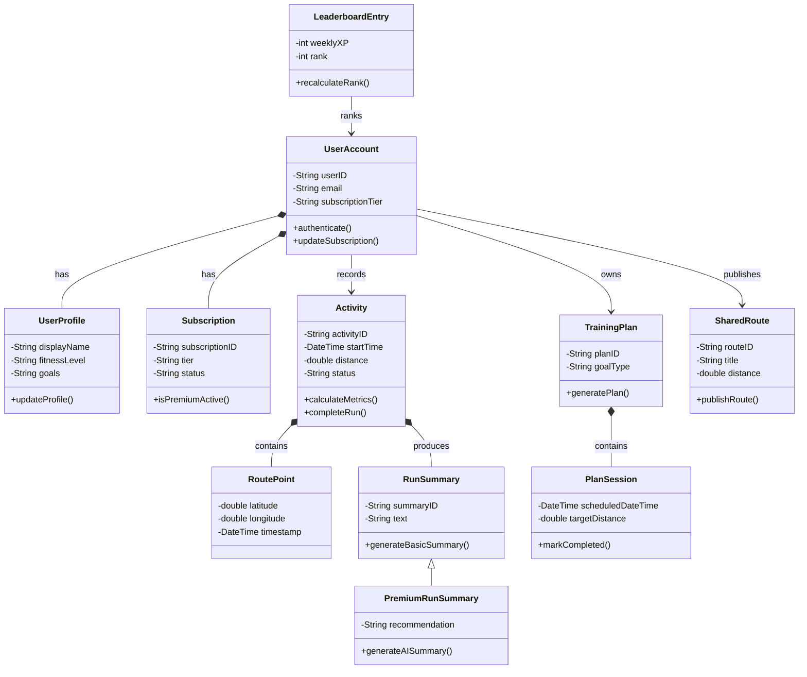

# Runiac Class Diagram Plan

> Main reference: `Topic 3.pdf` pages 15-23, which covers the Logical View, UML class symbols, object symbols, and class relationships.
> Purpose: define how to draw Runiac's UML class diagram for the PDD.

## 1. Topic 3 Rules Learned

Topic 3 places class diagrams in the UML Logical View. For Runiac, this means the class diagram should describe the system's static logical structure: important classes, their data, their operations, and their relationships. It should not describe deployment, UI navigation, screen flow, or runtime sequence.

| Topic 3 Rule | Runiac Application |
| --- | --- |
| Class diagrams model the system in the logical view. | Show domain objects such as user accounts, activities, plans, routes, leaderboard entries, summaries, notifications, and subscriptions. |
| The basic class symbol is a box with the class name. | Start with class names first; add attributes and operations only where they make the design clearer. |
| A class can include attributes, data types, and methods. | Use attributes for key stored state and operations for important domain behavior such as `calculateXP()` or `generateSummary()`. |
| Detail level depends on the diagram purpose. | Keep the PDD class diagram design-level, not full source-code-level. |
| Object diagrams explain class relationships through instances. | Do not use object symbols in the main PDD class diagram unless an example instance is needed separately. |
| Package diagrams group related class diagrams. | If the class model is too dense, split or group it by account, running, training, social, competition, and notification packages. |

## 2. Class Box Notation

Use a UML class box with up to three compartments:

```text
ClassName
-------------------------
- attributeName: DataType
# protectedValue: DataType
+ publicValue: DataType
-------------------------
+ methodName(): ReturnType
- helperMethod(): ReturnType
```

Rules:

- Class names should be singular nouns in PascalCase, for example `UserAccount`, `Activity`, `TrainingPlan`.
- Attribute syntax should be `visibility name: Type`.
- Operation syntax should be `visibility methodName(): ReturnType`.
- Use `+` for public, `-` for private, and `#` for protected.
- Use `{read only}` for constants or immutable values.
- Underline static attributes or methods if the final drawing tool supports it.
- Avoid adding getters and setters unless they are important to explain the design. Topic 3 shows them as valid UML operations, but the PDD should stay readable.

## 3. Relationship Rules

Use the most specific correct relationship, but do not force special notation when a simple association is enough.

| Relationship | Meaning From Topic 3 | UML Notation | Runiac Use |
| --- | --- | --- | --- |
| Association | Generic relationship: has-a, uses, communicates with, or makes requests of. | Plain line, optionally labelled. | Default for most domain relationships, such as `UserAccount` records `Activity`. |
| Aggregation | One object is part of another, but the part can exist independently. | Hollow diamond at the whole/assembly side. | Use for weak part-of relationships only. |
| Composition | Strong part-of relationship where the part cannot exist independently. | Filled diamond at the whole side. | Use for `Activity` composed of `RoutePoint`, `TrainingPlan` composed of `PlanSession`, and `Activity` composed of `RunSummary`. |
| Inheritance | Generalization/specialization; subclass is-a superclass and inherits properties. | Hollow triangle arrow pointing to the superclass. | Use sparingly, for example `PremiumRunSummary` is a specialized `RunSummary`. |

Decision rule:

- If the relationship means "uses", "talks to", "requests", "records", "owns a reference to", or "has a link to", use association.
- If the relationship means "part of" and the part can survive separately, use aggregation.
- If the relationship means "part of" and the part should disappear with the whole, use composition.
- If the relationship means "is a specialized type of", use inheritance.

## 4. Runiac Class Scope

Include logical domain classes:

| Package / Area | Classes |
| --- | --- |
| Account | `UserAccount`, `UserProfile`, `Subscription`, `EntitlementPolicy` |
| Running | `Activity`, `RoutePoint`, `RunMetric`, `RunSummary`, `PremiumRunSummary` |
| Training | `TrainingPlan`, `PlanSession`, `Reminder` |
| Motivation | `XPRecord`, `UserProgression`, `Streak` |
| Route Sharing | `SharedRoute`, `RouteFavorite`, `RouteReport` |
| Competition | `LeaderboardRegion`, `LeaderboardEntry`, `LeagueDivision` |
| Notification | `Notification`, `NotificationPreference` |
| External Integration | `MapServiceAdapter`, `AIServiceAdapter`, `WearableDataAdapter`, `PushNotificationAdapter` |

Exclude from the class diagram:

- UI screens such as Home Page, Login Page, or Run Summary Page.
- Firebase physical services such as Firestore, Firebase Auth, Cloud Functions, and FCM. These belong in architecture/component diagrams.
- Firestore collections as database tables. Those belong in the Semantic Data Diagram.
- Basic/Premium as user subclasses unless the implementation genuinely treats them as different class types. Prefer `Subscription` and `EntitlementPolicy`.

## 5. Candidate Class Details

Keep only the most meaningful attributes and operations in the final diagram.

| Class | Key Attributes | Key Operations |
| --- | --- | --- |
| `UserAccount` | `userID`, `email`, `subscriptionTier`, `createdAt` | `authenticate()`, `updateSubscription()` |
| `UserProfile` | `displayName`, `fitnessLevel`, `goals`, `healthDeclarations` | `updateProfile()` |
| `Subscription` | `subscriptionID`, `tier`, `status`, `renewalDate` | `isPremiumActive()` |
| `EntitlementPolicy` | `featureKey`, `requiredTier` | `canAccessFeature()` |
| `Activity` | `activityID`, `startTime`, `endTime`, `distance`, `duration`, `status` | `calculateMetrics()`, `completeRun()` |
| `RoutePoint` | `latitude`, `longitude`, `timestamp`, `elevation`, `speed` | `validatePoint()` |
| `RunMetric` | `averagePace`, `calories`, `heartRateAvg` | `deriveFromActivity()` |
| `RunSummary` | `summaryID`, `summaryType`, `text`, `generatedAt` | `generateBasicSummary()` |
| `PremiumRunSummary` | `recommendation`, `aiPromptVersion` | `generateAISummary()` |
| `TrainingPlan` | `planID`, `goalType`, `startDate`, `endDate`, `status` | `generatePlan()`, `rescheduleSession()` |
| `PlanSession` | `sessionID`, `scheduledDateTime`, `targetDistance`, `completionStatus` | `markCompleted()` |
| `Reminder` | `reminderID`, `reminderType`, `scheduledAt`, `sentStatus` | `schedule()`, `markSent()` |
| `XPRecord` | `xpRecordID`, `xpAmount`, `reason`, `createdAt` | `awardXP()` |
| `UserProgression` | `totalXP`, `level`, `streakCount`, `leagueDivision` | `updateLevel()`, `updateStreak()` |
| `SharedRoute` | `routeID`, `title`, `distance`, `difficulty`, `visibilityStatus` | `publishRoute()`, `reportRoute()` |
| `RouteFavorite` | `favoriteID`, `createdAt` | `saveRoute()`, `removeRoute()` |
| `RouteReport` | `reportID`, `reason`, `description`, `status` | `submitReport()`, `resolveReport()` |
| `LeaderboardRegion` | `regionID`, `name`, `type`, `boundaryReference` | `mapCoordinatesToRegion()` |
| `LeaderboardEntry` | `entryID`, `weeklyXP`, `monthlyXP`, `rank`, `updatedAt` | `recalculateRank()` |
| `Notification` | `notificationID`, `title`, `body`, `readStatus` | `markRead()` |

## 6. Candidate Relationships

Use these as the first draft of the diagram:

| Source | Relationship | Target | Recommended UML Relationship |
| --- | --- | --- | --- |
| `UserAccount` | has profile | `UserProfile` | Composition |
| `UserAccount` | has subscription | `Subscription` | Composition |
| `Subscription` | checked by | `EntitlementPolicy` | Association |
| `UserAccount` | records | `Activity` | Association |
| `Activity` | contains route points | `RoutePoint` | Composition |
| `Activity` | produces metrics | `RunMetric` | Composition |
| `Activity` | has summary | `RunSummary` | Composition |
| `PremiumRunSummary` | specializes | `RunSummary` | Inheritance |
| `UserAccount` | owns | `TrainingPlan` | Association |
| `TrainingPlan` | contains | `PlanSession` | Composition |
| `PlanSession` | schedules | `Reminder` | Association |
| `Activity` | awards | `XPRecord` | Association |
| `UserAccount` | has progression | `UserProgression` | Composition |
| `UserProgression` | has streak | `Streak` | Composition |
| `UserAccount` | publishes | `SharedRoute` | Association |
| `UserAccount` | saves route through | `RouteFavorite` | Association |
| `SharedRoute` | receives reports | `RouteReport` | Association |
| `LeaderboardRegion` | contains | `LeaderboardEntry` | Composition |
| `LeaderboardEntry` | ranks | `UserAccount` | Association |
| `UserAccount` | receives | `Notification` | Association |
| `Activity` | uses | `MapServiceAdapter` | Association |
| `PremiumRunSummary` | uses | `AIServiceAdapter` | Association |
| `Activity` | may use | `WearableDataAdapter` | Association |
| `Notification` | sent through | `PushNotificationAdapter` | Association |

## 7. Suggested Layout

Recommended one-page layout:

```text
Account / Entitlement       Running Activity             Analysis
UserAccount                 Activity                     RunSummary
UserProfile                 RoutePoint                   PremiumRunSummary
Subscription                RunMetric                    AIServiceAdapter
EntitlementPolicy           WearableDataAdapter

Training / Reminder         Motivation                   Route / Competition
TrainingPlan                XPRecord                     SharedRoute
PlanSession                 UserProgression              RouteFavorite
Reminder                    Streak                       LeaderboardRegion
Notification                                             LeaderboardEntry
```

Drawing guidance:

- Place `UserAccount` near the left or center because many classes relate to it.
- Keep composition lines close to their owner class so filled diamonds are easy to read.
- Put inheritance vertically, with `RunSummary` above `PremiumRunSummary`.
- Put external adapter classes at the edge of the diagram.
- Use short relationship labels such as `records`, `contains`, `generates`, `uses`, `ranks`, and `receives`.

## 8. Mermaid Draft For Internal Review

This is only a review draft. The final PDD diagram may be cleaner in draw.io because UML diamonds and labels are easier to control visually.


