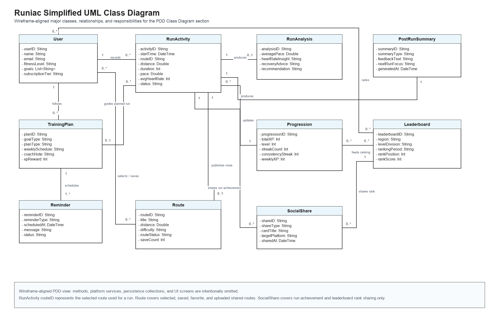

# Simplified Class Diagram

> Diagram category: PDD / Section 1 / Class Diagram
> Purpose: show the major classes required for Runiac, how they relate to each other, and the purpose of each class.

## Current Assets

- Draw.io source: `class_diagram_simplified.drawio`
- SVG export: `class_diagram_simplified.svg`
- PNG export: `class_diagram_simplified.png`
- Detailed reference diagram: `class_diagram.drawio`

## Diagram

## PDD Explanation

The simplified class diagram presents the major domain classes needed by Runiac without exposing implementation-level helper classes. The `User` class represents the runner using the application and links to running records, plans, route selection, and ranking. `TrainingPlan` guides planned runs and schedules `Reminder` objects for upcoming running or rest sessions. `RunActivity` stores the selected route reference and completed run metrics, then provides source data for `RunAnalysis`, `PostRunSummary`, `Progression`, route publication, and run achievement sharing.

This diagram intentionally keeps the class model high-level for the PDD. It does not include Firebase services, Firestore collections, adapter classes, UI screens, or detailed helper records. Basic and Premium behavior is represented through attributes such as `subscriptionTier`, `planType`, and `summaryType` instead of separate user subclasses.

Based on the Basic and Premium wireframes, `Route` covers selected routes, saved/favorite routes, and Premium route upload from a completed run. `SocialShare` covers run achievement sharing and leaderboard rank sharing. `PostRunSummary` stores beginner or AI-assisted post-run feedback, but it is not modelled as a direct share target.

## Wireframe Alignment Notes

| Wireframe flow | Class diagram representation |
| --- | --- |
| Today's plan, weekly plan, expert plan, and edit schedule screens | `User` follows `TrainingPlan`; `TrainingPlan` guides `RunActivity` and schedules `Reminder`. |
| Run landing, active tracking, pause, cool-down, and summary screens | `User` records `RunActivity`; completed activity produces `RunAnalysis` and `PostRunSummary`. |
| Maps, shared route list, selected route, My Route, favorite route, and Premium route upload screens | `User` selects/saves `Route`; completed `RunActivity` may publish a shared `Route`. |
| XP update, streak screen, You page, and runner level display | `RunActivity` updates `Progression`; `Progression` feeds `Leaderboard`. |
| Share run screen and leaderboard rank sharing screen | `SocialShare` shares `RunActivity` achievements and `Leaderboard` ranks only. |

## Class Purpose

| Class | Purpose |
| --- | --- |
| `User` | Manages account, profile, goals, health-related onboarding data, and subscription tier. |
| `RunActivity` | Stores selected-route reference and completed running records such as distance, duration, pace, heart rate, and status. |
| `RunAnalysis` | Stores derived performance insights such as pace, heart-rate insight, recovery advice, and recommendations. |
| `TrainingPlan` | Manages user goals, weekly schedules, plan type, coach notes, XP rewards, and planned-run guidance. |
| `Reminder` | Manages running, rest, missed-session, and streak-risk reminders. |
| `Progression` | Tracks XP, level, streak count, consistency streak, and weekly XP. |
| `Route` | Represents selected, saved, favorite, and community-shared running routes. |
| `Leaderboard` | Manages territorial, regional, and level-division ranking information. |
| `SocialShare` | Handles shareable run achievement cards and leaderboard rank cards. |
| `PostRunSummary` | Stores rule-based or AI-assisted feedback after a run. |

## Feature Coverage

| Feature | Main Class |
| --- | --- |
| F1 Collect running-related activity data | `RunActivity` |
| F2 Estimate running effects and provide analysis | `RunAnalysis` |
| F3 Supply running advice and schedule a running plan | `TrainingPlan` |
| F4 Remind user of running or rest | `Reminder` |
| F5 Connect with social media and initiate competitions | `SocialShare` |
| F6 Streak & Consistency Tracking | `Progression` |
| F7 Community-Driven Route Sharing | `Route` |
| F8 Level-Based Territorial Leaderboard | `Leaderboard` |
| F9 Runner Level and XP Progression System | `Progression` |
| F10 AI-assisted Post-Run Summary | `PostRunSummary` |

## UML Notes

- The diagram uses simple UML associations with relationship labels.
- Multiplicities such as `1`, `0..1`, `0..*`, and `1..*` show how many objects may participate in each relationship.
- Methods are omitted because this PDD version focuses on major classes and their responsibilities.
- Route upload/sharing from the Premium summary flow is represented as `RunActivity` publishing a shared `Route`.
- `SocialShare` shares run achievements and leaderboard ranks, not the `PostRunSummary` feedback object.
- The more detailed reference diagram remains available as `class_diagram.drawio` if implementation-level detail is needed later.
