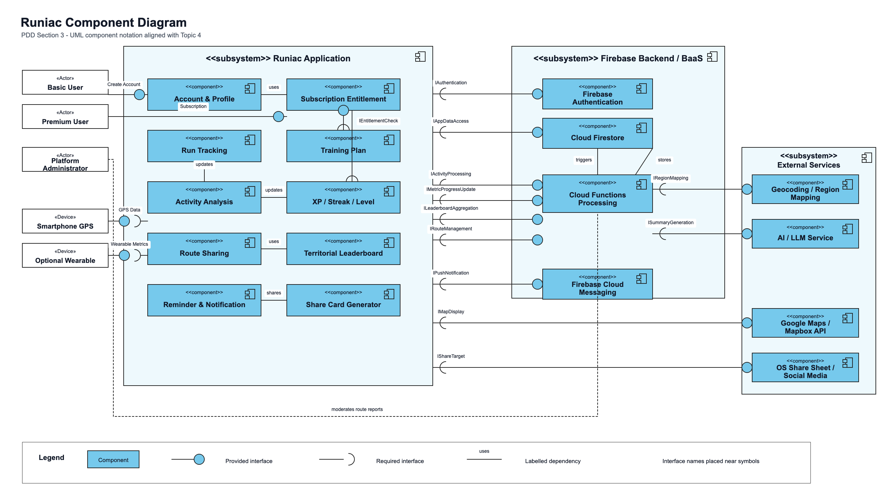

# Component Diagram

> Diagram category: PDD / Section 3 / Component Diagram

## Current Assets

- Draw.io source: `component_diagram.drawio`
- SVG export: `component_diagram.svg`
- PNG export: `component_diagram.png`
- Planning notes: `component_diagram_plan.md`

## Diagram

## PDD Explanation

The component diagram shows the main functional components that make up the Runiac system and how they collaborate through provided and required interfaces. The `Runiac Applications` subsystem contains the mobile application components, grouped into `Account Management` and `Runiac Core`. Account Management handles account creation and profile creation. Runiac Core contains subscription entitlement, run tracking, activity analysis, training plans, territorial leaderboard, route sharing, XP/streak/level progression, reminder/notification handling, and share card generation.

The Firebase Backend / BaaS subsystem provides authentication, persistent data storage, backend processing, and push notification delivery. External services are kept outside the Runiac and Firebase boundaries because they are not owned by the application. These services provide social sharing targets, geocoding/region mapping, map display, and AI summary generation.

The diagram focuses on design-level functionality rather than code packages, screens, Firestore collections, or individual classes.

## Subsystem Structure

| Subsystem | Contains | Purpose |
| --- | --- | --- |
| `Runiac Applications` | `Account Management`, `Runiac Core` | User-facing mobile application functionality. |
| `Account Management` | `Account`, `Profile` | Creates user accounts and profiles. |
| `Runiac Core` | `Subscription Entitlement`, `Run Tracking`, `Activity Analysis`, `Training Plan`, `Territorial Leaderboard`, `Route Sharing`, `Share Card Generator`, `XP / Streak / Level`, `Reminder / Notification` | Main running, progression, leaderboard, sharing, and notification features. |
| `Firebase Backend / BaaS` | `Firebase Authentication`, `Cloud Firestore`, `Cloud Function Processing`, `Firebase Cloud Messaging` | Backend services used by the application. |
| `External Services` | `OS Share Sheet / Social Media`, `Geocoding / Region Mapping`, `Google Map / Mapbox API`, `AI / LLM Service` | Third-party services used by Runiac and Firebase processing. |

## Interface And Connector Interpretation

Use the Topic 4 component diagram notation consistently:

- A complete circle shows a provided interface.
- A half circle/socket shows a required interface.
- The complete circle should be placed on the component or subsystem that provides the service.
- The socket should be placed on the component or subsystem that requires the service.
- The interface name should be placed near the circle/socket pair.
- Simple labelled lines such as `uses`, `updates`, `share`, `triggers`, and `stores` are acceptable for secondary dependencies.

| Interface / Connector | Provider: place complete circle here | Required by: place socket here | Meaning |
| --- | --- | --- | --- |
| `Create Account` | `Account` component | `User` actor interaction line | User starts account creation through the Account component. |
| `Create Profile` | `Profile` component | `Account` component | Account creation leads to profile creation. |
| `Subscription` | `Subscription Entitlement` component | `Premium User` actor interaction line | Premium user accesses subscription entitlement. |
| `Provide GPS Data` | `Smartphone GPS` device | `Run Tracking` component | GPS provides location data for run tracking. |
| `Provide Wearable Metrics` | `Optional Wearable` device | `Activity Analysis` or `Run Tracking` component | Wearable provides optional activity metrics. |
| `Authentication` / `IAuthentication` | `Firebase Authentication` | `Account Management` or `Account` component | Account/profile features require Firebase authentication. |
| `AppDataAccess` / `IAppDataAccess` | `Cloud Firestore` | Runiac application components | App components read and write persistent data. |
| `ActivityProcessing` / `IActivityProcessing` | `Cloud Function Processing` | `Run Tracking` | Completed run data is sent for backend processing. |
| `MetricsProgressUpdate` / `IMetricProgressUpdate` | `Cloud Function Processing` | `Activity Analysis` and `XP / Streak / Level` | Backend processing updates metrics, XP, streaks, and levels. |
| `LeaderboardAggregation` / `ILeaderboardAggregation` | `Cloud Function Processing` | `Territorial Leaderboard` | Leaderboard uses backend aggregation results. |
| `RouteManagement` / `IRouteManagement` | `Cloud Function Processing` and `Cloud Firestore` | `Route Sharing` | Route sharing stores, retrieves, and moderates shared routes. |
| `Push Notification` / `IPushNotification` | `Firebase Cloud Messaging` | `Reminder / Notification` | Reminder component depends on FCM to deliver push notifications. |
| `Map Display` / `IMapDisplay` | `Google Map / Mapbox API` | `Run Tracking`, `Route Sharing`, `Territorial Leaderboard` | App components require map rendering and route display. |
| `Region Mapping` / `IRegionMapping` | `Geocoding / Region Mapping` | `Cloud Function Processing` and leaderboard/route features | Coordinates are converted into regions for territorial features. |
| `SummaryGeneration` / `ISummaryGeneration` | `AI / LLM Service` | `Cloud Function Processing` | Cloud Functions request AI-generated premium run summaries. |
| `Share Target` / `IShareTarget` | `OS Share Sheet / Social Media` | `Share Card Generator` | Generated cards are shared outside the app. |
| `Entitlement Check` / `IEntitlementCheck` | `Subscription Entitlement` | `Training Plan`, `Activity Analysis`, and premium summary flow | Premium-only behavior is gated by entitlement checks. |

## Current Diagram Review Notes

- The overall grouping is correct: actors and devices are outside the app boundary, Firebase services are outside the Runiac application boundary, and external services are outside both Runiac and Firebase ownership.
- The component rectangles and component icons match the Topic 4 component diagram notation.
- The nested `Account Management` and `Runiac Core` subsystem boundaries are acceptable because they group related functionality inside the Runiac application.
- The main improvement is connector readability. The interface symbols between `Runiac Applications` and `Firebase Backend / BaaS` should be spaced further apart so labels and lines do not overlap.
- For each service dependency, check that the complete circle is on the provider side. For example, `Authentication` should have its complete circle near `Firebase Authentication`, while the socket should be near `Account Management` or `Account`.
- Interface labels can be made more formal by using the `I...` prefix, such as `IAuthentication`, `IAppDataAccess`, `IActivityProcessing`, and `IMapDisplay`.

## Notes

- The diagram represents functionality, not physical code packages.
- `Cloud Firestore` is shown once as a storage component rather than as individual collection boxes.
- Premium-only behavior is represented through `Subscription Entitlement`.
- Provided and required interfaces use UML lollipop/socket notation based on the Topic 4 component diagram rules.
