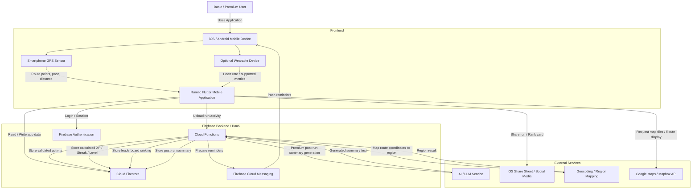

# Physical Architecture Diagram Source Notes

## Diagram Classification

- PDD section: `2.1 Physical Architecture Diagram`
- Diagram type: physical/runtime architecture
- Current version: `v1`
- Based on: user-provided screenshot from 2026-05-20
- Screenshot file: `physical_architecture_current.png`

## Diagram Content

Current screenshot:

## Key Interpretation

The diagram should be read as:

1. Basic/Premium users access Runiac through an iOS/Android mobile device.
2. The mobile device supplies GPS data; optional wearable devices supply heart-rate or supported fitness metrics.
3. The Runiac Flutter app sends run activity data to Firebase Cloud Functions and reads/writes app data in Cloud Firestore.
4. Firebase Authentication handles login/session.
5. Cloud Functions performs backend processing and stores processed results in Cloud Firestore.
6. Firebase Cloud Messaging sends reminders back to the mobile device.
7. External services support AI summaries, social sharing, region mapping, and map display.

## Final Diagram Quality Checklist

- `Cloud Functions` is the backend orchestrator for AI/LLM and geocoding calls.
- `AI / LLM Service` does not directly read from or write to `Cloud Firestore`.
- `Cloud Firestore` stores app data and processed backend results.
- `Firebase Cloud Messaging` sends push reminders to the mobile device.
- `Google Maps / Mapbox API` connects to the Flutter app for map and route display.
- `OS Share Sheet / Social Media` connects to the Flutter app for sharing run/rank cards.
- The diagram remains split into Frontend, Firebase Backend/BaaS, and External Services.
