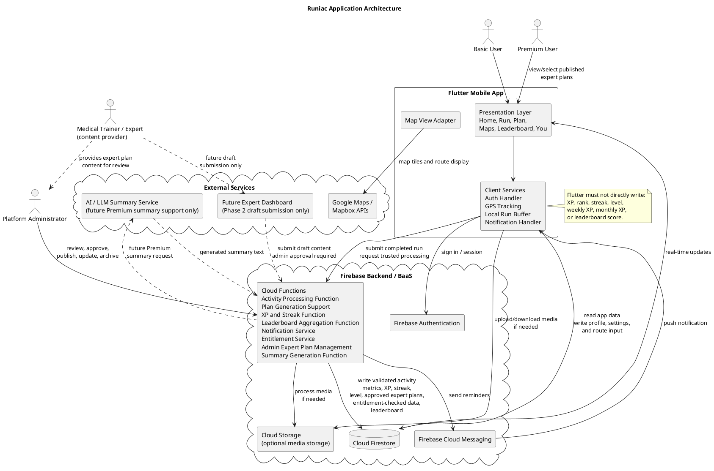

# 01. Application Architecture

## 1. Architecture Overview

Runiac uses a mobile client with Firebase Backend-as-a-Service architecture. The Flutter mobile application handles the user-facing experience, including onboarding, run tracking screens, map views, training plan displays, post-run summaries, reminders, XP display, and leaderboard views. Firebase provides authentication, persistent data storage, server-side processing, and push notification delivery.

This architecture is suitable for a university MVP because it keeps the system small enough to implement within the project timeline while still supporting synchronized user data, server-side validation, reminders, XP progression, and future leaderboard features. Security-sensitive and fairness-sensitive logic is handled in Firebase Cloud Functions rather than inside the Flutter client.

The most important architectural rule is that the Flutter app does not directly write XP, rank, streak, level, or leaderboard score values. The client may display these values after reading them from Firestore, but calculation and updates are performed by Cloud Functions.

## 2. Main Architectural Layers

| Layer | Main Elements | Purpose |
| --- | --- | --- |
| User Layer | Basic User, Premium User, Platform Administrator, Medical Trainer/Expert | Represents the people who use, manage, review, or provide expert plan content for the system. |
| Flutter Mobile App Layer | Flutter screens, navigation, state management, GPS tracking, local run buffer, map UI, notification handler | Provides the mobile experience and collects user input and run data. |
| Firebase Service Layer | Firebase Authentication, Cloud Firestore, Cloud Functions, Firebase Cloud Messaging, optional Firebase Cloud Storage | Provides identity, database storage, backend processing, push notifications, and optional media/file storage. |
| External Service Layer | Google Maps / Mapbox APIs, optional AI / LLM summary service | Provides map rendering, route display, geocoding support, and future AI-assisted summary generation. |

## 2.1 Canonical PDD Component Names

The following names are used consistently across the PDD:

| Area | Canonical name |
| --- | --- |
| Authentication | Auth Component, Authentication Service |
| Onboarding and profile | Onboarding Component, Profile Component, User/Profile Data Service |
| Plans | Plan Component, Plan Data Service |
| Running | Run Tracking Component, Activity Data Service, Activity Processing Function |
| Analysis | Activity Analysis Component, Summary Generation Function |
| Progression | XP and Streak Function |
| Routes | Explore / Route Component, Route Data Service |
| Competition | Leaderboard Component, Leaderboard Aggregation Function |
| Notifications | Notification Service |
| Premium access | Premium / Entitlement Component, Entitlement Service |
| Maps | Google Maps / Mapbox APIs |

## 3. Responsibilities Of Each Layer

### 3.1 User Layer

The Basic User and Premium User interact with Runiac through the mobile application. Basic and Premium access is distinguished by `subscriptionStatus`, while operational or content-governance responsibility is distinguished by `userRole`. Basic users access the core running habit features. When F7 Community-Driven Route Sharing is implemented, Basic users may also use basic route viewing, route selection, and basic route sharing/upload. Premium users receive advanced analytics, published expert goal plans, saved route collections, advanced route filters, route comparison, AI-assisted summaries, and enhanced sharing presentation, but they earn XP, level, rank, and leaderboard score under exactly the same server-owned rules as Basic users, so Premium gives no ranking advantage.

The Platform Administrator is an operational `userRole` responsible for moderation and expert plan governance. For expert plans, the Platform Administrator reviews Medical Trainer/Expert content for safety, completeness, beginner suitability, and consistency with Runiac standards before entering, approving, publishing, updating, or archiving the plan in the system. Premium Users can only view and select expert plans that have been approved and published.

The Medical Trainer/Expert is a content provider rather than a direct plan publisher in the MVP. They may prepare expert goal plan content through an off-system or controlled submission process, but they must not directly publish training plans into the Runiac mobile app or database. A future Expert Dashboard may allow verified experts to submit draft content in Phase 2, but Platform Administrator approval is still required before publication.

### 3.2 Flutter Mobile App Layer

The Flutter mobile app is responsible for:

- Rendering the Home, Maps, Run, Leaderboard, and You screens shown in the wireframes.
- Handling login and onboarding interaction through Firebase Authentication.
- Capturing GPS route points, distance, duration, pace, and optional wearable metrics during a run.
- Temporarily storing active run data in a local buffer so that a run is not lost when connectivity is unstable.
- Displaying training plans, run summaries, XP progress, streaks, levels, and leaderboard results received from Firestore.
- Rendering map-based route and leaderboard views using Google Maps / Mapbox APIs.
- Handling Firebase Cloud Messaging notifications and opening the relevant app screen.

The Flutter app may write user-owned input such as profile information, preferences, plan schedule changes, and raw completed activity submissions. It must not directly calculate or write XP, level, rank, streak, weekly XP, monthly XP, or leaderboard score fields.

### 3.3 Firebase Service Layer

Firebase Authentication manages user identity and session tokens. It ensures that only authenticated users can access protected app data.

Cloud Firestore stores the main application data, including user profiles, onboarding details, subscription or entitlement state, activity records, training plans, approved and published expert plans, progress records, route records, notification preferences, and leaderboard result documents. Firestore is also used for real-time synchronization so that processed backend results can appear in the Flutter app shortly after Cloud Functions update them.

Cloud Functions handles backend logic that must be trusted and consistent. This includes the Activity Processing Function for activity validation and metric derivation, backend-supported plan generation that uses onboarding profile, goals, running level, availability, health/safety readiness, and cautiousness inputs to create the first beginner running plan, the XP and Streak Function for XP, level, streak, weekly XP, and monthly XP updates, the Leaderboard Aggregation Function for regional and league-based ranking, the Notification Service for reminder checks, the Entitlement Service for backend premium checks, the Admin Expert Plan Management workflow for expert plan review and publication, and the Summary Generation Function for AI-assisted post-run summaries. XP and leaderboard logic must be placed here to prevent users from manipulating progression or ranking values from the client.

Firebase Cloud Messaging sends push notifications for run reminders, rest reminders, missed-session reminders, and streak-risk reminders.

Firebase Cloud Storage is optional. It is only required if the project stores route images, generated share cards, or other media files that are not suitable for direct Firestore storage. In the MVP, route metadata and activity data can remain in Firestore unless media upload becomes necessary.

### 3.4 External Service Layer

Google Maps / Mapbox APIs provide map display, route visualization, and map interaction for run tracking, route exploration, and territorial leaderboard screens.

An AI summary service is treated as a future extension only. If implemented later, Cloud Functions should prepare a structured activity summary request, call the AI service, validate or filter the response, and store the generated summary in Firestore. The Flutter app should only display the stored result and should not call the AI service directly.

## 4. Data Flow Between Flutter And Firebase

1. The user signs in through the Flutter app. Firebase Authentication returns an authenticated session, and Firestore security rules use this identity to control access to user data.
2. During onboarding, the Flutter app submits and stores profile, goal, running level, availability, preference, health/safety readiness, and cautiousness inputs in Cloud Firestore. The Plan Data Service and Cloud Functions then create or initialise the first beginner running plan and store it in Firestore for plan screens and reminders.
3. During a run, the Flutter app records GPS samples and live metrics locally while rendering the active run screen and map view.
4. When the run ends, Flutter submits the completed activity data to the Activity Data Service or a restricted raw activity submission path that triggers the Activity Processing Function.
5. The Activity Processing Function validates the activity by checking minimum duration, plausible pace, route consistency, GPS trace quality, and other anti-abuse rules.
6. After validation, the Activity Processing Function writes the canonical activity record and derived metrics to Firestore.
7. The XP and Streak Function calculates XP, level, streak, weekly XP, and monthly XP, then writes those progression records to Firestore. Flutter only reads and displays these values.
8. For leaderboard features, the Leaderboard Aggregation Function aggregates validated XP records by region and level division, then writes precomputed leaderboard documents to Firestore. Flutter reads these documents for the leaderboard UI and does not write ranking values.
9. For expert plans, the Medical Trainer/Expert prepares plan content outside the MVP mobile app or through a controlled submission process. The Platform Administrator reviews the content and uses a restricted backend workflow or future admin dashboard to create, approve, publish, update, or archive expert plan records.
10. Premium Users can read and select only approved and published expert plans through the Plan Component. Draft, under-review, revision-required, or archived expert plans are not shown in the mobile app.
11. Scheduled Cloud Functions evaluate plans, missed sessions, rest needs, and streak risk. When a notification is needed, the function sends a message through Firebase Cloud Messaging.
12. The Flutter app receives FCM notifications and routes the user to the relevant screen, such as today's plan, reminders, XP update, or run summary.

## 5. MVP Scope Vs Future Extension

| Area | MVP Scope | Future Extension |
| --- | --- | --- |
| Authentication and onboarding | Firebase Authentication, user profile, goals, fitness level, readiness/cautiousness onboarding, and backend-supported first beginner plan initialisation | Additional sign-in providers, richer profile controls, administrator review tools |
| Run tracking | Flutter GPS tracking, local run buffer, activity upload, basic activity history | Deeper wearable integration and richer offline sync handling |
| Analysis and plans | Basic metrics, beginner-friendly training plan, schedule display, simple plan adjustment | Premium goal plans for 5K, 10K, 21K, and 42K preparation, visible only after Platform Administrator approval and publication |
| Expert plan governance | Platform Administrator can enter, approve, publish, update, or archive expert plans through a restricted backend workflow; Medical Trainer/Expert content is handled off-system or through controlled submission | Future Expert Dashboard for verified experts to submit draft plan content; admin approval still required before publication |
| Reminders | Cloud Functions reminder checks and FCM push notifications | More personalized reminder timing based on behavior patterns |
| XP, level, and streak | Cloud Functions calculate XP, level, streak, weekly XP, and monthly XP | Tuned XP weighting, additional achievements, seasonal progression |
| Leaderboard | Data model can prepare for leaderboard records, but full territorial leaderboard can be deferred | Cloud Functions aggregate regional and level-based leaderboard rankings |
| Route sharing | Map display may be used for run tracking and selected routes | Community route sharing for Basic and Premium users, with Premium advanced filters, saved collections, route comparison, enhanced route presentation, route reports, route moderation, and optional Cloud Storage for route media |
| AI summary | Not included in the core MVP architecture | Optional AI summary service called only by Cloud Functions |

## 6. PlantUML Source: Application Architecture Diagram

Caption: The PlantUML diagram includes Phase 2 paths such as route moderation, leaderboard aggregation, AI-assisted summary generation, optional media storage, and a future Expert Dashboard for intended design completeness. In the MVP, Medical Trainer/Expert content is reviewed and published only by the Platform Administrator, and these Phase 2 paths are not all required for the MVP demo.

## 7. Feed/Friends Architecture Addendum

The Friends Feed is an additive, privacy-sensitive extension of the validated activity flow. Flutter retains presentation/local-interaction ownership. Firebase Authentication supplies identity; Firestore stores reciprocal trusted users/{uid}/friends/{friendUid}, directional users/{uid}/blockedUsers/{blockedUid}, validated activities/{activityId}, immutable top-level feedPosts/{activityId}, user-owned likes and flat comments, users/{uid}/hiddenFeedPosts/{postId}, and top-level reports/{reportId}. Clients cannot forge friends, blocks, hidden markers, lifecycle state, or derived counts; own/current accepted friend visibility is revoked by either block direction.

completeRun never posts. After an explicit **Post to Feed** confirmation, publishActivityToFeed verifies the owned activity's validated status and safe staging object, then idempotently creates at most one active immutable snapshot. The snapshot contains trusted activity metrics plus sanitized author display name/avatar initials, never raw GPS, route arrays, coordinates, addresses, private-profile read dependency, progression, entitlement, expert-plan, or competitive fields.

The exact privacy-masked Running History PNG bytes are reused: 88 logical pixels, DPR capped at 3, 12-logical-pixel start/end masks, metadata-free, and no larger than 1 MiB. Owner-only feed-thumbnail-staging/{uid}/{activityId}/{uploadId}.png is promoted to server-owned immutable feed-thumbnails/{uid}/{activityId}/route-preview.png, recorded with path, generation, and SHA-256. Friends never directly read Storage. readFeedThumbnail(postId) checks active publication, hidden state, accepted friendship, both blocks, and the recorded binding before returning bounded bytes; it never returns a signed URL.

Feed pages use one authorUid equality query per owner/current friend, independent buffers/cursors, deterministic (createdAt, postId) k-way merging, unique newest-first pages of 20, and pull-to-refresh. There is no popularity ranking or auto-scroll reorder. Offline Feed is visibly cached/read-only, with all mutations disabled. Likes/comments are user-owned but trusted retry-safe triggers own counts; comments are flat, newest-first cursor pages of 20, trimmed to 1–500 characters, author-editable/deletable, and have no replies. Reporting hides only for the reporter with no penalty. Owner post deletion preserves the source activity; trusted activity deletion idempotently cascades Feed artifacts and the exact thumbnail generation. Feed remains non-competitive: Cloud Functions retain XP, streak, level, rank, leaderboard, entitlement, and expert-publication authority.
