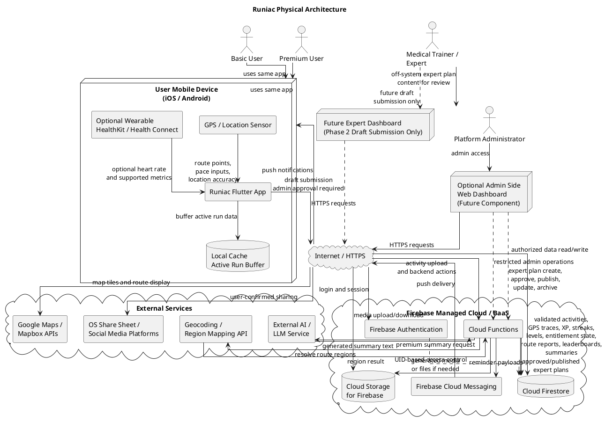

# 02. Physical Architecture

## 2.1 Physical Deployment Explanation

Runiac is deployed as a mobile-first system using a Flutter application and Firebase Backend-as-a-Service (BaaS). The main runtime environment is the user's iOS or Android mobile device. The mobile device runs the Runiac Flutter app, collects GPS-based activity data, displays maps and progress information, and communicates with managed Firebase services through the Internet using HTTPS.

The backend is not deployed as a custom server, Kubernetes cluster, or microservice platform. Instead, backend responsibilities are handled by managed Firebase cloud components. Firebase Authentication manages user identity, Cloud Firestore stores application data, Cloud Functions runs server-side validation and aggregation logic, Firebase Cloud Messaging delivers reminders, and Cloud Storage for Firebase stores files or generated media if required.

External services are used only where Firebase and the mobile device do not provide the required capability. Google Maps / Mapbox APIs provide map rendering and route display. A geocoding or region mapping service may be used by backend processing to associate run routes with country, city, district, or neighbourhood regions. An external AI/LLM service may be used for Premium post-run summaries through backend-controlled summary generation. Social sharing is performed through the operating system share sheet and external social media applications, with user confirmation.

Medical Trainer/Expert plan content is not written directly to Firebase by the expert in the MVP. The Medical Trainer/Expert prepares expert goal plan content through an off-system or controlled submission process. The Platform Administrator reviews the submitted content for safety, completeness, beginner suitability, and consistency with Runiac standards before entering, approving, publishing, updating, or archiving the expert plan in the system.

An optional admin web dashboard may be added as an admin-side component for Platform Administrators. This dashboard is not required for the MVP mobile user flow. For the FYP demo, route moderation and expert plan management can be handled through a restricted backend workflow; if a dashboard is implemented later, it should use Firebase Authentication and restricted backend operations through Cloud Functions for moderation, expert plan review/publication, user support, and configuration tasks. A future Expert Dashboard may allow verified experts to submit draft plan content in Phase 2, but it must not publish plans without Platform Administrator approval.

## 2.2 Client Device Responsibilities

| Client-side component | Physical responsibility |
| --- | --- |
| iOS / Android mobile device | Runs the Flutter application and provides access to platform capabilities such as GPS, notifications, local storage, and OS sharing. |
| Runiac Flutter app | Renders the user interface, handles navigation, displays activity history, shows plans, maps, XP, streaks, and leaderboard views. |
| GPS / location sensor | Captures route points, location accuracy, pace-related data, and distance-related inputs during a running session. |
| Optional wearable integration | Provides supported metrics such as heart rate through platform mechanisms such as HealthKit or Health Connect, where available. |
| Local cache / active run buffer | Temporarily stores in-progress activity data so that a run is not lost when the user has weak or unstable network connectivity. |
| Push notification receiver | Receives reminder and engagement notifications delivered through Firebase Cloud Messaging. |
| OS share sheet | Allows the user to share selected run summaries, achievement cards, or leaderboard cards to external platforms after explicit confirmation. |

The mobile client may calculate display-only values needed for immediate feedback during a run, such as elapsed time or temporary pace display. However, the client must not be trusted as the authority for XP, level, streak, leaderboard score, or rank. Those values are calculated or validated through Firebase Cloud Functions before being stored.

## 2.3 Firebase Cloud Responsibilities

| Firebase service | Responsibility in Runiac |
| --- | --- |
| Firebase Authentication | Handles sign-in, user identity, session tokens, and access control integration with Firestore security rules and Cloud Functions. |
| Cloud Firestore | Stores persistent application data, including user profiles, onboarding information, subscription or entitlement state, activity records, GPS trace records, route metadata, route reports, training plans, approved/published expert plans, XP records, streak records, leaderboard aggregates, reminder settings, and post-run summaries. |
| Cloud Functions | Performs trusted server-side logic, including the Activity Processing Function for validation, the XP and Streak Function for progression updates, the Leaderboard Aggregation Function for ranking, the Notification Service for reminders, the Entitlement Service for premium checks, Admin Expert Plan Management, route region mapping orchestration, and Summary Generation Function orchestration for AI-assisted summaries. |
| Firebase Cloud Messaging | Sends push notifications for planned runs, rest reminders, missed sessions, streak-risk reminders, and engagement prompts. |
| Cloud Storage for Firebase | Stores binary assets where needed, such as profile images, generated share cards, route-related media, or exported files. Core structured data remains in Firestore. |

Firebase is treated as a managed cloud platform. This keeps the system realistic for a one-semester FYP because the team does not need to operate servers, load balancers, container orchestration, or database infrastructure.

## 2.4 External Service Responsibilities

| External service | Responsibility in Runiac |
| --- | --- |
| Google Maps / Mapbox APIs | Provides map tiles, map rendering support, route display, and map-based interaction for run tracking, community routes, and territorial leaderboard views. |
| Geocoding / region mapping service | Converts route coordinates into administrative or application-defined regions used by territorial leaderboards. This is called from Cloud Functions rather than trusted directly from the client for ranking updates. |
| External AI / LLM service | Generates enhanced Premium post-run summaries from structured activity context prepared by Cloud Functions. It does not directly read from or write to Firestore. |
| OS share sheet / social media platforms | Allows users to share selected content outside Runiac. Sharing is user-initiated and should avoid exposing sensitive route or health information without confirmation. |
| Optional admin web dashboard | Future or admin-side interface for Platform Administrators to moderate routes, review reports, create/review/publish/update/archive expert plans, manage basic configuration, and support users. It should access Firebase through authenticated and authorized paths only. |
| Future Expert Dashboard | Phase 2-only draft submission interface for verified Medical Trainer/Expert users. It may submit draft plan content for review, but it cannot publish plans directly. |

## 2.5 Network Communication Flow

1. A Basic User or Premium User opens the Runiac Flutter app on an iOS or Android mobile device.
2. The app authenticates the user through Firebase Authentication over HTTPS. The resulting identity token is used when accessing protected Firebase resources.
3. During a run, the app collects GPS samples and optional wearable metrics locally. The active run is buffered on the device to reduce data-loss risk during poor connectivity.
4. After the user completes the run, the app uploads the activity data over HTTPS. The Activity Processing Function validates the activity before it can affect XP, streaks, levels, or leaderboards.
5. The Cloud Functions layer writes validated activity results, GPS trace records, XP updates, streak updates, level changes, entitlement-checked outputs, route report state, and leaderboard aggregates to Cloud Firestore.
6. The app reads user-specific data and aggregated public data from Cloud Firestore using Firebase SDK communication over HTTPS.
7. For map screens, the app requests map tiles and route display support from Google Maps / Mapbox APIs over HTTPS.
8. For territorial leaderboard processing, Cloud Functions may call geocoding or region mapping APIs to resolve route coordinates into supported regions.
9. For Premium post-run summaries, Cloud Functions prepares a structured prompt, calls the external AI/LLM service over HTTPS, applies safety constraints, and stores the generated summary in Firestore.
10. For reminders, scheduled Cloud Functions evaluate plans, inactivity, streak risk, and rest conditions, then send notification payloads through Firebase Cloud Messaging to the user device.
11. If the user chooses to share a run, rank card, or summary, the app invokes the OS share sheet. The user selects the external platform and confirms the share.
12. Medical Trainer/Expert plan content is submitted off-system or through a controlled draft-submission process. It is not written directly into Firebase by the expert in the MVP.
13. Platform Administrator actions are handled through a restricted backend moderation and expert plan management workflow. If an optional admin dashboard is implemented, the Platform Administrator accesses it through a browser over HTTPS and performs restricted admin actions through Firebase Authentication and Cloud Functions.
14. Premium Users read only approved and published expert plan records from Firestore-backed views.

## 2.6 Security Considerations

- All client-to-cloud communication should use HTTPS through Firebase SDKs or approved external provider SDKs.
- Firebase Authentication should be the source of user identity. The mobile app should not store raw passwords or implement custom authentication.
- Firestore security rules should enforce user-specific access for private records such as health profile information, activity history, GPS routes, training plans, and account settings.
- Cloud Functions should enforce trusted operations for activity validation, XP calculation, streak calculation, level assignment, leaderboard aggregation, route moderation state changes, expert plan review/publication state changes, AI summary orchestration, and Premium entitlement checks.
- The mobile client must not directly write authoritative XP, level, rank, streak, or leaderboard score fields.
- Premium features must be checked on the backend where they affect data generation or access, not only hidden in the mobile UI.
- Location privacy must be protected. Shared routes should support privacy masking for sensitive start and end points, and public sharing should require explicit user confirmation.
- Health-related onboarding data and injury information should be treated as sensitive data and only used for running guidance, plan generation, and safe progression support.
- External AI/LLM calls should receive only the minimum structured context needed to generate a post-run summary. The external service should not receive unnecessary personal, health, or precise location data.
- Admin dashboard or restricted backend workflow access should be separated from normal user access through role checks, restricted Cloud Functions, and audit-friendly operations. There should be no client-side-only admin path and no Medical Trainer/Expert direct publication path in the MVP.
- Firebase budget alerts, Firestore query design, and pre-aggregated leaderboard records should be used to reduce the risk of uncontrolled operating cost.

## 2.7 PlantUML Source for Physical Architecture Diagram

The physical diagram includes future or Phase 2 infrastructure paths for community route sharing, territorial leaderboard aggregation, AI-assisted summaries, optional generated media storage, an optional admin dashboard, and a future Expert Dashboard for draft submission only. These paths show the intended deployment design, but they do not mean all Phase 2 features must be completed for the MVP demo.

Caption: The PlantUML diagram keeps Basic User and Premium User as separate actors for clarity, but both use the same Runiac mobile app deployment. Medical Trainer/Expert does not directly publish to Firebase in the MVP; expert content is reviewed and published by the Platform Administrator. Phase 2 paths such as community route sharing, territorial leaderboard aggregation, AI-assisted summaries, optional generated media storage, an optional admin dashboard, and a future Expert Dashboard are included for intended design completeness and are not all required for the MVP demo.
