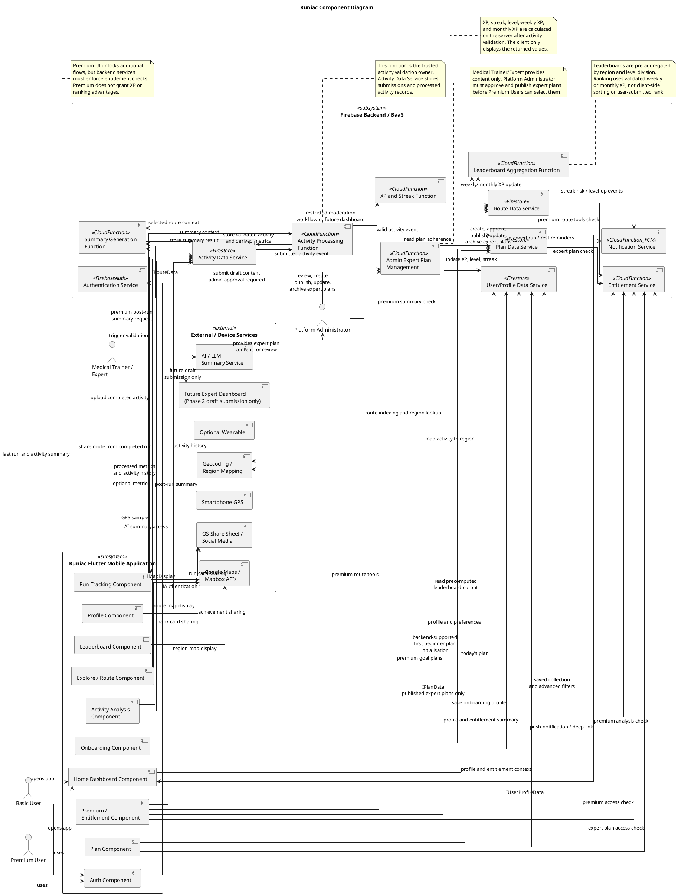

# 03. Component Diagram

## 3.1 Component Diagram Explanation

The component diagram describes the main software components that make up Runiac and the dependencies between them. It is a design-level view, so screens are grouped by feature area instead of being shown one by one. This keeps the diagram focused on responsibility boundaries rather than navigation detail.

Runiac is organised into a Flutter mobile application and a Firebase backend. The Flutter application handles user interaction, screen rendering, GPS-based run tracking, map display, and local session behaviour. Firebase provides authentication, persistent data access, backend processing, aggregation, and notification delivery. External services such as map providers, geocoding, device sensors, the operating system share sheet, and optional AI summary generation sit outside the Runiac ownership boundary.

The most important design rule is that the client does not directly calculate or write XP, level, rank, streak, or leaderboard score. The mobile app uploads completed activity data and reads processed results from Firestore-backed views or controlled backend interfaces, while Cloud Functions perform validation, XP and streak calculation, summary generation, entitlement checks, and leaderboard aggregation on the server side.

User tier and role are separate concerns. `subscriptionStatus` distinguishes Basic and Premium access. `userRole` distinguishes operational or governance roles, such as Platform Administrator and Medical Trainer/Expert. For expert plans, Medical Trainer/Expert is a content provider only. Platform Administrator owns expert plan review, create, publish, update, and archive actions.

## 3.2 Canonical Component Names

| Area | Canonical name used in this PDD |
| --- | --- |
| Authentication | Auth Component, Authentication Service |
| Onboarding and profile | Onboarding Component, Profile Component, User/Profile Data Service |
| Plans | Plan Component, Plan Data Service |
| Expert plan governance | Admin Expert Plan Management |
| Running | Run Tracking Component, Activity Data Service, Activity Processing Function |
| Analysis | Activity Analysis Component, Summary Generation Function |
| Progression | XP and Streak Function |
| Routes | Explore / Route Component, Route Data Service |
| Competition | Leaderboard Component, Leaderboard Aggregation Function |
| Notifications | Notification Service |
| Premium access | Premium / Entitlement Component, Entitlement Service |
| Maps | Google Maps / Mapbox APIs |

## 3.3 Main Frontend Components

| Frontend Component | Grouped Feature Area | Main Responsibility | Main Dependencies |
| --- | --- | --- | --- |
| Auth Component | Sign up, login, session entry | Handles user authentication entry points and observes authenticated session state. | Authentication Service, User/Profile Data Service |
| Onboarding Component | Beginner profile setup | Captures running experience, goals, fitness level, health/safety readiness, cautiousness inputs, and initial preferences. | User/Profile Data Service, Plan Data Service |
| Home Dashboard Component | Home tab and daily overview | Displays today's plan, last run, XP/streak summary, reminders, quick start actions, and upgrade prompts. | User/Profile Data Service, Plan Data Service, Activity Data Service |
| Plan Component | Today's plan, weekly plan, schedule editing, premium goal plans | Presents training plans, allows schedule adjustments, and exposes only approved/published premium expert goal plan flows where entitlement allows. | Plan Data Service, User/Profile Data Service, Entitlement Service |
| Run Tracking Component | Run landing, guide, live tracking, pause/end, cool-down, summary entry | Captures GPS and optional wearable metrics during a run, maintains local run state, and uploads completed activity data. | Activity Data Service, Activity Processing Function, Route Data Service, device GPS, optional wearable, Google Maps / Mapbox APIs |
| Activity Analysis Component | Run summary, post-run analysis, premium analysis detail | Displays processed metrics, basic summaries, AI-assisted Premium summaries, and advanced analysis where entitlement allows. It reads backend-generated results rather than generating trusted analysis locally. | Activity Data Service, Summary Generation Function, Entitlement Service |
| Explore / Route Component | Maps/Explore tab, route list, route detail, selected route, basic route sharing, route report | Displays shared routes, route details, selected routes, basic route sharing/upload, saved routes, and route reporting flows. | Route Data Service, Activity Data Service, Entitlement Service, Google Maps / Mapbox APIs |
| Leaderboard Component | Territorial leaderboard, region ranking, league list, rank sharing | Displays pre-aggregated leaderboard data by region and level division; it does not compute rank locally. | Firestore-backed leaderboard records written by Leaderboard Aggregation Function, User/Profile Data Service, Google Maps / Mapbox APIs |
| Profile Component | You tab, progress, calendar, recent runs, level view, preferences | Shows user progress, activity history, streaks, level state, calendar data, and profile preferences. | User/Profile Data Service, Activity Data Service |
| Premium / Entitlement Component | Upgrade page, entitlement display, premium feature access | Displays subscription state and premium access points for expert plans, advanced analytics, AI summaries, advanced route tools, saved route collections, and enhanced sharing. Backend services still enforce premium entitlement. | Entitlement Service, User/Profile Data Service, Plan Data Service, Activity Data Service, Route Data Service |

## 3.4 Main Backend Components

| Backend Component | Firebase Role | Main Responsibility | Main Consumers |
| --- | --- | --- | --- |
| Authentication Service | Firebase Authentication | Manages account identity, login, token/session state, and authenticated access context. | Auth Component, User/Profile Data Service |
| User/Profile Data Service | Cloud Firestore data access | Stores and retrieves user profiles, onboarding data, preferences, subscription entitlement, health/safety readiness and cautiousness signals, and user-visible progression snapshots. | Auth, Onboarding, Home Dashboard, Profile, Premium |
| Plan Data Service | Firestore data access with Cloud Function support | Stores weekly plans, daily plan sessions, schedule edits, plan adherence state, and approved/published premium goal preparation plans. Medical Trainer/Expert does not directly write to this service in the MVP. | Home Dashboard, Plan, Run Tracking, Notification Service, Admin Expert Plan Management |
| Activity Data Service | Cloud Firestore data access | Accepts activity submissions, stores activity history, route traces, derived metrics, and post-run results after trusted processing. It is not the sole authority for validation. | Run Tracking, Home Dashboard, Profile, Explore / Route |
| Activity Processing Function | Cloud Functions | Owns completed activity validation, anti-abuse checks, GPS trace quality checks, metric derivation, and processing events for XP and summary generation. | Activity Data Service, XP and Streak Function, Summary Generation Function |
| XP and Streak Function | Cloud Functions | Calculates XP, streak, level, league division, weekly XP, and monthly XP after a valid activity or scheduled streak check. | Activity Processing Function, User/Profile Data Service, Leaderboard Aggregation Function, Notification Service |
| Leaderboard Aggregation Function | Cloud Functions | Aggregates validated XP data by region and level division, then stores pre-computed weekly/monthly leaderboard records. | Leaderboard Component |
| Route Data Service | Firestore data access with Cloud Function support | Stores shared routes, selected routes, privacy-masked route data, route reports, route moderation state, and route query metadata. Basic users can use basic route sharing when F7 is implemented; Premium adds saved collections, advanced filters, comparison, and enhanced route presentation. Platform Administrator moderation uses a restricted backend workflow or a future admin dashboard. | Explore / Route, Run Tracking, Leaderboard, Platform Administrator |
| Entitlement Service | Cloud Functions with Firestore-backed subscription state | Enforces premium access for expert plans, AI summaries, advanced analytics, saved route collections, route comparison, and premium sharing templates. | Premium / Entitlement, Plan, Activity, Route |
| Admin Expert Plan Management | Restricted Cloud Function or admin workflow | Lets Platform Administrator review submitted expert plan content, create plan records, publish approved plans, update plan versions, and archive old plans. Medical Trainer/Expert can provide content, but cannot publish directly in the MVP. | Platform Administrator, Plan Data Service |
| Summary Generation Function | Cloud Functions | Creates rule-based summaries for Basic users and calls the external AI / LLM service for Premium summaries using backend-prepared context. | Activity Data Service, Premium / Entitlement |
| Notification Service | Cloud Functions and Firebase Cloud Messaging | Evaluates plan adherence, inactivity, streak risk, rest reminders, and sends push notifications to the mobile device. | Home Dashboard, Plan Component, Profile Component |

## 3.5 Interface and Dependency Explanation

The frontend components depend on backend interfaces rather than directly owning backend logic. `IAuthentication` is provided by the Authentication Service and required by the Auth Component. `IUserProfileData`, `IPlanData`, `IActivityData`, and `IRouteData` are provided by Firebase-backed data services and are consumed by the corresponding Flutter feature components.

Run completion follows the most important dependency path. The Run Tracking Component collects GPS and optional wearable data, then sends the completed activity through `IActivityData`. The Activity Data Service records the submission and triggers the Activity Processing Function. The Activity Processing Function is the single trusted validation owner. After a valid activity is confirmed, the XP and Streak Function updates XP, streak, level, weekly XP, and monthly XP. The Leaderboard Aggregation Function then uses the server-side weekly/monthly XP values to update pre-aggregated leaderboard records.

The Leaderboard Component only reads leaderboard results through `ILeaderboardData`. It does not sort users, calculate rank, or decide level divisions on the client. This prevents users from manipulating ranking logic through the mobile app.

The Plan Component depends on `IPlanData` for the current plan and schedule changes. First beginner plan initialisation is backend-supported using onboarding profile, goal, running level, availability, health/safety readiness, and cautiousness inputs. Expert-plan selection is also backend-supported because it depends on entitlement state and approved/published plan status. The Notification Service reads plan, activity, and streak state to send reminders through Firebase Cloud Messaging. Notification delivery is server-driven, while the mobile app only receives the push notification and opens the relevant screen.

Expert plan governance is handled separately from the Premium plan UI. The Medical Trainer/Expert prepares expert plan content but does not publish it into the app or database in the MVP. The Platform Administrator uses Admin Expert Plan Management to review the content for safety, completeness, beginner suitability, and Runiac standards before creating, approving, publishing, updating, or archiving the plan. Premium Users can only read and select published expert plan records.

The Explore / Route Component depends on `IRouteData` and Google Maps / Mapbox APIs. Route sharing uses backend route storage and privacy masking before routes become visible to other users. Basic users may use basic route viewing, route selection, and basic route sharing/upload when F7 is implemented. Premium unlocks advanced filters, saved collections, route comparison, and enhanced route presentation. Region mapping for route and leaderboard features is handled by backend processing and geocoding services rather than by UI screens.

Premium access is represented by the Premium / Entitlement Component on the frontend, but premium enforcement must also exist in backend services. The Entitlement Service checks subscription state for premium-only plans, advanced analysis, AI-assisted summaries, saved route collections, route comparison, and premium sharing templates. Premium users do not receive XP, streak, rank, or leaderboard score advantages.

Phase 2 or future-oriented components are included in the diagram because the PRD and wireframes include them. Route sharing, territorial leaderboard, AI-assisted summaries, expert goal plans, and premium sharing visuals may be implemented after the MVP foundation.

## 3.6 PlantUML Source for Component Diagram

Caption: The PlantUML diagram includes Phase 2 paths such as route sharing, route moderation, territorial leaderboard aggregation, AI-assisted summaries, expert goal plans, a future Expert Dashboard, and premium sharing visuals for intended design completeness. In the MVP, Medical Trainer/Expert provides content only, while Platform Administrator review and publication are required before Premium Users can select expert plans.

## 3.7 Feed/Friends Component Addendum

The Feed extension adds a Flutter Feed Component, per-author Feed Query Coordinator, and keyboard-safe flat Comments Bottom Sheet. The coordinator executes one authorUid equality query per owner/current accepted friend, retains per-author buffers/cursors, and deterministically k-way merges (createdAt, postId) into newest-first pages of 20. Pull-to-refresh is supported; popularity ranking and automatic scroll reordering are excluded. Cached offline rows are visibly read-only, and publication, likes, comments, edits, deletion, and reporting are disabled offline.

Its Firestore contract adds trusted reciprocal friends, directional blocks, validated activities, immutable top-level feedPosts, user-owned likes/flat comments, reporter-private hidden markers, and reports. Clients cannot write relationship, block, hidden, status, likeCount, or commentCount records. Comments are trimmed 1–500-character flat documents, newest-first cursor pages of 20, author-editable/deletable, with no replies. Trusted retry-safe triggers derive counts.

The trusted Function boundary adds publishActivityToFeed, readFeedThumbnail, reportFeedPost, deleteFeedPost, and source-activity cleanup. Explicit confirmation and an owned validated activity are required for at most one immutable snapshot. The owner-only staging PNG is promoted to a server-owned immutable final object with path/generation/SHA-256. readFeedThumbnail returns bounded generation/hash-matched bytes only after active-post, hidden, friendship, and both-block checks; it never returns a signed URL and friends never directly read Storage. The snapshot has safe trusted metrics and sanitized author display fields only, not raw GPS, route arrays, coordinates, addresses, progression, entitlement, expert-plan, or competitive fields. Feed has no authority over XP, streak, level, rank, or leaderboard values.
