# 04. Class Diagram

## Class Diagram Explanation

The class diagram represents the design-level logical structure of Runiac. It identifies the main model classes used to describe users, running activities, GPS traces, plans, routes, route reports, progression, leaderboards, post-run feedback, and notification preferences. It also includes the main service and controller classes that coordinate authentication, plan handling, run tracking, activity processing, XP calculation, leaderboard aggregation, route management, entitlement checks, summary generation, and notifications.

This diagram is intentionally kept at PDD level. It does not show every Flutter widget, screen, Firestore collection detail, Firebase SDK class, or implementation helper. Flutter UI screens use these services and models, while Firebase Authentication, Cloud Firestore, Cloud Functions, Firebase Cloud Messaging, and map services are represented indirectly through service responsibilities.

Basic User and Premium User are not modelled as separate subclasses. Instead, Basic/Premium access is represented through `User.subscriptionStatus`. Operational and governance responsibility is represented through `User.userRole`, such as Platform Administrator and Medical Trainer/Expert. This avoids duplicating user classes when tiers share the same identity, profile, activity, XP, and leaderboard model. Premium-only features, such as expert goal plans, richer route features, and AI-assisted summaries, must still be checked through service-level entitlement rules and backend validation rather than only hiding UI controls.

Expert plan governance is modelled explicitly. `MedicalTrainerExpert` represents the content provider who prepares expert goal plan content. The expert does not directly publish plans into the mobile app or database in the MVP. `AdminExpertPlanManagementService` represents the Platform Administrator's restricted workflow for creating, reviewing, approving, publishing, updating, and archiving expert plans. Premium Users can select only `ExpertPlan` records with a published status.

Server-side responsibilities are also separated from client-side controllers. In particular, the Flutter client may display XP, level, streak, rank, and leaderboard data, but it must not directly calculate or write those values. The `ActivityProcessingFunction`, `XPAndStreakFunction`, and `LeaderboardAggregationFunction` represent backend processing that validates activity data and updates trusted progression and ranking records.

Design assumptions:

- `User.userId` maps to the Firebase Authentication user identifier.
- `subscriptionStatus` is used to distinguish Basic User and Premium User entitlement.
- `userRole` is used for operational or governance roles such as Platform Administrator and Medical Trainer/Expert.
- The Flutter client may create a temporary activity draft during tracking, but trusted activity validation, XP, streak, level, and leaderboard updates are completed by backend logic.
- Medical Trainer/Expert is a content provider only; Platform Administrator controls expert plan approval and publication.
- Expert plans, advanced route management, territorial leaderboard aggregation, and AI-assisted post-run summaries can be treated as Phase 2 or premium-oriented extensions.

## Main Entity Classes

| Class | Purpose | Key attributes |
| --- | --- | --- |
| `User` | Represents the authenticated Runiac account and role/tier state. | `userId`, `email`, `userRole`, `subscriptionStatus`, `createdAt` |
| `UserProfile` | Stores onboarding and personal running profile information, including readiness and cautiousness signals. | `profileId`, `userId`, `displayName`, `fitnessLevel`, `goals`, `healthSafetyReadiness`, `planCautiousness` |
| `TrainingPlan` | Represents a user's active or historical running plan. | `planId`, `userId`, `goalType`, `planType`, `startDate`, `endDate`, `status` |
| `PlanDay` | Represents one scheduled workout or rest day inside a training plan. | `planDayId`, `scheduledDate`, `workoutType`, `targetDistance`, `targetDuration`, `completionStatus`, `xpReward` |
| `Activity` | Stores a completed or submitted run activity after run tracking. | `activityId`, `userId`, `planDayId`, `routeId`, `startedAt`, `endedAt`, `distance`, `duration`, `avgPace`, `validationStatus` |
| `ActivityTrackPoint` | Represents a lightweight GPS trace point captured during a run. | `trackPointId`, `activityId`, `latitude`, `longitude`, `timestamp`, `accuracy`, `sequenceNo` |
| `Route` | Represents a running route that can be selected, viewed, shared, or moderated. | `routeId`, `ownerUserId`, `title`, `distance`, `estimatedDuration`, `difficulty`, `region`, `visibilityStatus` |
| `SavedRoute` | Links a user to a saved or favourite route. | `savedRouteId`, `userId`, `routeId`, `savedAt`, `collectionName` |
| `RouteReport` | Represents a user-submitted report for unsafe or inappropriate shared route content. | `reportId`, `routeId`, `reporterUserId`, `reason`, `description`, `status`, `createdAt` |
| `UserStats` | Stores trusted progression values calculated by backend logic. | `userId`, `totalXP`, `level`, `streakCount`, `weeklyXP`, `monthlyXP`, `leagueDivision`, `updatedAt` |
| `LeaderboardEntry` | Represents a user's ranking record for a region, period, and league division. | `entryId`, `userId`, `region`, `leagueDivision`, `rankingPeriod`, `scoreXP`, `rank`, `updatedAt` |
| `PostRunSummary` | Stores post-run feedback for a completed activity. | `summaryId`, `activityId`, `summaryType`, `feedbackText`, `nextRunFocus`, `generatedBy`, `generatedAt` |
| `MedicalTrainerExpert` | Represents the expert plan content provider. | `expertId`, `name`, `specialty`, `credentialSummary`, `providerStatus` |
| `ExpertPlan` | Represents Premium expert or goal-based plan templates governed by admin review. | `expertPlanId`, `expertId`, `title`, `goalType`, `difficulty`, `durationWeeks`, `createdByAdminId`, `reviewedByAdminId`, `status`, `reviewComment`, `publishedAt`, `version` |
| `PlanReview` | Records Platform Administrator review decisions for expert plan content. | `reviewId`, `expertPlanId`, `reviewerAdminId`, `decision`, `comment`, `reviewedAt` |
| `NotificationPreference` | Stores user preferences for reminders and push notifications. | `preferenceId`, `userId`, `runReminderEnabled`, `restReminderEnabled`, `streakRiskEnabled`, `reminderTime`, `fcmToken` |

## Main Service And Controller Classes

| Class | Layer | Design responsibility |
| --- | --- | --- |
| `AuthService` | Flutter client and Firebase Auth integration | Creates accounts, signs users in/out, resolves the current authenticated user, and links identity to the `User` and `UserProfile` records. |
| `PlanService` | Client/backend coordination service | Loads training plans, requests backend-supported first beginner plan initialisation from onboarding inputs, reschedules `PlanDay` items, checks premium access for published `ExpertPlan` records, and saves plan updates. |
| `RunTrackingService` | Flutter client controller | Starts, pauses, resumes, and ends active GPS run tracking. It creates an activity draft but does not award XP or update leaderboard data. |
| `ActivityService` | Client/backend coordination service | Submits completed activities, retrieves activity history, and reads generated analysis or summary results. Validation is delegated to `ActivityProcessingFunction`. |
| `ActivityProcessingFunction` | Cloud Function / backend service | Owns activity validation, anti-abuse checks, GPS trace quality checks, derived metric creation, and downstream processing events. |
| `XPAndStreakFunction` | Cloud Function / backend service | Calculates XP, updates `UserStats`, updates streak and level values, and triggers downstream leaderboard refresh after valid activity processing. |
| `LeaderboardAggregationFunction` | Backend aggregation function | Aggregates trusted `UserStats` into regional and league-based `LeaderboardEntry` records and returns leaderboard views to the app. |
| `RouteService` | Client/backend route service | Searches routes, saves or removes saved routes, publishes eligible shared routes, and supports route report/moderation workflows. Basic route sharing is allowed when F7 is implemented; Premium adds advanced route tools. |
| `EntitlementService` | Backend service | Checks `subscriptionStatus` before allowing expert plans, AI-assisted summaries, advanced analytics, saved route collections, route comparison, or premium sharing templates. |
| `AdminExpertPlanManagementService` | Restricted admin service | Allows Platform Administrator to create, review, approve, publish, update, version, and archive expert plans. |
| `SummaryGenerationFunction` | Cloud Function / backend service | Generates rule-based Basic summaries and coordinates AI / LLM-assisted Premium summaries through backend-controlled processing. |
| `NotificationService` | Backend scheduling and FCM service | Reads `NotificationPreference`, checks plan and streak conditions, and sends run, rest, missed-session, or streak-risk reminders through Firebase Cloud Messaging. |

## Important Relationships

| Relationship | Meaning |
| --- | --- |
| `User` 1 to 1 `UserProfile` | Each authenticated account has one running profile used for onboarding, goal setting, and plan personalisation. |
| `User` 1 to 1 `UserStats` | Each user has one trusted progression record. This record is updated by backend processing, not directly by the Flutter client. |
| `User` 1 to 1 `NotificationPreference` | Each user can configure reminder and notification settings. |
| `User` 1 to many `TrainingPlan` | A user may have one active plan and historical plans over time. |
| `TrainingPlan` 1 to many `PlanDay` | A training plan is composed of scheduled workout/rest days. |
| `PlanDay` 0 or 1 to `Activity` | A planned day may be completed by one activity, but free runs may exist without a plan day. |
| `User` 1 to many `Activity` | A user can record many running activities. |
| `Activity` 1 to many `ActivityTrackPoint` | A run can contain GPS trace points used for map display, distance reconstruction, and validation. |
| `Activity` 0 or 1 to `Route` | A run may use a selected community route, but quick-start runs can be recorded without a predefined route. |
| `Activity` 0 or 1 to `PostRunSummary` | A validated activity may produce a basic or AI-assisted post-run summary. |
| `User` 1 to many `SavedRoute` and `SavedRoute` many to 1 `Route` | Saved routes are represented as a linking class so route ownership and route saving are not confused. |
| `User` and `Route` to `RouteReport` | Users can report unsafe or inappropriate shared routes, and reports support Platform Administrator moderation. |
| `MedicalTrainerExpert` to `ExpertPlan` | The expert provides source content for expert plans but does not publish directly. |
| `ExpertPlan` to `PlanReview` | Expert plan review decisions are recorded before publication. |
| `ExpertPlan` to `TrainingPlan` | Published Premium expert plans act as templates or sources for user-specific training plans. |
| `UserStats` to `LeaderboardEntry` | Weekly and monthly XP values feed leaderboard aggregation, but rank is stored in `LeaderboardEntry` after backend processing. |
| `RunTrackingService` to `ActivityService` to `ActivityProcessingFunction` | The client records run data and submits it; backend processing performs validation before XP, summaries, and leaderboard updates can occur. |
| `EntitlementService` to premium-only flows | Premium-only data generation and access are checked by backend entitlement logic, not only by UI visibility. |
| `AdminExpertPlanManagementService` to `ExpertPlan` | Only Platform Administrator can enter, approve, publish, update, or archive expert plans in the system. |
| `NotificationService` to `PlanDay`, `UserStats`, and `NotificationPreference` | Reminder logic depends on the user's schedule, streak risk, and notification preferences. |

## MVP And Future Extension Notes

The MVP class model is centred on `User`, `UserProfile`, `TrainingPlan`, `PlanDay`, `Activity`, `ActivityTrackPoint`, `UserStats`, `NotificationPreference`, and the core services for authentication, plan handling, run tracking, activity submission, activity processing, XP processing, entitlement checks, and notifications.

`Route`, `SavedRoute`, `RouteReport`, `LeaderboardEntry`, `MedicalTrainerExpert`, `ExpertPlan`, `PlanReview`, and AI-enhanced `PostRunSummary` support Phase 2 or premium-oriented features such as community route sharing, route moderation, territorial leaderboards, governed expert goal plans, and richer post-run feedback. They are included in the diagram because they are part of the overall Runiac design, but they can be implemented after the MVP foundation is stable.

## PlantUML Source

```plantuml
@startuml Runiac_Class_Diagram
title Runiac Design-Level Class Diagram

skinparam classAttributeIconSize 0
hide circle

package "Entity / Model Classes" {
  class User <<Entity>> {
    - userId: String
    - email: String
    - userRole: String
    - subscriptionStatus: String
    - createdAt: DateTime
  }

  class UserProfile <<Entity>> {
    - profileId: String
    - userId: String
    - displayName: String
    - fitnessLevel: String
    - goals: List<String>
    - healthSafetyReadiness: String
    - planCautiousness: String
  }

  class TrainingPlan <<Entity>> {
    - planId: String
    - userId: String
    - goalType: String
    - planType: String
    - startDate: Date
    - endDate: Date
    - status: String
  }

  class PlanDay <<Entity>> {
    - planDayId: String
    - scheduledDate: Date
    - workoutType: String
    - targetDistance: Double
    - targetDuration: Int
    - completionStatus: String
    - xpReward: Int
  }

  class Activity <<Entity>> {
    - activityId: String
    - userId: String
    - planDayId: String
    - routeId: String
    - startedAt: DateTime
    - endedAt: DateTime
    - distance: Double
    - duration: Int
    - avgPace: Double
    - validationStatus: String
  }

  class ActivityTrackPoint <<Entity>> {
    - trackPointId: String
    - activityId: String
    - latitude: Double
    - longitude: Double
    - timestamp: DateTime
    - accuracy: Double
    - sequenceNo: Int
  }

  class Route <<Entity>> {
    - routeId: String
    - ownerUserId: String
    - title: String
    - distance: Double
    - estimatedDuration: Int
    - difficulty: String
    - region: String
    - visibilityStatus: String
  }

  class SavedRoute <<Entity>> {
    - savedRouteId: String
    - userId: String
    - routeId: String
    - savedAt: DateTime
    - collectionName: String
  }

  class RouteReport <<Entity>> {
    - reportId: String
    - routeId: String
    - reporterUserId: String
    - reason: String
    - description: String
    - status: String
    - createdAt: DateTime
  }

  class UserStats <<Entity>> {
    - userId: String
    - totalXP: Int
    - level: Int
    - streakCount: Int
    - weeklyXP: Int
    - monthlyXP: Int
    - leagueDivision: String
    - updatedAt: DateTime
  }

  class LeaderboardEntry <<Entity>> {
    - entryId: String
    - userId: String
    - region: String
    - leagueDivision: String
    - rankingPeriod: String
    - scoreXP: Int
    - rank: Int
    - updatedAt: DateTime
  }

  class PostRunSummary <<Entity>> {
    - summaryId: String
    - activityId: String
    - summaryType: String
    - feedbackText: String
    - nextRunFocus: String
    - generatedBy: String
    - generatedAt: DateTime
  }

  class MedicalTrainerExpert <<Entity>> {
    - expertId: String
    - name: String
    - specialty: String
    - credentialSummary: String
    - providerStatus: String
  }

  class ExpertPlan <<Entity>> {
    - expertPlanId: String
    - expertId: String
    - title: String
    - goalType: String
    - difficulty: String
    - durationWeeks: Int
    - createdByAdminId: String
    - reviewedByAdminId: String
    - status: String
    - reviewComment: String
    - publishedAt: DateTime
    - version: Int
  }

  class PlanReview <<Entity>> {
    - reviewId: String
    - expertPlanId: String
    - reviewerAdminId: String
    - decision: String
    - comment: String
    - reviewedAt: DateTime
  }

  class NotificationPreference <<Entity>> {
    - preferenceId: String
    - userId: String
    - runReminderEnabled: Boolean
    - restReminderEnabled: Boolean
    - streakRiskEnabled: Boolean
    - reminderTime: String
    - fcmToken: String
  }
}

package "Service / Controller Classes" {
  class AuthService <<Client Service>> {
    + createAccount(): User
    + signIn(): User
    + signOut(): void
    + getCurrentUser(): User
  }

  class PlanService <<Coordination Service>> {
    + getActivePlan(userId: String): TrainingPlan
    + createBeginnerPlanFromOnboarding(userId: String): TrainingPlan
    + reschedulePlanDay(planDayId: String): PlanDay
    + selectExpertPlan(expertPlanId: String): TrainingPlan
  }

  class RunTrackingService <<Client Controller>> {
    + startRun(): Activity
    + pauseRun(): void
    + resumeRun(): void
    + endRun(): Activity
  }

  class ActivityService <<Application Service>> {
    + submitActivity(activity: Activity): void
    + getActivityHistory(userId: String): List<Activity>
    + getPostRunSummary(activityId: String): PostRunSummary
  }

  class ActivityProcessingFunction <<Cloud Function>> {
    + validateActivity(activityId: String): Boolean
    + deriveMetrics(activityId: String): void
    + checkTraceQuality(activityId: String): Boolean
    + publishProcessingEvent(activityId: String): void
  }

  class XPAndStreakFunction <<Cloud Function>> {
    + calculateXP(activityId: String): Int
    + updateUserStats(userId: String): UserStats
    + triggerLeaderboardRefresh(userId: String): void
  }

  class LeaderboardAggregationFunction <<Backend Service>> {
    + aggregateRegionRankings(region: String): void
    + getLeaderboard(region: String): List<LeaderboardEntry>
    + getUserRank(userId: String): LeaderboardEntry
  }

  class RouteService <<Application Service>> {
    + searchRoutes(region: String): List<Route>
    + saveRoute(userId: String, routeId: String): SavedRoute
    + removeSavedRoute(savedRouteId: String): void
    + submitRouteReport(routeId: String): RouteReport
    + publishRoute(activityId: String): Route
  }

  class EntitlementService <<Backend Service>> {
    + canAccessFeature(userId: String, featureKey: String): Boolean
    + requirePremium(userId: String, featureKey: String): void
  }

  class AdminExpertPlanManagementService <<Backend Service>> {
    + createExpertPlan(expertId: String): ExpertPlan
    + reviewExpertPlan(expertPlanId: String): PlanReview
    + publishExpertPlan(expertPlanId: String): void
    + updateExpertPlan(expertPlanId: String): ExpertPlan
    + archiveExpertPlan(expertPlanId: String): void
  }

  class SummaryGenerationFunction <<Cloud Function>> {
    + generateBasicSummary(activityId: String): PostRunSummary
    + generatePremiumSummary(activityId: String): PostRunSummary
  }

  class NotificationService <<Backend Service>> {
    + updatePreferences(userId: String): NotificationPreference
    + schedulePlanReminder(planDayId: String): void
    + sendStreakRiskReminder(userId: String): void
    + sendPushNotification(userId: String): void
  }
}

User "1" *-- "1" UserProfile : has
User "1" *-- "1" UserStats : owns
User "1" *-- "1" NotificationPreference : configures
User "1" -- "0..*" TrainingPlan : follows
TrainingPlan "1" *-- "1..*" PlanDay : contains
PlanDay "0..1" -- "0..1" Activity : completed by
User "1" -- "0..*" Activity : records
Activity "1" *-- "0..*" ActivityTrackPoint : contains
Activity "0..*" --> "0..1" Route : uses
Activity "1" *-- "0..1" PostRunSummary : produces
User "1" -- "0..*" Route : creates
User "1" -- "0..*" SavedRoute : saves
SavedRoute "0..*" --> "1" Route : references
User "1" -- "0..*" RouteReport : submits
Route "1" -- "0..*" RouteReport : receives
MedicalTrainerExpert "1" -- "0..*" ExpertPlan : provides content for
ExpertPlan "1" *-- "0..*" PlanReview : has reviews
ExpertPlan "0..1" --> "0..*" TrainingPlan : published template for
User "1" -- "0..*" LeaderboardEntry : ranked as
UserStats "1" ..> "0..*" LeaderboardEntry : feeds score

AuthService ..> User : authenticates
AuthService ..> UserProfile : creates profile
PlanService ..> TrainingPlan : manages
PlanService ..> PlanDay : reschedules
PlanService ..> ExpertPlan : selects published template
PlanService ..> EntitlementService : checks expert plan access
RunTrackingService ..> Activity : creates draft
RunTrackingService ..> ActivityTrackPoint : records GPS trace
RunTrackingService ..> Route : follows selected route
ActivityService ..> Activity : submits
ActivityService ..> ActivityProcessingFunction : triggers processing
ActivityService ..> PostRunSummary : reads
ActivityProcessingFunction ..> Activity : validates
ActivityProcessingFunction ..> ActivityTrackPoint : checks trace quality
ActivityProcessingFunction ..> XPAndStreakFunction : valid activity event
ActivityProcessingFunction ..> SummaryGenerationFunction : summary context
XPAndStreakFunction ..> UserStats : updates XP/streak/level
XPAndStreakFunction ..> LeaderboardAggregationFunction : requests refresh
LeaderboardAggregationFunction ..> UserStats : reads trusted stats
LeaderboardAggregationFunction ..> LeaderboardEntry : writes rank
RouteService ..> Route : manages
RouteService ..> SavedRoute : manages
RouteService ..> RouteReport : records report
RouteService ..> EntitlementService : checks advanced route tools
EntitlementService ..> User : reads subscriptionStatus
EntitlementService ..> ExpertPlan : gates published premium plans
EntitlementService ..> SavedRoute : gates saved collections
AdminExpertPlanManagementService ..> MedicalTrainerExpert : records content provider
AdminExpertPlanManagementService ..> ExpertPlan : create/review/publish/update/archive
AdminExpertPlanManagementService ..> PlanReview : records decision
SummaryGenerationFunction ..> Activity : reads processed activity
SummaryGenerationFunction ..> EntitlementService : checks premium summary
SummaryGenerationFunction ..> PostRunSummary : writes summary
NotificationService ..> NotificationPreference : reads preferences
NotificationService ..> PlanDay : checks schedule
NotificationService ..> UserStats : checks streak risk

note right of User
subscriptionStatus distinguishes Basic and Premium access.
userRole distinguishes operational or advisory roles,
such as Platform Administrator and Medical Trainer/Expert.
end note

note right of UserProfile
healthSafetyReadiness and planCautiousness are
readiness/cautiousness signals for safe beginner
plan generation. They are not diagnosis, treatment,
medical advice, or exercise clearance fields.
end note

note right of PlanService
PlanService coordinates plan access from the client,
but first beginner plan initialisation is
backend-supported using onboarding inputs.
end note

note right of ExpertPlan
status values include:
draft, submitted, pendingAdminReview,
revisionRequested, approved, published,
rejected, archived.
Premium Users can select only published plans.
end note

note right of AdminExpertPlanManagementService
Medical Trainer/Expert provides content only.
Platform Administrator controls plan entry,
approval, publication, updates, and archiving.
end note

note right of ActivityProcessingFunction
ActivityProcessingFunction is the trusted
validation owner. ActivityService only submits
and reads activity data.
end note

note right of XPAndStreakFunction
XP, level, streak, and leaderboard score are
calculated by backend logic. The Flutter client
only displays trusted results.
end note

@enduml
```

Caption: The PlantUML diagram includes Phase 2 classes and services such as `RouteReport`, `LeaderboardEntry`, governed `ExpertPlan`, `PlanReview`, `EntitlementService`, and `SummaryGenerationFunction` for intended design completeness. Medical Trainer/Expert is modelled as a content provider only; Platform Administrator controls expert plan publication. These classes support the overall design but are not all required for the MVP demo.

## Feed/Friends Data-Security Addendum

The class model adds trusted AcceptedFriend and BlockedUser records, an owned validated Activity source, immutable server-derived FeedPost, FeedThumbnail binding, user-owned FeedLike and flat FeedComment, reporter-private HiddenFeedPost, and reporter-owned FeedReport. Basic and Premium remain attributes on User.subscriptionStatus, not subclasses; userRole remains responsible for operational/governance access.

FeedPost.postId equals the source activity identifier and stores only trusted activity metrics, sanitized author display name/avatar initials, timestamps, lifecycle state, server-derived likeCount/commentCount, and final thumbnail path/generation/SHA-256. It excludes raw GPS, route arrays, coordinates, addresses, private profile read dependencies, progression, entitlement, expert-plan, and competitive fields. A validated activity maps to at most one active immutable Feed post; completeRun maps to none until explicit confirmation invokes publishActivityToFeed.

FeedThumbnail represents owner-only feed-thumbnail-staging/{uid}/{activityId}/{uploadId}.png and final server-owned feed-thumbnails/{uid}/{activityId}/route-preview.png. It reuses the exact privacy-masked 88-logical-pixel Running History PNG, with DPR capped at 3, 12-logical-pixel start/end masks, metadata-free bytes, and a 1 MiB limit. Final path, generation, and SHA-256 are binding data.

ReadFeedThumbnail resolves an active post then checks the caller's hidden marker, accepted reciprocal friendship, both directional blocks, and exact thumbnail binding before returning bounded bytes, never a signed URL. The client never directly reads the final object. FeedLifecycleService owns reporting/hiding, owner deletion that preserves the source activity, retry-safe counts, and idempotent source-activity cascade of post, engagement, markers/reports, and exact thumbnail generation. Feed is newest-first through per-author buffered/cursor queries and deterministic global pages of 20; offline access is cached/read-only with all mutations disabled. Existing Cloud Functions remain sole authority for XP, streak, level, rank, leaderboard aggregation, entitlement, and expert-plan publication, so Feed adds no competitive advantage.

### Exact Feed Record Fields

Accepted friendship is represented by reciprocal existence of the two trusted friendship documents, not by a reciprocal Boolean. Each document carries `friendUid`, `createdAt`, and `updatedAt`; a directional block carries `blockedUid`, `createdAt`, and optional `reasonCode`. The validated Feed post uses `authorUid`, `activityId`, `authorDisplayName`, `authorAvatarInitials`, `completedAt`, `distanceMeters`, `durationSeconds`, `averagePaceSecondsPerKm`, `thumbnailStoragePath`, `thumbnailObjectGeneration`, `thumbnailSha256`, `likeCount`, `commentCount`, `status` (`published`, `deleting`, or `deleted`), `schemaVersion`, `createdAt`, and `updatedAt`.

Each like contains `userUid` and `createdAt`. A flat comment contains `authorUid`, `authorDisplayName`, `authorAvatarInitials`, `body`, `createdAt`, and `updatedAt`. The private hidden marker contains `postId` and `createdAt`; a report contains `reporterUid`, `targetType: feedPost`, `targetId`, `reason: feed_inappropriate`, `description: ''`, and `createdAt`. On every friend request, `readFeedThumbnail` performs the three current Firestore relationship/block checks—accepted friendship, author-to-caller block, and caller-to-author block—in addition to active-post, caller-hidden, and exact path/generation/SHA-256 binding validation before returning bytes.
