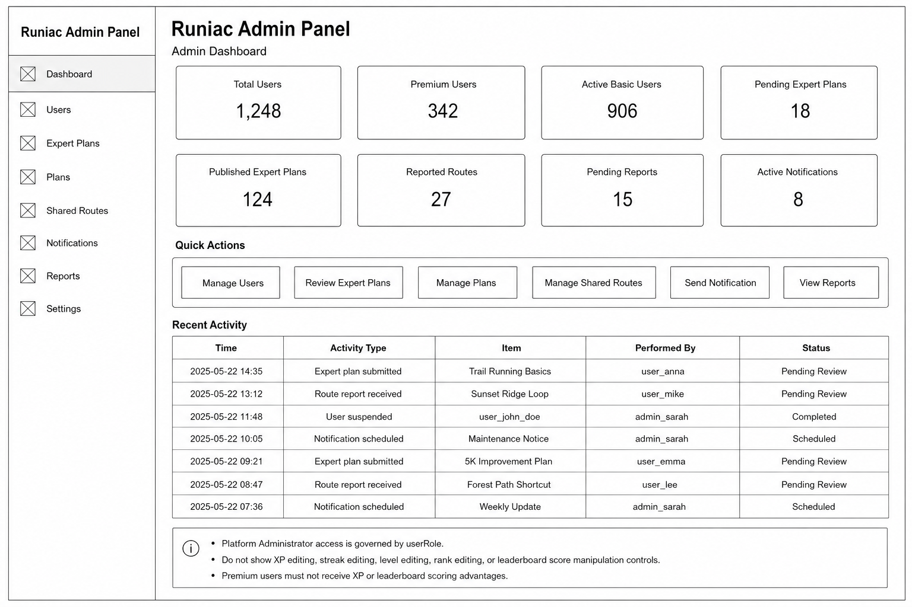
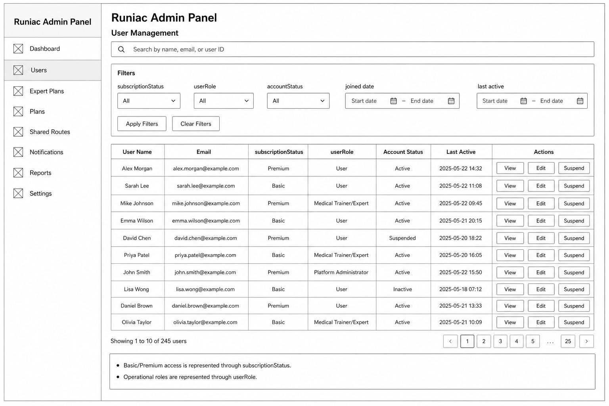
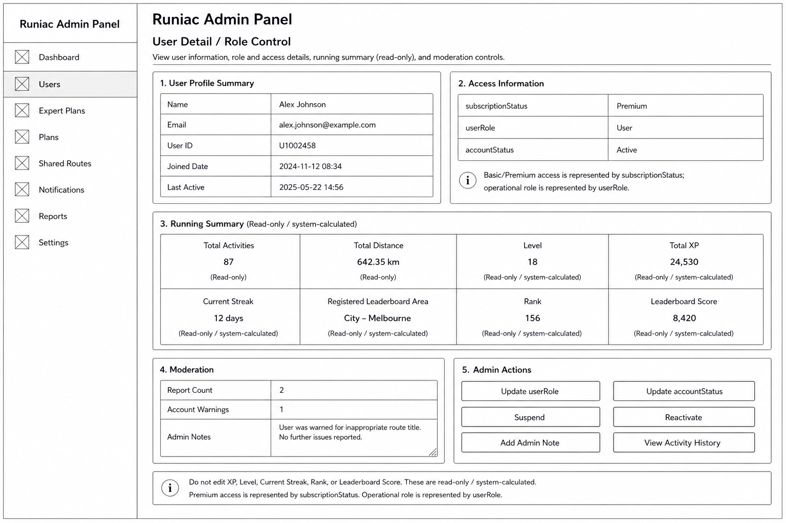
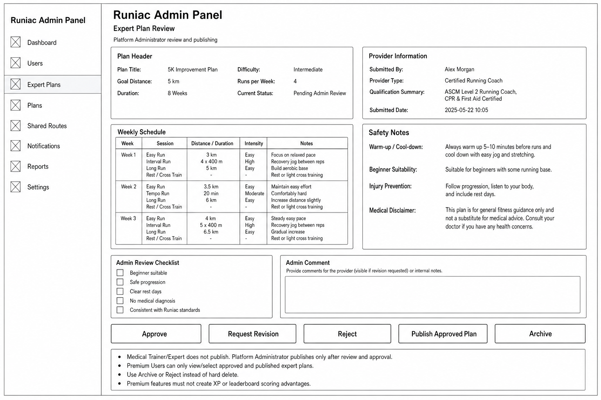
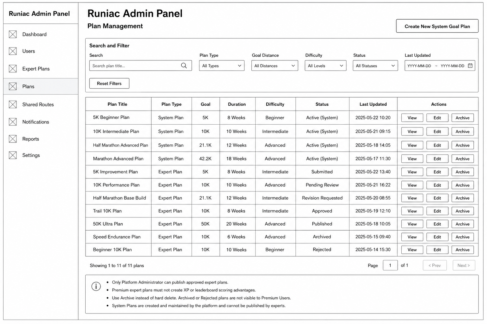
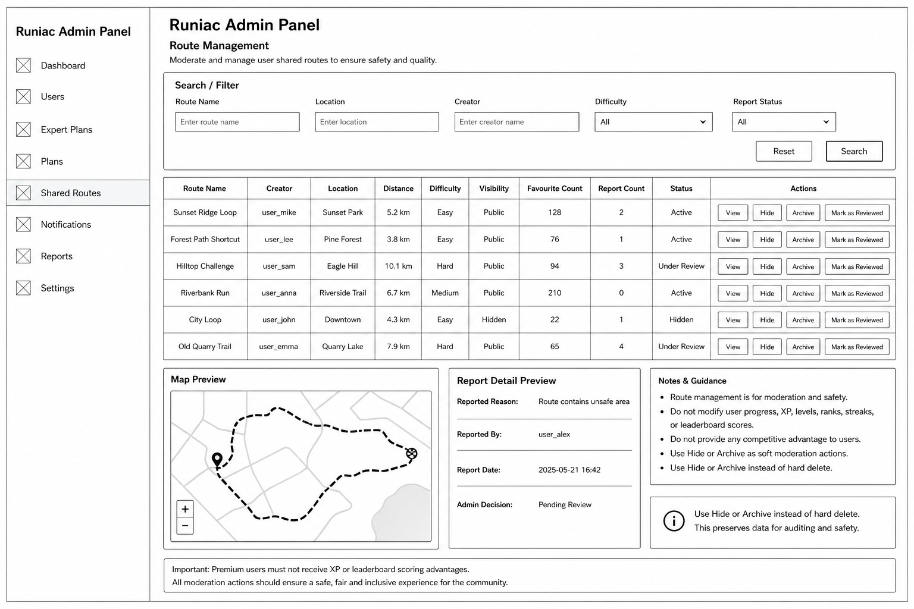
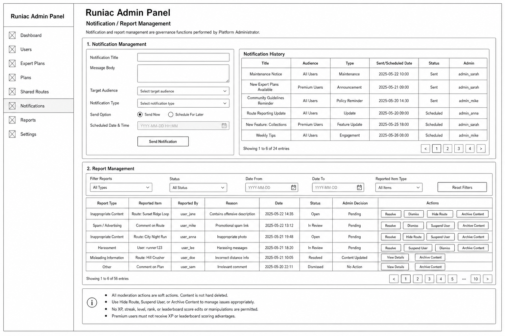
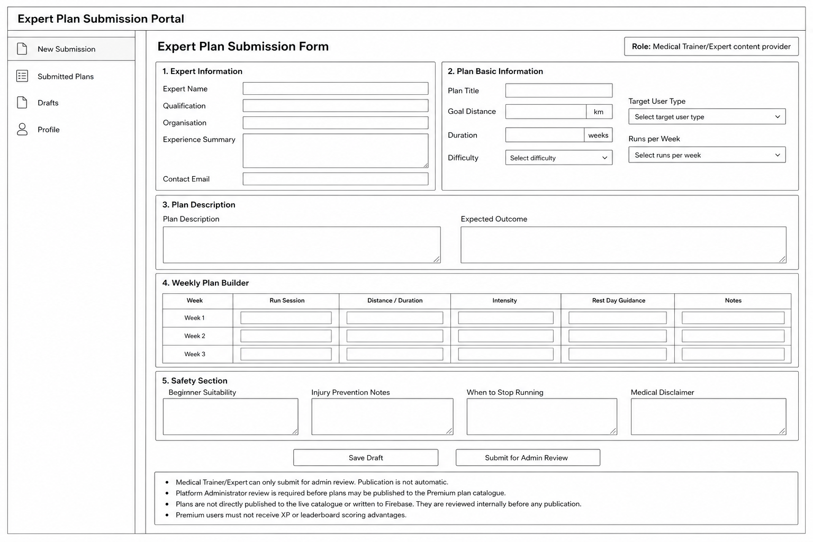
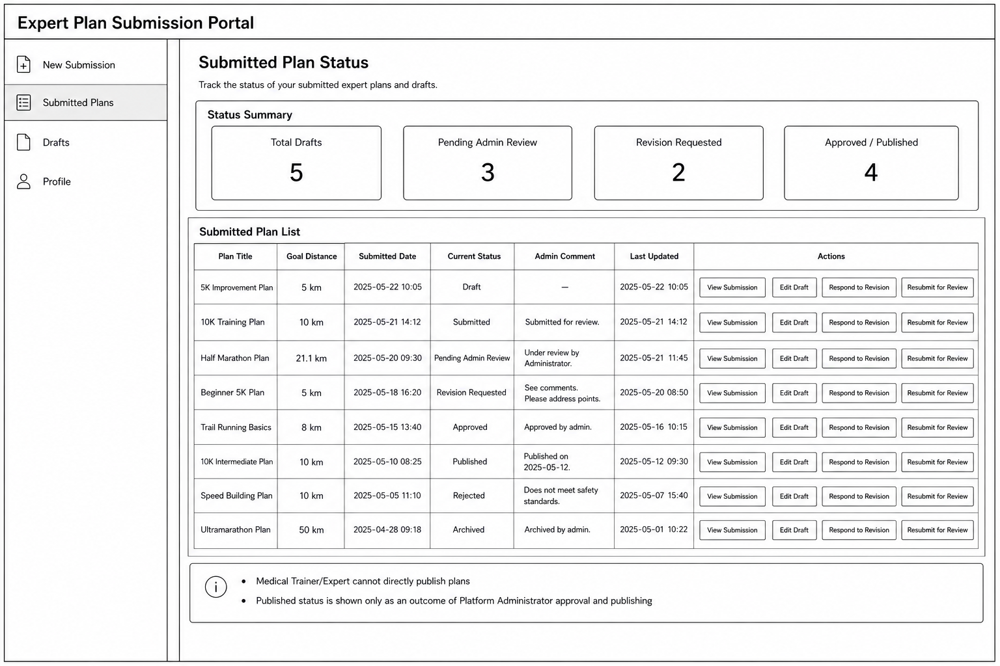

# Final PDD Wireframe Insertion Order

> **Planning note:** This file is a figure insertion planning note. It supports final PDD assembly but is not the final wireframe description section.

This section defines the recommended order for inserting Runiac wireframe figures and explanation text into the final PDD. The sequence starts with the main mobile user journey, then moves to route, leaderboard, profile, premium expert-plan access, and finally the controlled Platform Administrator and Medical Trainer/Expert governance screens.

## Recommended Placement

Insert this material in PDD Section 5, after the wireframe description introduction and before detailed screen-by-screen notes. The Admin/Expert governance flow overview should appear before the Admin/Expert web wireframe figures so readers understand the expert plan lifecycle before seeing the individual governance screens.

## Mobile Figure Grouping Rules

Use grouped figures for repeated Basic/Premium mobile variants instead of inserting every individual screen as a separate large figure. Basic and Premium versions should be compared inside the same figure group where the difference is meaningful, such as Home, Plan, Run Summary, Routes, Leaderboard Sharing, Profile, and Premium Expert Plan Access.

State screens such as loading, empty, permission denied, GPS unavailable, network unavailable, no route found, no plan selected, subscription locked, and route privacy/restricted access can normally be documented as notes under the relevant figure group. They only need separate figures if the final PDD needs to explain a state that is central to the flow.

Most Basic/Premium mobile images already exist under `docs/pdd/wireframe-images/mobile-user/`. Onboarding / Profile Setup is the only likely new mobile image needed later.

## 5.1 Mobile User Wireframes

### Figure 5.1: Home Dashboard

**Suggested source:** Basic Home Page, View Updated Home Page, Premium Home Page, Premium Updated Home Page.

**Caption:** Home Dashboard wireframes showing daily plan guidance, XP progress, weekly plan preview, last-run information, and Premium dashboard extensions.

**PDD explanation:** The Home Dashboard is the main entry point for Basic User and Premium User. It supports daily running guidance, habit visibility, and quick access to the current plan or run start flow. Premium versions add richer goal-plan and route suggestions, but do not create XP or leaderboard scoring advantages.

### Figure 5.2: Onboarding / Profile Setup

**Suggested source:** PRD-based flow description; no separate exported wireframe asset is currently available. This is the only likely new mobile image needed later.

**Caption:** Profile Setup wireframe showing goal, current level, preferred schedule, and health/safety readiness prompts for beginner-friendly plan setup.

**PDD explanation:** Onboarding represents a multi-step setup summary before the user reaches the main app. It collects goal, running level, preferred schedule, and design-level health/safety readiness prompts to guide plan cautiousness and safety messaging. These prompts do not diagnose, treat, provide medical clearance, or claim clinical compliance. Location permission should be requested later when the user starts a run or uses route features, not forced during onboarding.

### Figure 5.3: Plan Home and Today's Plan Detail

**Suggested source:** Basic You Plan Page, Premium You Plan Page, Today's Plan Page, Tuesday's Plan Detail Page, Premium Today's Plan Detail Page.

**Caption:** Training plan wireframes showing weekly plan progress, daily plan detail, session guidance, XP reward display, and start-run entry points.

**PDD explanation:** These wireframes show how users review weekly plans and inspect individual sessions before running. The screens connect Training Plan, Reminder / Notification, Run Tracking, and XP / Streak / Level display. Premium plan details provide richer guidance, while XP remains server-side calculated.

### Figure 5.4: Edit Schedule

**Suggested source:** Edit Plan Schedule Page.

**Caption:** Edit Schedule wireframe showing day/time changes, schedule details, change reason, save, and cancel actions.

**PDD explanation:** The Edit Schedule screen supports realistic beginner habit formation by allowing users to adjust planned sessions rather than abandon the plan. Schedule updates affect plan display and reminders but do not directly award XP.

### Figure 5.5: Run Start and Live Run

**Suggested source:** Run Landing Page, Run Guide Page, Run Tracking Page, Paused Run Tracking Page.

**Caption:** Run flow wireframes showing route/plan confirmation, pre-run guide, active GPS tracking, pause, resume, and end-run controls.

**PDD explanation:** These screens represent the core activity recording journey. Flutter handles the live interaction, map display, and GPS tracking interface, while completed activity processing and trusted progression updates are handled by backend services.

### Figure 5.6: Cool Down and Run Summary

**Suggested source:** Cool Down Landing/Intro, Slow Walking Tracking, Stretching Tracking, Cool Down Completed, Basic Run Summary Page, Premium Run Summary Page, Premium Run Analysis Page, XP & Streak Update.

**Caption:** Post-run wireframes showing recovery guidance, activity summary, XP/streak update, and Premium run analysis.

**PDD explanation:** The post-run flow closes the activity session and converts run data into understandable feedback. Basic users receive essential metrics and beginner-friendly summaries, while Premium users may receive deeper analysis. XP, streak, level, and leaderboard-related values are displayed after server-side calculation.

## 5.2 Route, Leaderboard, and Profile Wireframes

### Figure 5.7: Explore Map and Route List

**Suggested source:** Maps Landing Page, View List of Shared Route Page.

**Caption:** Explore and route discovery wireframes showing map preview, search, nearby shared routes, filters, and route cards.

**PDD explanation:** These screens support community route discovery and route selection. Basic users can browse and select routes when route sharing is implemented, while Premium users may receive richer filters and saved-route management. Route features must not create ranking or XP advantages.

### Figure 5.8: Route Detail and My Route

**Suggested source:** Basic Map Detail Page, Premium Shared Map Detail Page, Route Selected Page, Success Selecting Route Page, Basic My Route Page, Premium My Route Page, Report Route screens.

**Caption:** Route detail and saved-route wireframes showing route information, select-route confirmation, reporting, selected-route management, and Premium saved-route extensions.

**PDD explanation:** The route detail flow allows users to inspect, select, report, and manage routes. Reported routes are handled by Platform Administrator moderation. Premium route features focus on convenience and presentation rather than competitive advantage.

### Figure 5.9: Leaderboard

**Suggested source:** Leaderboard Landing Page, Click Regional Page, View More Ranking Page, View League Page, Leaderboard Sharing Page.

**Caption:** Leaderboard wireframes showing territorial ranking, regional detail, league views, expanded rankings, and sharing.

**PDD explanation:** Leaderboard screens show level-based territorial competition using precomputed backend ranking data. Basic and Premium users can access fair ranking information; Premium may receive enhanced sharing templates but no XP, rank, or leaderboard score advantage.

### Figure 5.10: Profile / You

**Suggested source:** Basic You Page, Premium You Landing Page.

**Caption:** Profile wireframes showing streak, calendar, recent runs, runner level, and plan entry points.

**PDD explanation:** The Profile area gives the user a personal progress view and links to recent run history and plan details. It displays progression information but does not calculate trusted XP, streak, level, or leaderboard values on the client.

### Figure 5.11: Premium Expert Plan Access

**Suggested source:** Explore Expert Goal Plan Page, View Expert Plan Detail Page, View Goal Plan Journey Page, Premium You Plan Page.

**Caption:** Premium expert plan wireframes showing expert plan discovery, published plan detail, goal-plan journey, and Premium plan progress.

**PDD explanation:** Premium Users can view and select only expert plans that have been approved and published by the Platform Administrator. Access is controlled by `subscriptionStatus`, while publication is controlled by administrator governance through `userRole`.

## 5.3 Admin/Expert Governance Flow Overview

### Optional Unnumbered Governance Overview

**Suggested source:** Optional future flow diagram. Existing screen-level coverage is sufficient; this diagram is not required unless the final PDD needs a visual lifecycle summary.

**Suggested caption:** Admin/Expert Expert Plan Governance Flow from Medical Trainer/Expert draft submission to Platform Administrator-controlled publication.

**PDD explanation:** The governance flow begins when the Medical Trainer/Expert creates draft expert plan content and submits it for admin review. The Platform Administrator reviews the plan for safety, completeness, beginner suitability, and Runiac standards. The administrator may request revision, approve, reject, archive, or publish only after approval. Premium Users can view and select only approved and published expert plans.

**Governance note:** Medical Trainer/Expert is a content provider only and must not publish plans. Basic/Premium feature access is controlled by `subscriptionStatus`; operational access is controlled by `userRole`.

## 5.4 Platform Administrator Wireframes

### Figure 5.12: Admin Dashboard

**Caption:** Admin Dashboard showing system status, pending expert plans, reported routes, active notifications, quick actions, and recent activity.

**PDD explanation:** This screen gives the Platform Administrator a central overview of governance workload and system activity. It supports quick movement into user management, expert plan review, plan management, route moderation, notification sending, and report handling.

**Governance note:** Access is controlled by `userRole = Platform Administrator`, not by `subscriptionStatus`.

### Figure 5.13: User Management

**Caption:** User Management screen showing account search, filters, user table, and View/Edit/Suspend actions.

**PDD explanation:** User Management supports administrator search and review of user accounts. Basic/Premium access is represented through `subscriptionStatus`, while operational identity is represented through `userRole`.

**Governance note:** Basic User and Premium User are not separate account classes. Suspend is a soft moderation action.

### Figure 5.14: User Detail / Role Control

**Caption:** User Detail / Role Control screen showing profile, access information, read-only running summary, moderation notes, and admin actions.

**PDD explanation:** This screen lets administrators inspect one user, update role/account status, add notes, and apply moderation actions. XP, level, streak, rank, and leaderboard-related data are shown only as read-only system-calculated fields.

**Governance note:** Admin must not directly edit XP, level, streak, rank, or leaderboard score.

### Figure 5.15: Expert Plan Review

**Caption:** Expert Plan Review screen showing submitted plan details, provider information, weekly schedule, safety notes, review checklist, admin comments, and decision buttons.

**PDD explanation:** Expert Plan Review is the controlled approval screen for expert-submitted plan content. It ensures safety, beginner suitability, completeness, and consistency with Runiac standards before publication.

**Governance note:** Medical Trainer/Expert does not publish plans. Platform Administrator publishes only after review and approval.

### Figure 5.16: Plan Management

**Caption:** Plan Management screen showing system and expert plan records, lifecycle statuses, search filters, and View/Edit/Archive actions.

**PDD explanation:** Plan Management allows the administrator to manage Runiac system goal plans and approved expert plans. It distinguishes System Plan and Expert Plan records and supports lifecycle states such as Submitted, Pending Review, Revision Requested, Approved, Published, Archived, and Rejected.

**Governance note:** Premium expert plans must not create XP, rank, leaderboard score, or competitive advantages.

### Figure 5.17: Route Management

**Caption:** Route Management screen showing shared route search, route table, map preview, report detail preview, and soft moderation actions.

**PDD explanation:** Route Management supports administrative review and moderation of shared routes. It helps handle unsafe, inappropriate, or reported routes through actions such as Hide, Archive, and Mark as Reviewed.

**Governance note:** Route moderation is for safety and privacy only; it must not grant Premium Users competitive advantages.

### Figure 5.18: Notification / Report Management

**Caption:** Notification / Report Management screen showing notification creation, notification history, report table, and moderation actions.

**PDD explanation:** This screen combines system notification management with report handling. It supports administrative communication and moderation decisions such as Resolve, Dismiss, Hide Route, Suspend User, and Archive Content.

**Governance note:** The screen must not include XP, streak, level, rank, or leaderboard score modification controls.

## 5.5 Medical Trainer/Expert Wireframes

### Figure 5.19: Expert Plan Submission Form

**Caption:** Expert Plan Submission Form showing expert credentials, plan details, weekly plan builder, safety guidance, and submission controls.

**PDD explanation:** This screen allows Medical Trainer/Expert to prepare structured expert plan content for Platform Administrator review. It standardises expert input while keeping publication controlled by Runiac governance.

**Governance note:** The screen includes Save Draft and Submit for Admin Review only. It must not include a Publish Plan button.

### Figure 5.20: Submitted Plan Status Page

**Caption:** Submitted Plan Status Page showing submitted expert plans, review statuses, admin comments, and revision-response actions.

**PDD explanation:** This screen allows Medical Trainer/Expert to track submitted plans, edit drafts, respond to revision requests, and resubmit for review. Published status is shown only as an outcome of Platform Administrator approval and publishing.

**Governance note:** Medical Trainer/Expert cannot approve, publish, archive published plans, or directly write published plan records.

## Optional Queue Figure

An additional Expert Plan Review Queue wireframe is optional, not necessary for the current PDD. The existing Admin Dashboard, Expert Plan Review, Plan Management, Expert Plan Submission Form, and Submitted Plan Status Page already explain the expert plan lifecycle. If added later, the caption should be:

**Suggested caption:** Expert Plan Review Queue showing pending expert plan submissions, review status, provider information, and administrator review actions.
