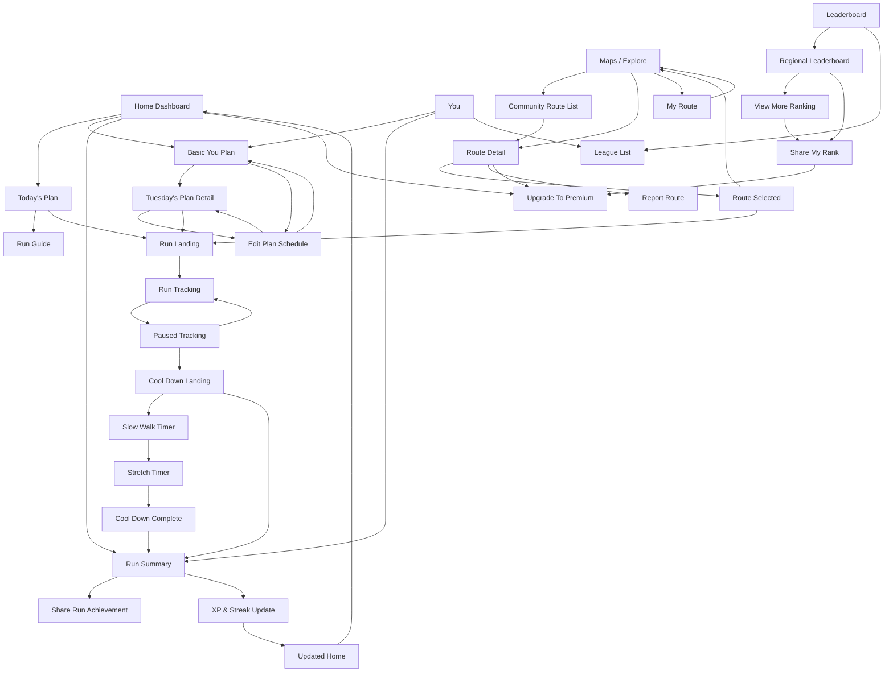
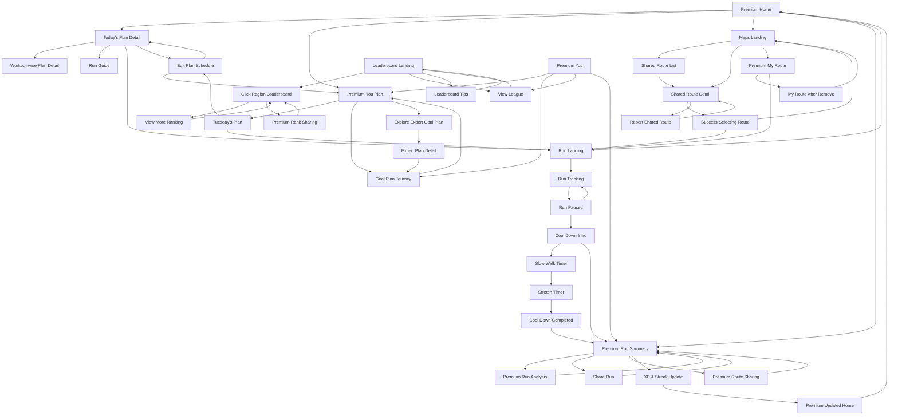

# Runiac Wireframe Reference

> Status: in progress. Basic User and Premium User wireframes have been received and saved. Premium connection overview was received inline in chat; local exported PNG path is still pending.
> Source assets are stored in `docs/pdd/wireframe-images/`.
> Figma prototype: [FYP wireframe](https://www.figma.com/proto/oCLn7dUg6bMSZImRj6zQZ0/FYP_wireframe?node-id=0-1&p=f&t=apDZUaAmueQ3sZzW-0&scaling=min-zoom&content-scaling=fixed&starting-point-node-id=25%3A20)

## Basic User Wireframes

Source folder: `/Users/leejinseo/Desktop/FYP/Wireframe_Figma/Basic`

Saved assets: `docs/pdd/wireframe-images/mobile-user/basic/` and `docs/pdd/wireframe-images/mobile-user/shared/`

Connection overview:

### Basic User Navigation Model

The Basic User wireframes use a five-tab mobile navigation model:

| Tab | Purpose |
| --- | --- |
| Home | Daily dashboard, current plan, XP, weekly plan, last run, premium promotion |
| Maps / Explore | Route discovery, shared routes, route detail, selected route, route reporting |
| Run | Run preparation, guide, active tracking, pause/end run, cool-down, post-run summary |
| Leaderboard | Territorial leaderboard, regional ranking, league list, rank sharing |
| You | Personal progress, calendar, recent runs, level progression, training plan |

### Basic User Screen Inventory

| Area | Screen | Asset | Main Purpose |
| --- | --- | --- | --- |
| Home | Basic Home Page |  | Initial dashboard with today's plan, quick start, XP progress, weekly plan, last run, and premium upgrade card. |
| Home | View Updated Home Page |  | Return state after completing today's plan, showing completion confirmation on the home dashboard. |
| Home / Plan | Today's Plan Page |  | Detailed daily plan with run target, focus items, coach note, XP reward, guide entry, and start run action. |
| Home / Plan | Tuesday's Plan Detail Page |  | Individual planned session detail with schedule, XP reward, edit schedule, and start run action. |
| Home / Plan | Edit Plan Schedule Page |  | Schedule editing screen opened from a planned session, with day selection, recommended/new time slots, change reason, save, and cancel actions. |
| Home / Premium | Upgrade To Premium Page |  | Premium conversion screen showing coach-verified plans, advanced analytics, AI coaching, route sharing, and rank sharing benefits. |
| Maps | Maps Landing Page |  | Explore screen with search, map preview, nearby shared routes, and entry points to route detail or full route list. |
| Maps | View List of Shared Route Page |  | Community route list with search, filters, and route cards. |
| Maps | Basic Map Detail Page |  | Route detail screen showing route map, distance/time/difficulty, runner saves, advice, premium lock card, and select route action. |
| Maps | Route Selected Page |  | Confirmation screen after selecting a route, with go-to-run and back-to-explore actions. |
| Maps | Basic My Route Page |  | Selected route management with change/remove route actions and premium-gated favorite route collection. |
| Maps | View Report Page |  | Report-route modal with selected route, reason options, explanation text area, and report action. |
| Run | Run Landing Page |  | Run start screen with selected route map, today's plan metrics, setting, start, and switch route actions. |
| Run | Run Guide Page |  | Pre-run and after-run guidance with stretch/warm-up items and confirmation action. |
| Run | Run Tracking Page |  | Active run tracking with route progress, elapsed time, pace, distance, and pause action. |
| Run | Paused Run Tracking Page |  | Paused run state with route progress, frozen metrics, resume, and end run controls. |
| Cool Down | Cool Down Landing Page |  | Post-run cool-down intro with slow walk, stretching, start cool-down, and skip-to-summary options. |
| Cool Down | Cool Down Slow Walking Tracking Page |  | Timed slow walk cool-down with circular timer, tips, pause button, and next action. |
| Cool Down | Cool Down Stretching Tracking Page |  | Timed stretching step with instruction, illustration, progress dots, and next action. |
| Cool Down | Cool Down Completed Page |  | Cool-down completion confirmation with XP reward and next button. |
| Run Summary | Basic Run Summary Page |  | Post-run summary with route, distance, pace, duration, heart rate, calories, pace chart, beginner summary, premium AI lock, sharing prompt, and XP update. |
| Run Summary | Share Page |  | Share achievement screen for post-run route and performance metrics. |
| Run Summary | View Updated XP and Streak Page |  | XP and streak result screen after a completed run. |
| Leaderboard | Leaderboard Landing Page |  | Territorial leaderboard map with weekly/monthly XP tabs and ranked-area preview. |
| Leaderboard | Click Regional Page |  | Regional leaderboard detail showing current region, top runners, user rank preview, and sharing actions. |
| Leaderboard | View More Leaderboard Page |  | Expanded regional leaderboard ranking list with nearby user rank. |
| Leaderboard | View League Page |  | League selection/list view for level-based leaderboard divisions. |
| Leaderboard | Basic Share Leaderboard Page |  | Share rank screen with basic rank card and premium-gated visual sharing area. |
| You | Basic You Page |  | Personal progress view with streak, consistency streak, running calendar, recent running history, and runner level. |
| You | Basic You Plan Page |  | Weekly 10K preparation plan with planned/completed/remaining counters and premium-only goal plan section. |
| Connectivity | Whole Wireframe Connection |  | Figma-level connection map showing screen-to-screen navigation. |

### Basic User Connectivity Summary

The Basic User flow is centered around five persistent tabs: Home, Maps, Run, Leaderboard, and You. Most flows branch from these tabs and eventually return to one of the same tab roots.

### Flow Notes

Home and plan flow:

- Home is the main entry screen for daily guidance.
- Today's Plan gives a full breakdown of the current run, coach note, reward, guide entry, and direct start action.
- Weekly plan access leads into Basic You Plan and then individual day details such as Tuesday's Plan Detail.
- Edit Schedule is opened from the weekly/day plan context and lets the user change the run day or time, provide a reason, then save the new schedule or cancel back to the plan detail.
- Completing a run updates XP/streak, then returns the user to an updated Home state.

Maps and route flow:

- Maps Landing lets the user search, view nearby shared routes, open the full community route list, or access My Route.
- Route cards open Basic Map Detail Page.
- Selecting a route leads to Route Selected Page, then Go to Run opens Run Landing.
- Report Route is a modal-style branch from route detail.
- Saving/reusing favorite route collections is premium-gated for Basic users.

Run and recovery flow:

- Run Landing starts from today's plan or a selected route.
- Start begins Run Tracking.
- Pause opens Paused Run Tracking; Resume returns to Run Tracking.
- End Run opens the cool-down flow.
- Cool-down can be completed step-by-step or skipped to Run Summary.
- Run Summary branches to Share Page and XP & Streak Update.

Leaderboard and sharing flow:

- Leaderboard Landing shows territorial ranking from a map view.
- Selecting a region opens Click Regional Page.
- The user can view more rankings, inspect leagues, or share rank.
- Advanced share presentation is premium-gated.

You flow:

- You displays progress, streak, calendar, recent runs, and runner level.
- The Plans tab in You opens Basic You Plan.
- Recent run cards can lead back to Run Summary.
- Level/league-related entry points connect to the league or leaderboard flow.

### PRD Feature Coverage Visible In Basic Wireframes

| PRD Feature | Wireframe Evidence |
| --- | --- |
| F1 Collect running-related activity data | Run Tracking Page, Paused Run Tracking Page, Basic Run Summary Page |
| F2 Estimate running effects and provide analysis | Basic Run Summary Page, pace chart, key run metrics, View Updated XP and Streak Page |
| F3 Supply running advice and schedule a running plan | Basic Home Page, Today's Plan Page, Tuesday's Plan Detail Page, Edit Plan Schedule Page, Basic You Plan Page, Run Guide Page |
| F4 Remind user of running or rest | Home notification icon, weekly plan upcoming state, plan schedule detail |
| F5 Connect with social media and initiate competitions | Share Page, Basic Share Leaderboard Page, share rank actions |
| F6 Streak and consistency tracking | Basic You Page, View Updated XP and Streak Page, weekly progress and consistency streak cards |
| F7 Community-driven route sharing | Maps Landing Page, View List of Shared Route Page, Basic Map Detail Page, Basic My Route Page |
| F8 Level-based territorial leaderboard | Leaderboard Landing Page, Click Regional Page, View More Leaderboard Page, View League Page |
| F9 Runner level and XP progression system | Basic Home Page, Basic You Page, Cool Down Completed Page, View Updated XP and Streak Page |
| F10 AI-assisted post-run summary | Basic Run Summary Page premium AI summary lock, Upgrade To Premium Page |

## Premium User Wireframes

Source folder: `/Users/leejinseo/Desktop/FYP/Wireframe_Figma/Premium`

Saved assets: `docs/pdd/wireframe-images/mobile-user/premium/` and `docs/pdd/wireframe-images/mobile-user/shared/`

### Premium User Navigation Model

Premium keeps the same five-tab structure as Basic, but unlocks richer plan, route, analysis, and sharing flows:

| Tab | Premium Additions |
| --- | --- |
| Home | Goal preparation progress, last-run advice, recommended community route carousel |
| Maps / Explore | Favorite routes, route upload/sharing, selected-route removal state, full shared route reporting |
| Run | Same run/cool-down spine, followed by advanced summary and detailed analysis |
| Leaderboard | Full rank sharing card, league access, regional details, leaderboard tips |
| You | Premium progress landing, plan journey, expert plan exploration, goal-plan details |

### Premium User Screen Inventory

| Area | Screen | Asset | Main Purpose |
| --- | --- | --- | --- |
| Home | Premium Home Page |  | Premium dashboard with today's plan, 10K preparation progress, XP, weekly plan, last-run advice, and recommended community routes. |
| Home | Premium Updated Home Page |  | Home state after run completion or progress update. |
| Plan | Today's Plan Detail Page |  | Premium daily plan detail with richer workout guidance. |
| Plan | View Detail of Today's Plan |  | Workout-wise detail view for today's plan. |
| Plan | Tuesday's Plan Page |  | Individual planned run detail for a weekly plan item. |
| Plan | Edit Plan Schedule Page |  | Premium schedule editing flow with day, time, duration, reason, save, and cancel actions. |
| Plan | View Goal Plan Journey Page |  | Goal-plan journey/progress overview for milestone preparation. |
| Plan | Explore Expert Goal Plan Page |  | Premium expert plan discovery list. |
| Plan | View Expert Plan Detail Page |  | Detailed view of a selected expert goal plan. |
| Maps | Maps Landing Page |  | Premium explore landing with route search, map preview, and nearby shared routes. |
| Maps | View List of Shared Route Page |  | Full shared route list with search and route cards. |
| Maps | Premium Shared Map Detail Page |  | Shared route detail for premium users, including route actions. |
| Maps | Success Selecting Route Page |  | Confirmation after selecting a route. |
| Maps | Premium My Route Page |  | Premium route management with selected route and favorite routes. |
| Maps | Premium My Route Page After Remove Route |  | My Route empty selected-route state after route removal. |
| Maps | Premium Route Sharing Page |  | Route upload/share flow from a completed run. |
| Maps | Report Shared Route Page |  | Report modal for a shared route. |
| Run | Run Landing Page |  | Premium run start screen using selected plan/route context. |
| Run | Run Tracking Page |  | Active run tracking with route progress and live metrics. |
| Run | Run Paused Page |  | Paused run state with resume and end run actions. |
| Cool Down | Cool Down Intro Page |  | Post-run cool-down introduction. |
| Cool Down | Cool Down Slow Walking Tracking Page |  | Slow-walk cool-down timer screen. |
| Cool Down | Cool Down Stretching Tracking Page |  | Stretching cool-down timer screen. |
| Cool Down | Cool Down Completed Page |  | Cool-down completion and XP reward confirmation. |
| Run Summary | Premium Run Summary Page |  | Premium post-run summary with advanced analysis entry and AI coaching summary. |
| Run Summary | Premium Run Analysis Page |  | Detailed premium run analysis with performance, pace, heart-rate, stamina, recovery, comparison, and recommendations. |
| Run Summary | Share Page |  | Share achievement screen for run metrics. |
| Run Summary | View Updated XP and Streak Page |  | XP and streak update after run completion. |
| Leaderboard | Leaderboard Landing Page |  | Premium territorial leaderboard landing view. |
| Leaderboard | Click Region Leaderboard Page |  | Regional ranking detail with top runners and user rank preview. |
| Leaderboard | View More Ranking Page |  | Expanded regional ranking list. |
| Leaderboard | View League Page |  | League list for level-based competition divisions. |
| Leaderboard | View Tips for Leaderboard Page |  | Tips/explanation screen for leaderboard mechanics. |
| Leaderboard | Premium Leaderboard Ranking Sharing Page |  | Premium rank sharing screen with unlocked visual card and social sharing options. |
| You | Premium You Landing Page |  | Premium personal progress landing screen. |
| You | Premium You Plan Page |  | Premium plan view with richer goal-plan and preparation context. |

### Premium User Connectivity Summary

Premium follows the same base spine as Basic, with extra branches for expert plans, advanced analysis, route upload, and fully unlocked sharing. The structure below reflects the Premium connection overview image received in chat.

### Premium Flow Notes

Home and plan flow:

- Premium Home adds milestone preparation progress, last-run advice, and recommended community routes.
- Premium users can inspect today's plan in more detail, open workout-wise guidance, edit schedules, and explore expert goal plans.
- Goal preparation has a deeper journey flow through View Goal Plan Journey, Explore Expert Goal Plan, and View Expert Plan Detail.

Maps and route flow:

- Premium users can save and manage favorite routes without the Basic lock state.
- Route selection still leads to Run Landing, but Premium also supports route upload/sharing after completion.
- Removing a selected route has its own empty-state screen.
- Shared routes can be reported through Report Shared Route.

Run, recovery, and analysis flow:

- The run and cool-down spine remains consistent with Basic: Run Landing, Run Tracking, Pause, Cool Down, Summary.
- Premium Run Summary unlocks More Details, AI Coaching Summary, and richer share route options.
- Premium Run Analysis expands post-run insight into performance, pace, heart rate, stamina, recovery, comparison, and recommendations.

Leaderboard and sharing flow:

- Premium keeps the same territorial leaderboard structure but unlocks polished achievement sharing.
- Region detail can branch to more rankings, league selection, leaderboard tips, or Premium Leaderboard Ranking Sharing.

### PRD Feature Coverage Visible In Premium Wireframes

| PRD Feature | Premium Wireframe Evidence |
| --- | --- |
| F1 Collect running-related activity data | Run Tracking Page, Run Paused Page, Premium Run Summary Page |
| F2 Estimate running effects and provide analysis | Premium Run Summary Page, Premium Run Analysis Page, Premium Home last-run advice |
| F3 Supply running advice and schedule a running plan | Premium Home Page, Today's Plan Detail Page, View Detail of Today's Plan, Edit Plan Schedule Page, View Goal Plan Journey Page, Explore Expert Goal Plan Page |
| F4 Remind user of running or rest | Weekly plan status, schedule editing, upcoming run state |
| F5 Connect with social media and initiate competitions | Premium Leaderboard Ranking Sharing Page, Share Page, Premium Route Sharing Page |
| F6 Streak and consistency tracking | View Updated XP and Streak Page, Premium You Landing Page |
| F7 Community-driven route sharing | Maps Landing Page, View List of Shared Route Page, Premium Shared Map Detail Page, Premium Route Sharing Page, Premium My Route Page |
| F8 Level-based territorial leaderboard | Leaderboard Landing Page, Click Region Leaderboard Page, View More Ranking Page, View League Page, View Tips for Leaderboard Page |
| F9 Runner level and XP progression system | Premium Home Page, Cool Down Completed Page, View Updated XP and Streak Page |
| F10 AI-assisted post-run summary | Premium Run Summary Page, Premium Run Analysis Page |
